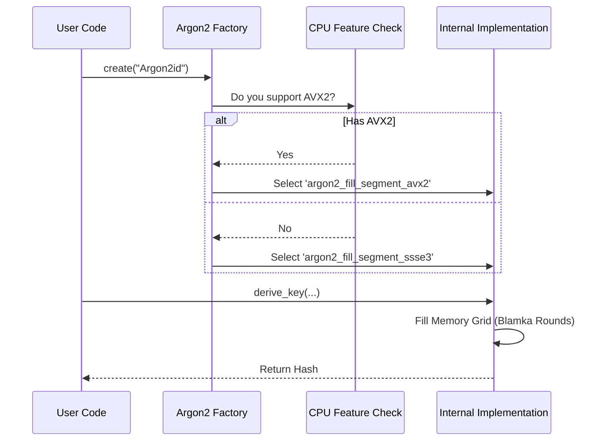

# Chapter 3: Argon2 (Password Hashing)

Welcome back! In the previous chapter, [ChaCha (Stream Cipher)](02_chacha__stream_cipher_.md), we learned how to encrypt messages so nobody can read them.

However, protecting **passwords** requires a completely different strategy. If you encrypt a password, you have to store the key somewhere. If a hacker steals your database, they might find the key and decrypt everyone's passwords.

Instead of encrypting passwords, we **hash** them. But wait—didn't we learn about hashes in Chapter 1? Why can't we just use SHA-256?

## Motivation: The Need for Slowness

Standard hash functions like SHA-256 are designed to be **fast**. That is great for checking file integrity, but terrible for passwords.

If a hacker steals your database of hashed passwords, they can use a powerful computer to guess billions of passwords per second (e.g., "123456", "password", "qwerty") and check if the hash matches. This is called a **Brute Force Attack**.

To stop this, we need a hash function that is deliberately **slow** and **heavy**. We want to force the computer to do a lot of work (like filling up memory) just to calculate *one* hash.

**Argon2** is the modern champion of password hashing. It forces the attacker to spend money on expensive hardware (RAM) and time, making attacks impractical.

### The Use Case
We want to store a user's password (`"CorrectHorseBatteryStaple"`) in our database. We will use Argon2 to turn it into a secure string.

## Key Concepts

1.  **Salt:** A random string added to the password before hashing. It ensures that two users with the same password (`"password123"`) end up with different hashes.
2.  **Memory Hardness:** Argon2 fills a large grid of memory (RAM) with data and mixes it around. This makes it very hard to run on cheap graphics cards (GPUs) which hackers often use.
3.  **The Blamka Round:** This is the internal mathematical engine of Argon2. It mixes the data blocks together.

## How to Use Argon2 in Botan

Using Argon2 involves selecting the algorithm family and tuning the difficulty parameters.

### Step 1: Create the Hash Family

We use the `PasswordHashFamily` factory.

```cpp
#include <botan/pwdhash.h>
#include <botan/system_rng.h>

int main() {
   // Create an instance of the Argon2id algorithm
   // 'Argon2id' is the recommended mode for most applications
   auto family = Botan::PasswordHashFamily::create("Argon2id");
   
   if(!family) return 1; // Check if successful
}
```
*Explanation:* We ask for "Argon2id". There are other versions (Argon2d, Argon2i), but "id" is the balanced choice recommended for general use.

### Step 2: Configure Difficulty (Tuning)

Argon2 is adjustable. We create a specific instance defined by how much memory and time we want it to use.

```cpp
   // M=64MB, T=3 iterations, P=1 thread
   auto hash = family->from_params(64 * 1024, 3, 1);
```
*Explanation:* 
*   **M (Memory):** We ask it to use 64MB of RAM. The more RAM required, the harder it is for a hacker to run millions of these in parallel.
*   **T (Time):** It runs the mixing process 3 times.
*   **P (Parallelism):** How many threads to use (1 is standard for simple login checks).

### Step 3: Hash the Password

Now we combine the password with a random salt to get the result.

```cpp
   std::string password = "CorrectHorseBatteryStaple";
   // In a real app, generate a random salt for each user!
   std::vector<uint8_t> salt = { 0x1, 0x2, 0x3, 0x4, 0x5 }; 
   
   // Prepare output buffer (32 bytes)
   std::vector<uint8_t> output(32);

   // Calculate!
   hash->derive_key(output.data(), output.size(),
                    password.data(), password.size(),
                    salt.data(), salt.size());
```
*Explanation:* `derive_key` performs the heavy lifting. It runs the "Blamka" function over the 64MB of memory for 3 iterations. The result in `output` is what you save in your database.

## Under the Hood: SIMD Blamka Rounds

You might be thinking: "Wait, you said Argon2 should be slow. Why does Botan optimize it?"

We want Argon2 to be efficient on *your* server (so legitimate users can log in instantly), but inefficient on a hacker's specialized hardware.

The core of Argon2 is a function called the **Blamka Round**. It takes blocks of data and mixes them. To make this efficient on a standard CPU, Botan uses **SIMD** instructions.

### The SIMD Check

Argon2 operates on 1024-byte blocks.
1.  **AVX2:** Can process vast amounts of data at once.
2.  **SIMD_2x64:** A slightly older/standard optimization.

Botan checks your CPU capabilities. If you have a modern CPU, it selects the AVX2 implementation of the Blamka round.

### Internal Workflow



### Internal Implementation Code

Deep inside the library, there is a "Transformation" function responsible for filling the memory grid. It uses function pointers or checks to pick the right SIMD tool.

Here is a simplified view of how Botan selects the round function:

```cpp
// Simplified from botan/source/lib/pwdhash/argon2/argon2.cpp

void Argon2::transform_memory_grid(uint8_t* block, size_t count) {
   
   // Check for the powerful AVX2 instruction set
   if(Botan::CPUID::has_avx2()) {
      // Use the highly optimized AVX2 Blamka function
      argon2_fill_segment_avx2(block, count);
   }
   else {
      // Fallback to SSSE3 or generic implementations
      argon2_fill_segment_ssse3(block, count);
   }
}
```
*Explanation:* 
1.  **`transform_memory_grid`**: This is where Argon2 spends 99% of its time.
2.  **`has_avx2()`**: Checks if the processor supports Advanced Vector Extensions 2.
3.  **`argon2_fill_segment_avx2`**: This function uses specific intrinsic commands to perform the Blamka mixing logic on multiple 64-bit integers simultaneously.

This optimization ensures that while the algorithm remains "heavy" (using lots of RAM), the CPU calculations are as efficient as possible for the defender.

## Summary

In this chapter, we learned:
1.  **Password Hashing** must be slow and memory-intensive to prevent brute-force attacks.
2.  **Argon2** is the industry standard for this, using Memory, Time, and Parallelism settings.
3.  **Botan** optimizes the internal "Blamka" round function using **AVX2** or **SIMD** instructions to ensure efficiency on general-purpose CPUs.

Throughout these chapters, we have seen `CPUID` checks and `SIMD` mentioned repeatedly. In the next chapter, we will look at the utilities that make this hardware detection possible.

[Next Chapter: Utils (SIMD Wrappers)](04_utils__simd_wrappers_.md)

---

Generated by [Code IQ](https://github.com/adityasoni99/Code-IQ)