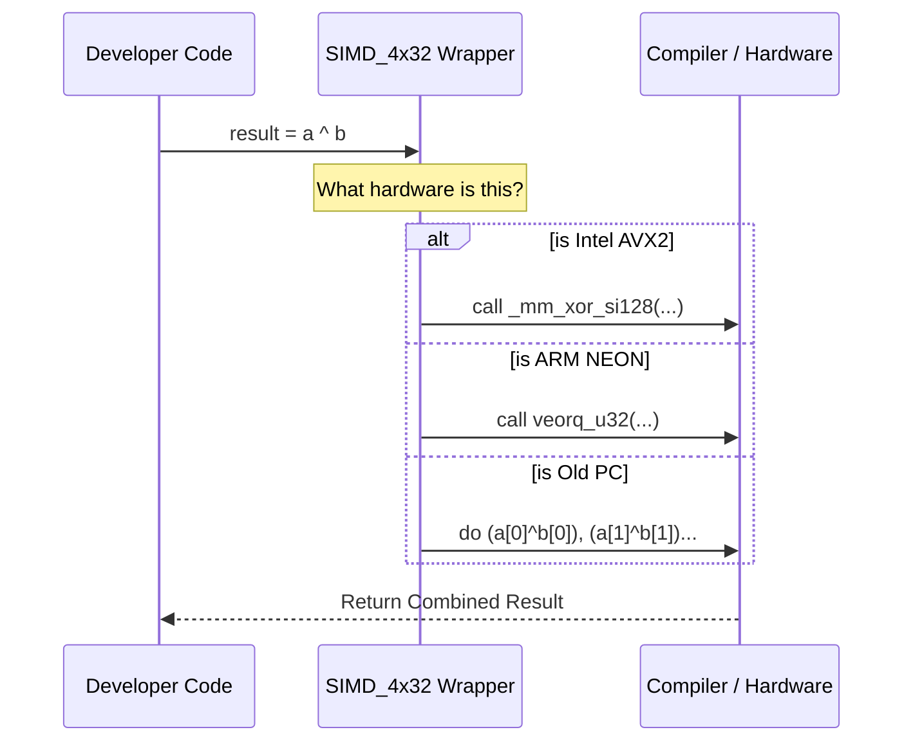

# Chapter 4: Utils (SIMD Wrappers)

Welcome to the final chapter of our beginner's guide to **Botan**!

In the previous chapter, [Argon2 (Password Hashing)](03_argon2__password_hashing_.md), we learned about memory-hard functions and saw that Botan checks your CPU capabilities to select the most efficient code.

Throughout this series, we have repeatedly used the term **SIMD** (Single Instruction, Multiple Data). We know it makes SHA-2, ChaCha, and Argon2 fast. But writing SIMD code is notoriously difficult and messy.

In this chapter, we will look at **Utils (SIMD Wrappers)**. This is the internal toolkit Botan developers use to write high-speed cryptography without losing their minds.

## Motivation: The Octopus vs. The One-Armed Robot

Standard programming is like a robot with one arm. If you want to add four pairs of numbers:
1.  Pick up pair 1, add them, put them down.
2.  Pick up pair 2, add them, put them down.
3.  (Repeat...)

**SIMD** is like an octopus. It picks up all four pairs at once, adds them all in a single movement, and puts them down together.

### The Problem: "Intrinsics" are Scary
To use the octopus (SIMD) in C++, you usually have to use **Compiler Intrinsics**. These are special, ugly commands that look like this:

```cpp
// Raw AVX2 code to add numbers. Looks scary, right?
__m256i result = _mm256_add_epi32(vector_a, vector_b);
```

If you write code like this:
1.  It is hard to read.
2.  It won't work on older computers (crashes).
3.  It won't work on non-Intel chips (like ARM processors in phones).

### The Solution: Botan's Wrappers
Botan wraps these ugly commands into clean C++ classes like `SIMD_4x32`. This allows developers to write math using standard operators (`+`, `^`, `|`) while the library handles the messy hardware details in the background.

### The Use Case
We want to perform a bitwise XOR operation on 4 integers at once. This is a very common operation in cryptography (like in the ChaCha cipher).

## Key Concepts

1.  **SIMD Register:** Think of this as a "wide" variable. Instead of holding one number (like `int`), it holds a packet of 4, 8, or 16 numbers side-by-side.
2.  **Intrinsic:** A specific function provided by the compiler (like GCC or Clang) that maps directly to a CPU assembly instruction.
3.  **Wrapper Class:** A C++ class that holds the SIMD register and defines operators (like `+` or `^`) to call the correct intrinsics.

## How to Use SIMD Wrappers

*Note: These classes are primarily used inside the library itself. As a user, you benefit from them automatically. However, understanding them explains how Botan achieves its speed.*

Let's imagine we are writing a piece of the ChaCha cipher and want to XOR four numbers.

### Step 1: Loading Data
Instead of creating `int`, we create a `SIMD_4x32`. This represents a packet of four 32-bit integers.

```cpp
// Hypothetical internal usage
#include <botan/internal/simd_32.h>

void calculate() {
    // Load 4 specific numbers into one register
    Botan::SIMD_4x32 packet_a(10, 20, 30, 40);
    
    // Load 4 other numbers
    Botan::SIMD_4x32 packet_b(5, 5, 5, 5);
}
```
*Explanation:* `packet_a` now holds `{10, 20, 30, 40}` inside a single CPU register.

### Step 2: Doing the Math
Now we can treat these packets like normal numbers.

```cpp
    // Perform XOR on all 4 pairs simultaneously
    // Ideally takes 1 CPU cycle!
    Botan::SIMD_4x32 result = packet_a ^ packet_b;
```
*Explanation:* 
*   10 XOR 5
*   20 XOR 5
*   30 XOR 5
*   40 XOR 5
All happening at the exact same moment.

### Step 3: Storing Data
Once the calculation is done, we usually dump the results back into a standard byte array.

```cpp
    std::vector<uint8_t> output(16);

    // Write the contents of the register to memory
    result.store_le(output.data());
```
*Explanation:* `store_le` (Store Little Endian) takes the data out of the special CPU register and writes it into standard RAM so the rest of the program can read it.

## Under the Hood: The Abstraction Layer

How does `packet_a ^ packet_b` know what to do?

Botan defines these classes using preprocessor directives (`#ifdef`). It checks what computer you are compiling on and swaps out the "guts" of the class.

### The Workflow



### Internal Implementation Code

Let's look at a simplified version of how Botan implements the `^` (XOR) operator inside these wrappers.

**File:** `botan/src/lib/utils/simd/simd_32.h` (Conceptual)

First, the class holds the raw data specific to the architecture:

```cpp
class SIMD_4x32 {
   private:
#if defined(BOTAN_TARGET_HAS_SSE2)
      __m128i m_simd_data; // Intel-specific type
#elif defined(BOTAN_TARGET_HAS_NEON)
      uint32x4_t m_simd_data; // ARM-specific type
#else
      uint32_t m_simd_data[4]; // Fallback array
#endif
   // ... constructors ...
};
```
*Explanation:* If you compile this on an Intel laptop, `m_simd_data` is a 128-bit Intel register. If you compile on an iPhone (ARM), it becomes a NEON register.

Next, the operator logic:

```cpp
inline SIMD_4x32 operator^(const SIMD_4x32& a, const SIMD_4x32& b) {
#if defined(BOTAN_TARGET_HAS_SSE2)
   // Use Intel Intrinsic
   return SIMD_4x32(_mm_xor_si128(a.raw(), b.raw()));

#elif defined(BOTAN_TARGET_HAS_NEON)
   // Use ARM Intrinsic
   return SIMD_4x32(veorq_u32(a.raw(), b.raw()));

#endif
   // ... fallback logic ...
}
```
*Explanation:*
1.  **`operator^`**: This allows the developer to use the `^` symbol.
2.  **`_mm_xor_si128`**: The actual command sent to an Intel CPU.
3.  **`veorq_u32`**: The actual command sent to an ARM CPU.

By writing code using `SIMD_4x32`, the cryptography implementations (like SHA-2 and ChaCha) become **portable**. They automatically "upgrade" themselves to use the fastest instructions available on whatever machine runs them.

## Tutorial Series Conclusion

Congratulations! You have completed the Botan Basics tutorial.

Let's recap what we've learned:
1.  **[SHA-2 (Hash Function)](01_sha_2__hash_function_.md)**: How to generate digital fingerprints to verify data integrity.
2.  **[ChaCha (Stream Cipher)](02_chacha__stream_cipher_.md)**: How to encrypt data streams to ensure confidentiality.
3.  **[Argon2 (Password Hashing)](03_argon2__password_hashing_.md)**: How to securely store passwords using memory-hard functions.
4.  **Utils (SIMD Wrappers)**: How Botan abstracts complex hardware instructions to make cryptography portable and blazing fast.

You are now equipped with the fundamental concepts to use Botan in your C++ projects. Secure coding!

---

Generated by [Code IQ](https://github.com/adityasoni99/Code-IQ)