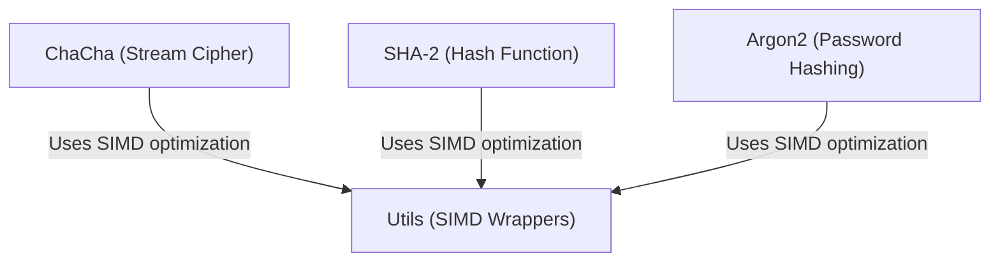

# Tutorial: botan

**Botan** is a comprehensive C++ cryptography library designed to provide the tools necessary for implementing practical systems, such as **TLS**, *certificates*, and modern ciphers. It focuses on performance and security, utilizing **SIMD wrappers** to optimize computationally intensive algorithms like **ChaCha**, **SHA-2**, and **Argon2**.

**Source Repository:** [https://github.com/randombit/botan](https://github.com/randombit/botan)

## Chapters

1. [SHA-2 (Hash Function)](01_sha_2__hash_function_.md)
2. [ChaCha (Stream Cipher)](02_chacha__stream_cipher_.md)
3. [Argon2 (Password Hashing)](03_argon2__password_hashing_.md)
4. [Utils (SIMD Wrappers)](04_utils__simd_wrappers_.md)

---

Generated by [Code IQ](https://github.com/adityasoni99/Code-IQ)