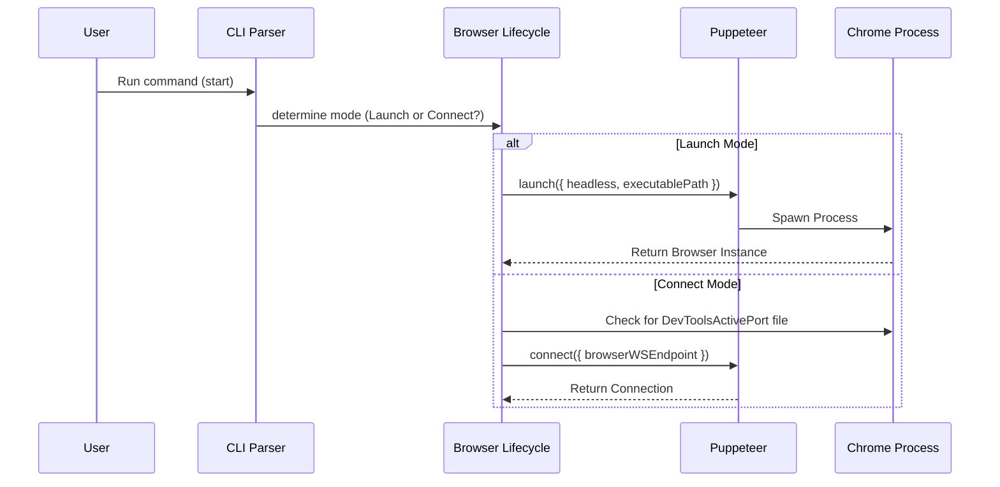

# Chapter 1: Browser Lifecycle (Process Management)

Welcome to the **Chrome DevTools MCP** tutorial! 

Before an AI agent can click buttons, read text, or analyze network requests, it needs one fundamental thing: **a running browser**.

This chapter explores the **Browser Lifecycle**. Think of this abstraction as the **Launchpad and Docking Station**. Its sole job is to ensure the vehicle (Chrome) is fueled up and running, so the pilot (the MCP server) can climb inside and fly it.

## The Goal: Getting Chrome Ready

Imagine you have an AI assistant on your computer. You ask it: *"Check the latest news on a tech site."*

To do this, the code needs to:
1.  Find where Chrome is installed on your computer.
2.  **Launch** a new process (open a window) OR **Connect** to a window you already have open.
3.  Ensure the connection is stable.

This sounds simple, but managing computer processes, finding executable paths across Windows/Mac/Linux, and handling WebSocket connections can be tricky. This module handles all of that complexity for you.

## Key Concepts

### 1. Launching (The Cold Start)
This is like buying a new car and driving it off the lot. The system creates a brand-new Chrome process.
*   **Headless Mode:** The browser runs without a visible UI (great for servers).
*   **Headful Mode:** You see the window pop up (great for debugging).

### 2. Connecting (The Warm Start)
This is like jumping into a taxi that is already driving. The browser is already open (perhaps you are using it), and the MCP server "attaches" to it to issue commands.

### 3. User Data Directory (The Suitcase)
Chrome stores your cookies, history, and logins in a **User Data Directory**.
*   **Persistent:** The server remembers who you are (keeps you logged in).
*   **Isolated:** The server creates a temporary profile that vanishes when the browser closes (good for privacy/testing).

---

## How to Use It: The CLI

For most users, interacting with the Browser Lifecycle happens via command-line arguments. Here are the most common ways to start the engine.

### Scenario A: Launch a New Instance
This is the default behavior. It opens a clean instance of Chrome.

```bash
# Basic launch (opens a visible window)
npx chrome-devtools-mcp

# Launch in "Headless" mode (invisible, faster)
npx chrome-devtools-mcp --headless
```

### Scenario B: Auto-Connect
If you are already browsing and want the AI to help you *in your current context*, use auto-connect.

```bash
# Connects to a Chrome instance running on port 9222
npx chrome-devtools-mcp --auto-connect
```
*Note: You usually need to start your Chrome with remote debugging enabled (`--remote-debugging-port=9222`) for this to work.*

---

## Under the Hood: Implementation

Let's look at how the code actually manages these processes. The project relies heavily on a library called **Puppeteer** to handle the heavy lifting of process spawning.

### The Lifecycle Flow

Here is what happens when the server starts up:



### 1. The Launch Function
Located in `src/browser.ts`, the `launch` function prepares the arguments and asks Puppeteer to start Chrome.

```typescript
// src/browser.ts (Simplified)

export async function launch(options: McpLaunchOptions) {
  // 1. Determine where to store user data (profile)
  // If isolated, we don't pick a specific path (temp dir used)
  let userDataDir = options.userDataDir; 
  
  // 2. Prepare arguments for Chrome
  const args = ['--hide-crash-restore-bubble'];
  if (options.headless) {
    // Set a default screen size for headless mode
    args.push('--screen-info={3840x2160}');
  }

  // 3. Launch Puppeteer
  // pipe: true allows us to see Chrome's logs in our terminal
  return await puppeteer.launch({
    executablePath: options.executablePath, // Custom path if provided
    headless: options.headless,
    userDataDir: userDataDir,
    args: args,
    pipe: true, 
  });
}
```
*Explanation:* We build a list of flags (like setting screen size) and pass them to `puppeteer.launch`. This returns a `Browser` object representing the running process.

### 2. The Connection Function
Sometimes we want to connect to a browser that is already running. This is handled by `ensureBrowserConnected`.

```typescript
// src/browser.ts (Simplified)

export async function ensureBrowserConnected(options) {
  // 1. Identify the 'DevToolsActivePort' file
  // Chrome writes its connection info to this file in the profile folder
  const portPath = path.join(options.userDataDir, 'DevToolsActivePort');
  
  // 2. Read the file to find the port (e.g., 9222)
  const fileContent = await fs.promises.readFile(portPath, 'utf8');
  const [rawPort, rawPath] = fileContent.split('\n');
  
  // 3. Construct the WebSocket URL
  const wsEndpoint = `ws://127.0.0.1:${rawPort}${rawPath}`;

  // 4. Connect Puppeteer to that URL
  return await puppeteer.connect({
    browserWSEndpoint: wsEndpoint,
    defaultViewport: null,
  });
}
```
*Explanation:* This acts like a detective. Even if we don't know exactly which port Chrome picked, we look into the `userDataDir` folder, read a special file called `DevToolsActivePort`, and find the address to connect to.

### 3. Handling Process Conflicts
A common issue in browser management is trying to open the same profile twice. Chrome puts a "lock" on the profile folder.

```typescript
// tests/browser.test.ts (Logic demonstration)

try {
    // Try to launch a second browser on the same folder
    const browser2 = await launch({ userDataDir: folderPath });
} catch (err) {
    // We catch the specific error to give a friendly message
    if (err.message.includes('already running')) {
        console.error("Browser is busy! Use --isolated for a new instance.");
    }
}
```
*Explanation:* The wrapper captures scary crash errors and converts them into helpful messages, telling the user to use `--isolated` if they want multiple browsers running at once.

## Summary

In this chapter, we learned how the **Browser Lifecycle** acts as the foundation of the project.
1.  It abstracts away the OS-level details of finding and running Chrome.
2.  It supports **Launch Mode** (creating new processes) and **Connect Mode** (attaching to existing ones).
3.  It manages **User Data Directories** to handle cookies and sessions.

Now that our vehicle is running and we have a connection to it, we need a pilot to manage the state of our flight.

[Next Chapter: MCP Context (State Management)](02_mcp_context__state_management_.md)

---

Generated by [Code IQ](https://github.com/adityasoni99/Code-IQ)