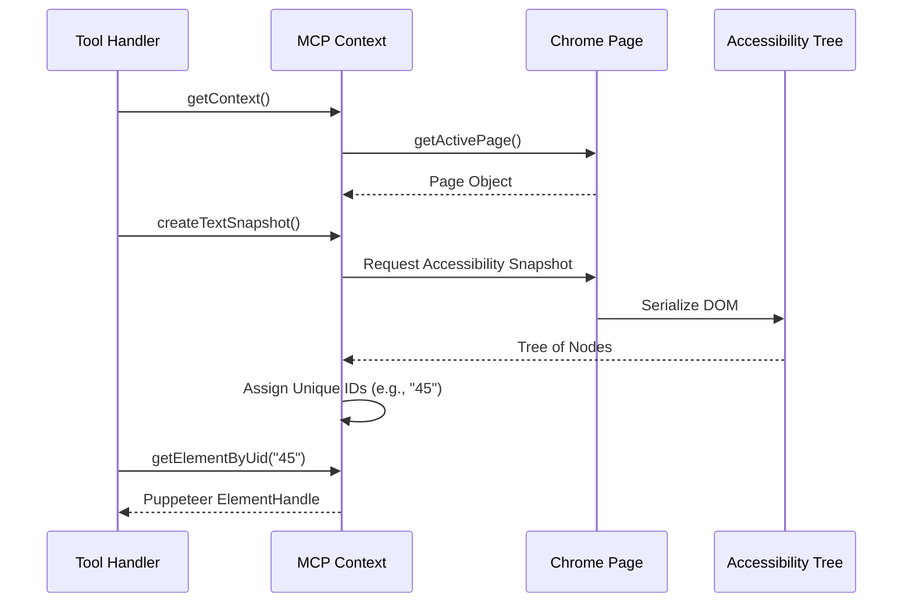

# Chapter 2: MCP Context (State Management)

Welcome to the second chapter of the **Chrome DevTools MCP** tutorial!

In the previous chapter, [Browser Lifecycle (Process Management)](01_browser_lifecycle__process_management_.md), we learned how to launch Chrome or connect to an existing instance. We have a running engine, but a running engine isn't enough to fly a plane.

Now, we introduce the **MCP Context**.

## The Goal: The Cockpit

Imagine you ask the AI: *"Click the 'Login' button."*

To the browser, this is confusing.
*   Which tab do you mean? (You might have 10 tabs open).
*   Where is the button?
*   Has the page finished loading?

The **MCP Context** acts as the **Cockpit** of the application. It is the central nervous system that answers these questions. It holds the current state of the browser session and provides a simplified map of the world to the AI.

## Key Concepts

### 1. The Active Page (Focus)
A browser can have many tabs (pages), but a user usually focuses on one at a time. The Context keeps track of the **Selected Page**. All commands (clicking, typing, scrolling) apply to this active page unless specified otherwise.

### 2. The Text Snapshot (The AI's Eyes)
This is the most critical concept. An AI (LLM) cannot "see" pixels like a human does. It reads text.

To let the AI "see" the page, the Context asks Chrome for the **Accessibility Tree**. This is a text-based representation of the website structure (buttons, inputs, headings). The Context takes a "Snapshot" of this tree and assigns a unique ID to every element.

*   **Website:** `<button>Submit</button>`
*   **Context Snapshot:** `[Button "Submit" (ID: 45)]`

When the AI wants to click, it says "Click ID 45," and the Context knows exactly which HTML element that refers to.

### 3. Data Collectors
The Context also holds references to **Data Collectors**. These are like the "Black Box" recorders, capturing network logs and console errors. We will cover these in detail in [Data Collectors (Event Buffering)](04_data_collectors__event_buffering_.md).

---

## How to Use It

The Context is usually created automatically in `main.ts` after the browser connects. Here is how a tool (like a "Click" tool) interacts with it.

### Scenario: Finding and Clicking an Element

1.  **Get the Context:** The system gives you the current context.
2.  **Refresh the Snapshot:** We ensure we are looking at the latest version of the page.
3.  **Find Element:** We ask for the element by its ID.

```typescript
// Conceptual example inside a Tool handler

async function clickButtonTool(params, context) {
  // 1. Ensure we have the latest map of the page
  await context.createTextSnapshot();

  // 2. The AI provides the ID it wants to click (e.g., "15")
  const elementId = params.targetId;

  // 3. The context translates "15" into a real browser element
  const element = await context.getElementByUid(elementId);

  // 4. Perform the action
  await element.click();
}
```

---

## Under the Hood: Implementation

How does the Context manage this state internally?

### The Flow of State

When a request comes in, the Context orchestrates the data gathering.



### 1. The Class Structure
Located in `src/McpContext.ts`, the class holds the state variables.

```typescript
// src/McpContext.ts (Simplified)

export class McpContext {
  // The Puppeteer browser instance
  browser: Browser;
  
  // The currently focused tab
  #selectedPage?: Page;

  // The map of the page structure (The AI's vision)
  #textSnapshot: TextSnapshot | null = null;

  // Maps simplified IDs back to real DOM nodes
  #uniqueBackendNodeIdToMcpId = new Map<string, string>();
  
  // ... constructor and other properties
}
```
*Explanation:* The `#` denotes private fields. The context holds the browser, the active page, and the snapshot data.

### 2. Managing the Active Page
We need to know which tab to control. `createPagesSnapshot` lists all tabs and defaults to the first one if none is selected.

```typescript
// src/McpContext.ts (Simplified)

async createPagesSnapshot() {
  // 1. Get all open pages from Chrome
  const allPages = await this.browser.pages();

  // 2. Filter out internal DevTools windows (usually)
  this.#pages = allPages.filter(p => !p.url().startsWith('devtools://'));

  // 3. If no page is selected, select the first one
  if (!this.#selectedPage && this.#pages[0]) {
    this.selectPage(this.#pages[0]);
  }
}
```
*Explanation:* This ensures that if the user opens a new tab, the Context knows about it.

### 3. Creating the "Vision" (Snapshot)
This is the most complex part. We take Chrome's accessibility tree and tag every node with a unique ID so the AI can reference it.

```typescript
// src/McpContext.ts (Simplified)

async createTextSnapshot() {
  const page = this.getSelectedPage();
  
  // 1. Ask Puppeteer for the accessibility tree
  const rootNode = await page.accessibility.snapshot();

  // 2. Recursively assign IDs to every node
  let idCounter = 0;
  const assignIds = (node) => {
    // Generate a simple ID (e.g., "1_0", "1_1")
    const id = `${this.#nextSnapshotId}_${idCounter++}`;
    
    // Store it in our map for lookup later
    node.id = id; 
    this.#textSnapshot.idToNode.set(id, node);

    // Process children
    node.children?.forEach(assignIds);
  };

  assignIds(rootNode);
}
```
*Explanation:* 
1.  We get a tree of nodes from Chrome. 
2.  We loop through every node.
3.  We give each node a temporary ID (like "1_45"). 
4.  We save this in a `Map`. When the AI says "Click 1_45", we look up this Map to find the real element.

### 4. Retrieving an Element
When the AI decides to act, it uses the ID.

```typescript
// src/McpContext.ts (Simplified)

async getElementByUid(uid: string) {
  // 1. Look up the node in our snapshot map
  const node = this.#textSnapshot?.idToNode.get(uid);
  
  // 2. Ask Puppeteer to convert that node into a handle we can click
  const handle = await node.elementHandle();
  
  return handle;
}
```
*Explanation:* This closes the loop. It translates the "Text Map" back into a "Control Handle" that allows us to click, type, or focus.

## Summary

The **MCP Context** is the bridge between the chaotic reality of a browser and the structured world the AI needs.

1.  It tracks the **Selected Page**.
2.  It translates the visual DOM into a **Text Snapshot** with unique IDs.
3.  It allows Tools to translate those IDs back into actionable elements.

Now that we have a Cockpit to manage our state, we need actual levers and buttons to pull. In the next chapter, we will look at how to define these capabilities.

[Next Chapter: Tool Definitions (Capabilities)](03_tool_definitions__capabilities_.md)

---

Generated by [Code IQ](https://github.com/adityasoni99/Code-IQ)