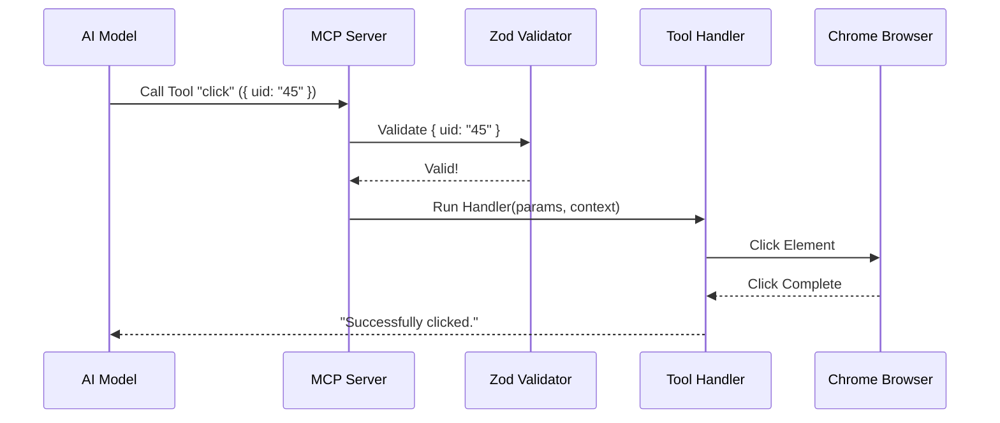

# Chapter 3: Tool Definitions (Capabilities)

Welcome to Chapter 3 of the **Chrome DevTools MCP** tutorial!

In the previous chapter, [MCP Context (State Management)](02_mcp_context__state_management_.md), we built the **Cockpit**—a way to manage the browser's state and translate the visual web page into a text map the AI can understand.

Now that the AI can "see" the plane's controls, we need to give it the ability to push buttons and pull levers. We call these **Tool Definitions**.

## The Goal: Teaching the AI "Verbs"

Imagine you are playing a role-playing game (RPG). You have a set of **Skill Cards**: "Attack", "Defend", or "Heal".
*   You cannot just say "Make the bad guy go away."
*   You must play the "Attack" card.
*   The card requires a target (Parameter).
*   The game engine executes the damage (Logic).

In this project, **Tools** are those Skill Cards. They turn vague AI desires into concrete code execution.

If the AI wants to "Type 'Hello' into the search box," it needs a Tool defined specifically for typing, and it needs to know exactly which box to type into.

## Key Concepts

### 1. The Definition (The Card Face)
This tells the AI **what** the tool is. It includes a unique name (e.g., `click`, `fill_form`) and a description. The description is crucial because the AI reads it to decide *if* this is the right tool for the job.

### 2. The Schema (The Rules)
We use a library called **Zod** to define strict rules for inputs. Think of Zod as the **Bouncer** at a club.
*   **Tool:** "I want to click."
*   **Zod:** "I need a `uid` (string) for the element. Do you have it?"
*   **AI:** "Yes, here is ID '12_4'."
*   **Zod:** "Access granted."

### 3. The Handler (The Action)
This is a standard JavaScript/TypeScript function. It receives the validated inputs from Zod and the `McpContext` we built in Chapter 2. It performs the actual work using Puppeteer.

---

## How to Use It: Defining a Tool

Let's look at how a tool is actually written in the code. We use a helper function called `defineTool`.

### Step 1: Naming and Describing
We need to tell the AI what this tool does.

```typescript
// src/tools/input.ts (Simplified)

export const click = defineTool({
  name: 'click',
  description: `Clicks on the provided element`,
  annotations: { 
    category: ToolCategory.INPUT 
  },
  // ... schema and handler go here
});
```
*Explanation:* The `name` is how the AI calls it. The `description` helps the AI understand when to use it.

### Step 2: Defining the Schema (Zod)
We define strictly what data the AI must provide.

```typescript
// src/tools/input.ts (Simplified)

  schema: {
    uid: zod.string()
      .describe('The uid of an element from the snapshot'),
      
    dblClick: zod.boolean().optional()
      .describe('Set to true for double clicks'),
  },
```
*Explanation:* We require a `uid` (String). We optionally accept `dblClick` (Boolean). If the AI sends a number for `uid`, Zod will reject it before it crashes our code.

### Step 3: The Handler Logic
This is where we actually touch the browser.

```typescript
// src/tools/input.ts (Simplified)

  handler: async (request, response, context) => {
    const uid = request.params.uid;

    // 1. Ask the Context (Chap 2) to find the element
    const handle = await context.getElementByUid(uid);

    // 2. Perform the Puppeteer action
    await handle.click();

    // 3. Tell the AI it worked
    response.appendResponseLine(`Successfully clicked.`);
  },
```
*Explanation:* 
1.  We extract the `uid` from the parameters.
2.  We use `context.getElementByUid` (which we learned about in [MCP Context (State Management)](02_mcp_context__state_management_.md)) to get the real button.
3.  We click it!

---

## Under the Hood: The Execution Flow

What happens when the AI actually decides to use a tool?



### Implementing Different Categories

The project organizes tools into categories to keep things tidy.

#### 1. Input Tools (`src/tools/input.ts`)
These interact with the page directly.
*   **Examples:** `click`, `fill` (type text), `press_key`.
*   **Key Mechanic:** They almost always require a `uid` from the `McpContext` snapshot.

#### 2. Network Tools (`src/tools/network.ts`)
These inspect traffic, useful for debugging APIs.
*   **Examples:** `list_network_requests`, `get_network_request`.
*   **Key Mechanic:** They act as "Read Only" tools that query logs stored in the Context.

```typescript
// src/tools/network.ts (Simplified)

export const listNetworkRequests = defineTool({
  name: 'list_network_requests',
  description: `List all requests since last navigation.`,
  schema: { /* ... filters ... */ },
  
  handler: async (request, response, context) => {
    // 1. Get raw data from the browser bridge
    const data = await context.getDevToolsData();
    
    // 2. Format it for the AI
    response.attachDevToolsData(data);
  },
});
```

#### 3. Performance Tools (`src/tools/performance.ts`)
These are complex tools that run over time.
*   **Examples:** `performance_start_trace`, `performance_stop_trace`.
*   **Key Mechanic:** These tools change the **State** of the Context (switching "Recording Mode" on or off).

```typescript
// src/tools/performance.ts (Simplified)

  handler: async (request, response, context) => {
    // Check if we are already recording
    if (context.isRunningPerformanceTrace()) {
      response.appendResponseLine('Error: Trace already running');
      return;
    }
    
    // Update state and start Puppeteer tracing
    context.setIsRunningPerformanceTrace(true);
    await page.tracing.start({ categories });
  },
```

## Summary

In this chapter, we defined the **Capabilities** of our AI agent.
1.  **Tools** are the "verbs" (actions) the AI can perform.
2.  **Schemas** (Zod) act as the safety guard, ensuring the AI provides the right arguments.
3.  **Handlers** use the `McpContext` to execute the logic in the browser.

We have the Engine (Browser), the Cockpit (Context), and the Controls (Tools). But what happens when the browser talks back? What if a network request fails or a console error appears while the AI is "thinking"?

We need a way to record these events.

[Next Chapter: Data Collectors (Event Buffering)](04_data_collectors__event_buffering_.md)

---

Generated by [Code IQ](https://github.com/adityasoni99/Code-IQ)