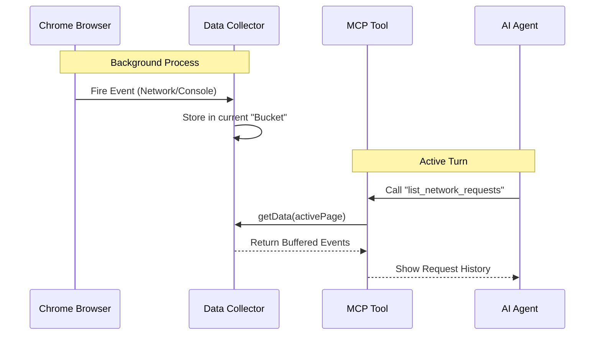

# Chapter 4: Data Collectors (Event Buffering)

Welcome to Chapter 4 of the **Chrome DevTools MCP** tutorial!

In the previous chapter, [Tool Definitions (Capabilities)](03_tool_definitions__capabilities_.md), we gave the AI the ability to perform actions like clicking buttons or typing text.

However, interacting with a browser isn't just about sending commands; it's about listening to what happens next.

## The Problem: The AI Blinked

Imagine you are debugging a website. You click "Login," but nothing happens. You immediately check the **Network Tab** to see if the request failed, or the **Console** to see if there was a JavaScript error.

Now, consider the AI:
1.  The AI sends a "Click" command.
2.  The Browser executes the click.
3.  **Milliseconds later:** A network request fails (404 Error).
4.  **Seconds later:** The AI receives a message: "Click successful."

Because the AI works in discrete turns (Step 1, Step 2), it "blinks" between steps. It wasn't watching the network tab the exact moment the error happened. By the time it decides to look, the event might be gone.

## The Solution: The Black Box Recorder

We solve this with **Data Collectors**. 

Think of a Data Collector as a **Black Box Flight Recorder**. It runs silently in the background, subscribing to the live stream of browser events. It buffers (records) everything.

When the AI asks, *"Did anything break in the last 5 seconds?"*, the Collector rewinds the tape and provides the data.

## Key Concepts

### 1. The Event Stream
Browsers are "Event Emitters." They constantly shout out information:
*   "A network request started!"
*   "A console log appeared!"
*   "The page finished loading!"

### 2. The Buffer (Storage)
The Collector catches these events and puts them into a list (an array). It doesn't analyze them; it just stores them. This ensures no data is lost while the AI is "thinking."

### 3. Navigation Buckets
This is the most critical logic. When a user navigates from `google.com` to `wikipedia.org`, we don't want to mix the logs together.

The Collector monitors for **Navigation Events**. When the page changes, it seals the old bucket of logs and starts a fresh one.

---

## How to Use It

Typically, you don't call Collectors directly in your main script. Instead, they are initialized when the application starts, and **Tools** query them.

Here is a conceptual example of how a tool gets data from a collector.

### Scenario: Checking for Errors

```typescript
// Inside a Tool Handler (e.g., "check_console_errors")

const handler = async (params, context) => {
  // 1. Get the current active page
  const page = context.getSelectedPage();
  
  // 2. Ask the Collector for logs specific to this page
  // The collector is stored inside the context
  const logs = context.consoleCollector.getData(page);
  
  // 3. Return the logs to the AI
  return logs.map(log => log.text());
};
```

---

## Under the Hood: Implementation

Let's look at `src/PageCollector.ts` to understand how this recording machine works.

### The Data Flow



### 1. The Base Class (`PageCollector`)
This class manages the storage. It uses a `WeakMap` so that if a browser tab is closed, the logs associated with it are automatically deleted from memory.

```typescript
// src/PageCollector.ts (Simplified)

export class PageCollector<T> {
  // Maps a Page to a list of lists (Buckets of events)
  protected storage = new WeakMap<Page, Array<Array<T>>>();

  // Helper to add data to the current bucket
  protected collect(page: Page, item: T) {
    const navigations = this.storage.get(page);
    // Add item to the most recent bucket (index 0)
    navigations[0].push(item);
  }
}
```
*Explanation:* `T` is a generic type. It could be a `ConsoleMessage` or a `HTTPRequest`. We store a list of lists: `[ [Current Page Data], [Previous Page Data] ]`.

### 2. Handling Navigation (The Bucket Swap)
When the user goes to a new page, we need a new bucket.

```typescript
// src/PageCollector.ts (Simplified)

protected splitAfterNavigation(page: Page) {
  const navigations = this.storage.get(page);
  
  // Create a new empty bucket at the front
  navigations.unshift([]);
  
  // Optional: Limit history to save memory (e.g., keep last 3 pages)
  if (navigations.length > 3) {
    navigations.pop();
  }
}
```
*Explanation:* `unshift([])` puts a clean empty array at the start of our list. Any new events will go into this new array, keeping history clean.

### 3. The Console Collector
This specific implementation listens for logs and errors. It's slightly complex because it listens to standard Puppeteer events *and* low-level CDP (Chrome DevTools Protocol) events for deep inspection.

```typescript
// src/PageCollector.ts (Simplified)

export class ConsoleCollector extends PageCollector<ConsoleMessage> {
  
  // Called when we attach to a new page
  override addPage(page: Page) {
    super.addPage(page);
    
    // Subscribe to Puppeteer's 'console' event
    page.on('console', (msg) => {
       this.collect(page, msg);
    });
    
    // Subscribe to 'pageerror' (uncaught exceptions)
    page.on('pageerror', (err) => {
       this.collect(page, err);
    });
  }
}
```
*Explanation:* This acts as the "ears" of the application. Whenever Puppeteer hears a console message, this collector grabs it and throws it into the storage bucket.

### 4. The Network Collector
This implementation tracks HTTP requests. It has special logic to ensure the "Navigation Request" itself (the request that loads the new page) ends up in the *new* bucket, not the old one.

```typescript
// src/PageCollector.ts (Simplified)

export class NetworkCollector extends PageCollector<HTTPRequest> {
  
  constructor(browser) {
    // Define the listener: When a request happens, collect it
    super(browser, (collect) => ({
      request: (req) => collect(req)
    }));
  }
  
  // Special logic to ensure the main page load is the 
  // first item in the new bucket
  override splitAfterNavigation(page: Page) {
     // ... Logic to move the navigation request ...
     // ... into the new bucket ...
  }
}
```

## Summary

In this chapter, we built the memory system for our agent.

1.  **Data Collectors** act as passive recorders (buffers) for streaming browser events.
2.  They solve the "AI Blinked" problem by ensuring history is available when the AI asks for it.
3.  They organize data by **Navigations**, so logs from one page don't pollute another.

We now have the raw data: DOM elements (Chapter 2), Tools to act (Chapter 3), and Event Logs (Chapter 4).

However, raw data is often ugly and too large for an AI to read efficiently. A single network log can contain kilobytes of headers and binary data. We need to clean this up.

[Next Chapter: Content Formatters (Data Translation)](05_content_formatters__data_translation_.md)

---

Generated by [Code IQ](https://github.com/adityasoni99/Code-IQ)