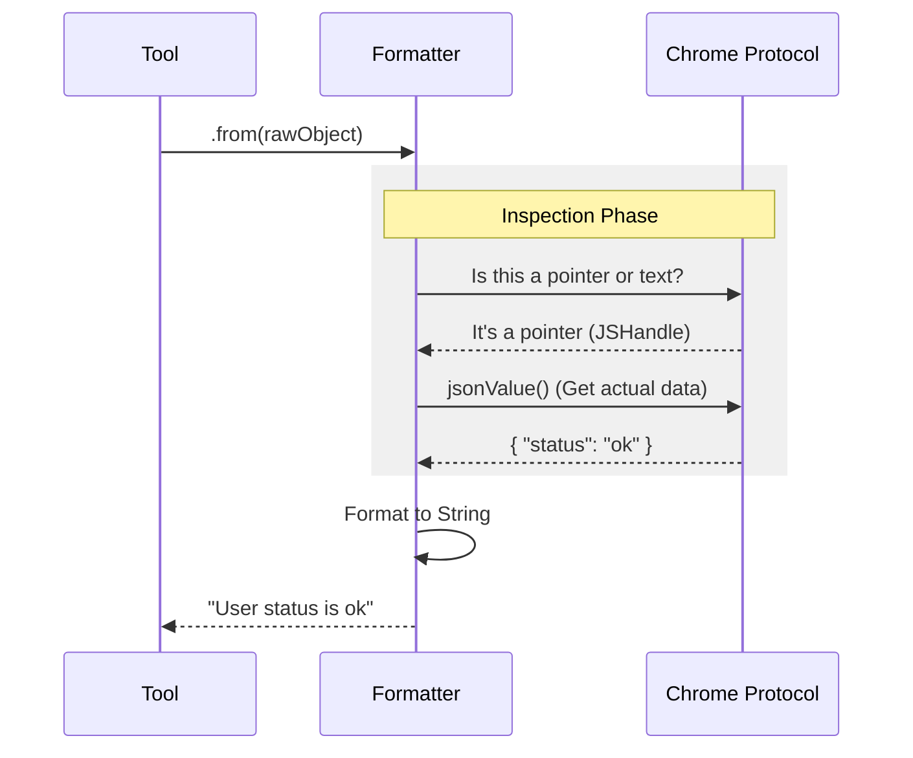

# Chapter 5: Content Formatters (Data Translation)

Welcome to Chapter 5 of the **Chrome DevTools MCP** tutorial!

In the previous chapter, [Data Collectors (Event Buffering)](04_data_collectors__event_buffering_.md), we built a system to record everything happening in the browser. We now have buckets full of network requests and console logs.

However, we have a new problem: **The data is ugly.**

## The Problem: Raw Data vs. AI Understanding

Browsers speak a language of optimized binary data and complex object references.

Imagine a website logs a user object.
*   **What the Browser sees:** A `JSHandle@object` (a memory reference pointing to a heap location).
*   **What the Network sees:** A `Buffer` (a raw array of bytes: `[123, 34, 110, ...]` ).

If we send this raw data to an AI, it will be confused. It doesn't know how to look up memory addresses, and it can't read raw bytes.

## The Goal: The Universal Translator

**Content Formatters** act as a **Universal Translator**.

They take the raw, technical, nested data from the browser and translate it into clear, human-readable (and AI-readable) text. They also handle **summarization**—ensuring we don't accidentally send a 10MB text file to the AI, which would crash its context window.

## Key Concepts

### 1. Object Unrolling
When you `console.log` an object in Chrome, you usually have to click a little arrow `>` to see what's inside. The AI cannot "click" to expand an object.
The Formatter proactively "unrolls" these objects, fetching their properties so they appear as text (e.g., `{ name: "Alice", age: 25 }`).

### 2. The Token Budget (Truncation)
AI models have a limit on how much text they can read. If a website returns a massive HTML page, we cannot send the whole thing.
Formatters enforce a **Token Budget**. If a string is too long, the formatter chops it off and adds a `... <truncated>` tag.

### 3. Binary Decoding
Network responses often come as streams of bytes. The Formatter checks: "Is this text?"
*   **If Yes (JSON/HTML):** Decode it to a string.
*   **If No (Image/Video):** Replace it with a placeholder like `<binary data>`.

---

## How to Use It

You rarely write a formatter from scratch. You typically use them inside your **Tools** (Chapter 3) to prepare data before sending it back to the AI.

### Scenario: Formatting Console Logs

Let's say we retrieved a raw message from our [Data Collectors](04_data_collectors__event_buffering_.md). We want to turn it into text.

```typescript
// Inside a Tool Handler
import { ConsoleFormatter } from '../formatters/ConsoleFormatter.js';

async function formatLogTool(rawMessage) {
  // 1. Instantiate the translator
  // We pass an ID so the AI can reference it later
  const formatter = await ConsoleFormatter.from(rawMessage, { id: 1 });

  // 2. Get the simple string version
  const text = formatter.toString(); 
  
  // Output: "msgid=1 [log] Hello World (0 args)"
  return text;
}
```

### Scenario: Formatting Network Requests

Similarly, for network traffic, we want to see the URL and status, not the raw socket info.

```typescript
// Inside a Tool Handler
import { NetworkFormatter } from '../formatters/NetworkFormatter.js';

async function formatRequestTool(rawRequest) {
  // 1. Create the formatter
  const formatter = await NetworkFormatter.from(rawRequest, {
      requestId: 'req_123'
  });

  // 2. Get the detailed view (Headers + Body)
  const details = formatter.toStringDetailed();
  
  return details;
}
```

---

## Under the Hood: Implementation

How does the translation process work? It involves checking data types and fetching missing information.

### The Translation Flow



### 1. The Console Formatter (`src/formatters/ConsoleFormatter.ts`)

This class handles the complexity of JavaScript objects. A console message isn't just text; it's a list of arguments.

```typescript
// src/formatters/ConsoleFormatter.ts (Simplified)

export class ConsoleFormatter {
  static async from(msg, options) {
    // 1. Loop through all arguments (e.g., console.log("Hi", userObj))
    const resolvedArgs = await Promise.all(
      msg.args().map(async (arg) => {
        try {
          // 2. Try to turn the handle into a plain JSON object
          return await arg.jsonValue();
        } catch {
          return '<error: value unavailable>';
        }
      })
    );

    // 3. Return a new instance with the clean data
    return new ConsoleFormatter({ ...options, resolvedArgs });
  }
}
```
*Explanation:* We map over every argument. If `console.log` had 3 arguments, we try to convert all 3 from "Handles" (pointers) to "Values" (text).

### 2. The Network Formatter (`src/formatters/NetworkFormatter.ts`)

This class deals with the messy reality of the internet: massive files and binary data.

#### Handling the Body
We need to be careful not to crash the server by loading a 1GB video file into memory.

```typescript
// src/formatters/NetworkFormatter.ts (Simplified)

async #getFormattedResponseBody(response, sizeLimit) {
  // 1. Get the raw buffer
  const buffer = await response.buffer();

  // 2. Check if it looks like text (UTF-8)
  if (isUtf8(buffer)) {
    const text = buffer.toString('utf-8');
    
    // 3. Apply the "Token Budget" (Cut it off if too big)
    if (text.length > sizeLimit) {
      return text.substring(0, sizeLimit) + '... <truncated>';
    }
    return text;
  }

  // 4. If it's an image or zip, don't show it
  return '<binary data>';
}
```
*Explanation:* 
1.  We check `isUtf8` to see if it is readable text.
2.  If it is text, we check `sizeLimit` (usually 10,000 characters).
3.  If it's too big, we chop the rest off.

### 3. Producing the Output
Both formatters provide two output methods:
1.  `toString()`: A one-line summary (good for lists).
2.  `toStringDetailed()`: A multi-line block with headers, bodies, and stack traces (good for inspection).

```typescript
// src/formatters/NetworkFormatter.ts (Simplified)

toStringDetailed() {
  const lines = [];
  lines.push(`## Request ${this.url}`);
  lines.push(`### Headers`);
  lines.push(...this.headers);
  
  if (this.body) {
     lines.push(`### Body`);
     lines.push(this.body); // This is the truncated version
  }
  
  return lines.join('\n');
}
```

## Summary

In this chapter, we learned how **Content Formatters** bridge the gap between browser internals and AI text processing.

1.  They **Translate** complex objects and handles into plain JSON or text.
2.  They **Filter** binary data that the AI cannot read.
3.  They **Truncate** massive responses to respect the AI's token budget.

We have now covered the entire pipeline: 
1.  **Browser** (Chapter 1) -> 
2.  **Context** (Chapter 2) -> 
3.  **Tools** (Chapter 3) -> 
4.  **Collectors** (Chapter 4) -> 
5.  **Formatters** (Chapter 5).

The final piece of the puzzle is how we communicate directly with Chrome using the low-level protocol when Puppeteer isn't enough.

[Next Chapter: DevTools Bridge (CDP Integration)](06_devtools_bridge__cdp_integration_.md)

---

Generated by [Code IQ](https://github.com/adityasoni99/Code-IQ)