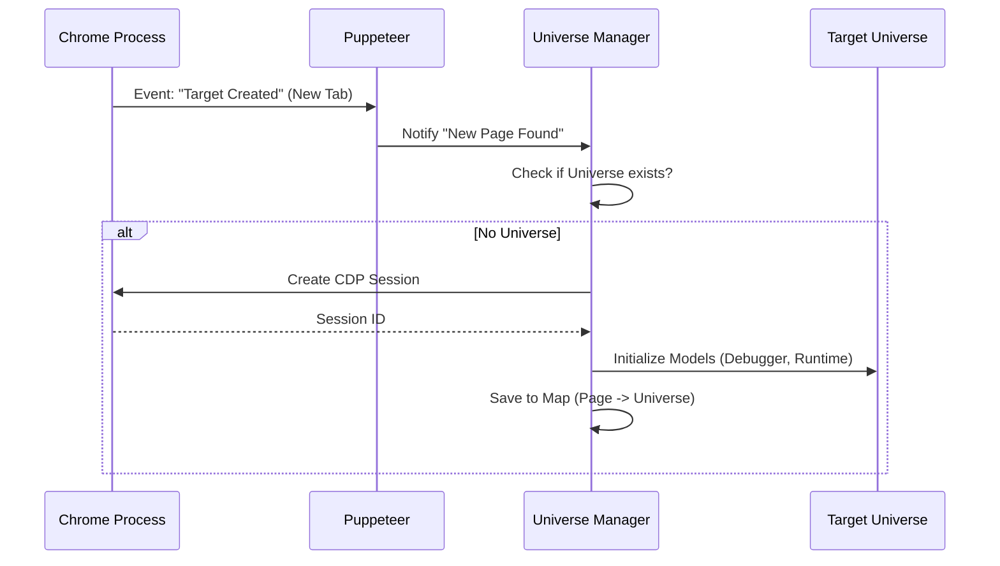

# Chapter 6: DevTools Bridge (CDP Integration)

Welcome to the final chapter of the **Chrome DevTools MCP** tutorial!

In the previous chapter, [Content Formatters (Data Translation)](05_content_formatters__data_translation_.md), we learned how to translate raw browser data into readable text for the AI.

We have built a Browser, a Context, Tools, Collectors, and Formatters. Most of these rely on **Puppeteer**, a high-level library that makes controlling Chrome easy (e.g., `page.click()`).

But sometimes, "easy" isn't enough. sometimes you need to do things Puppeteer doesn't support, like:
*   Recording a detailed **Performance Profile**.
*   Parsing deep **Source Maps** to debug original TypeScript code.
*   Accessing low-level protocol events.

This is where the **DevTools Bridge** comes in.

## The Goal: The Foreign Diplomat

Think of Chrome as a foreign country with its own complex language called **CDP (Chrome DevTools Protocol)**. 
*   **Puppeteer** is like a generic phrasebook. It lets you order food and ask for directions.
*   **The DevTools Bridge** is a **Foreign Diplomat**. It speaks the language fluently.

This layer creates a direct, low-level line of communication to Chrome's engine. It wraps the raw connection in a "Universe"—a contained environment where the MCP server can act exactly like the Chrome DevTools window you see when you press F12.

## Key Concepts

### 1. The Target Universe
In Chrome, every tab, iframe, or worker is called a **Target**.
Our code wraps every Target in a **Universe**.
*   **Universe:** A bundle containing the connection to Chrome and all the "Models" (Debugger, Network, Runtime) needed to manage that target.
*   It allows our code to say: "Hey Universe, give me the Debugger Model for this specific tab."

### 2. The Universe Manager
Since a browser has many tabs, we need a manager. The **Universe Manager** watches the browser.
*   **New Tab Open?** -> Create a new Universe.
*   **Tab Closed?** -> Destroy the Universe.
*   It ensures we always have a diplomatic channel open to every active page.

### 3. Symbolized Errors (The Detective)
This is a superpower of the Bridge.
When JavaScript crashes, Chrome reports an error in the *compiled* code (e.g., `app.bundle.js:10502`). This is useless to a developer writing in TypeScript.
The Bridge uses **Source Maps** to trace that error back to your original file (e.g., `LoginButton.tsx:42`).

---

## How to Use It: The Manager

You typically don't create Universes manually. The system initializes the **Universe Manager** when the browser starts. Tools access it via the shared context.

### Scenario: Getting a Low-Level Connection

Imagine you are writing a tool that needs to enable a specific Chrome experiment.

```typescript
// Inside a Tool Handler
async function enableExperimentTool(params, context) {
  // 1. Get the Puppeteer page
  const page = context.getSelectedPage();

  // 2. Ask the Manager for the "Universe" (The Bridge)
  const universe = context.universeManager.get(page);

  // 3. Access the raw CDP connection
  const client = universe.connection.cdp();
  
  // 4. Send a raw command (e.g., enable experimental feature)
  await client.send('Page.setLifecycleEventsEnabled', { enabled: true });
}
```

---

## Under the Hood: Implementation

Let's see how the Diplomat establishes these relationships.

### The Connection Flow



### 1. The Universe Manager (`src/DevtoolsUtils.ts`)
This class maintains a `WeakMap`. A WeakMap is special because if the `Page` object is deleted (tab closed), the entry in the map disappears automatically, preventing memory leaks.

```typescript
// src/DevtoolsUtils.ts (Simplified)

export class UniverseManager {
  // Maps a Puppeteer Page to our custom Bridge
  #universes = new WeakMap<Page, TargetUniverse>();

  // Helper to safely check and create universes
  #mutex = new Mutex();

  // Called when a new tab is detected
  async #onTargetCreated(target) {
    const page = await target.page();
    // Create the bridge and store it
    const universe = await this.#createUniverseFor(page);
    this.#universes.set(page, universe);
  }
}
```
*Explanation:* The Manager listens to browser events. When a target is created, it calls a factory function to build the bridge.

### 2. Creating the Universe
The factory function sets up the internal models. It mimics how the actual Chrome DevTools frontend initializes itself.

```typescript
// src/DevtoolsUtils.ts (Simplified)

const DEFAULT_FACTORY = async (page) => {
  // 1. Get the raw session from Puppeteer
  const session = await page.createCDPSession();
  
  // 2. Create the "Universe" container
  const universe = new DevTools.Foundation.Universe.Universe({ /*...*/ });

  // 3. Tell the universe about the connection
  const targetManager = universe.context.get(DevTools.TargetManager);
  
  // 4. Create the main target (The Tab)
  targetManager.createTarget('main', /* ... */, session);

  return { target, universe };
};
```
*Explanation:* This code is "booting up" a headless version of DevTools logic inside our Node.js server.

### 3. Processing Traces (`src/trace-processing/parse.ts`)
One of the biggest benefits of the Bridge is processing complex data, like Performance Traces.

```typescript
// src/trace-processing/parse.ts (Simplified)

export async function parseRawTraceBuffer(buffer) {
  // 1. Decode the raw bytes from Chrome
  const asString = new TextDecoder().decode(buffer);
  const data = JSON.parse(asString);

  // 2. Feed it into the DevTools Trace Engine
  // This engine calculates frame rates, bottlenecks, etc.
  await engine.parse(data.traceEvents);
  
  // 3. Return the insights
  return engine.parsedTrace();
}
```
*Explanation:* We take a raw file (which is just a massive list of timestamps) and use the Bridge's logic to figure out "This frame took 50ms to render because of a long JavaScript task."

### 4. Symbolized Errors (`src/DevtoolsUtils.ts`)
The bridge can reconstruct stack traces.

```typescript
// src/DevtoolsUtils.ts (Simplified)

export class SymbolizedError {
  static async fromDetails(opts) {
    // 1. Get the raw error from the protocol
    const rawStack = opts.details.stackTrace;

    // 2. Ask the Universe's Debugger Model to resolve it
    // This checks Source Maps to find original filenames
    const stackTrace = await createStackTrace(
      opts.devTools, 
      rawStack, 
      opts.targetId
    );

    return new SymbolizedError(opts.details.text, stackTrace);
  }
}
```
*Explanation:* This transforms `Error at a.b (bundle.js:1)` into `Error at calculateTax (utils.ts:55)`.

## Summary

In this final chapter, we explored the **DevTools Bridge**.

1.  It acts as the **Foreign Diplomat**, enabling deep communication via the **Chrome DevTools Protocol (CDP)**.
2.  The **Universe Manager** ensures every tab has a dedicated diplomatic channel.
3.  It powers advanced features like **Performance Tracing** and **Source Map Error Resolution** (`SymbolizedError`).

### Conclusion

You have now completed the **Chrome DevTools MCP** tutorial! 

You have learned how the system:
1.  Launches the Browser ([Chapter 1](01_browser_lifecycle__process_management_.md)).
2.  Tracks state in the Context ([Chapter 2](02_mcp_context__state_management_.md)).
3.  Defines Actions via Tools ([Chapter 3](03_tool_definitions__capabilities_.md)).
4.  Records History via Collectors ([Chapter 4](04_data_collectors__event_buffering_.md)).
5.  Cleans data via Formatters ([Chapter 5](05_content_formatters__data_translation_.md)).
6.  Connects deeply via the Bridge (Chapter 6).

You now have a complete mental model of how an AI agent can inhabit and control a web browser. Happy coding!

---

Generated by [Code IQ](https://github.com/adityasoni99/Code-IQ)