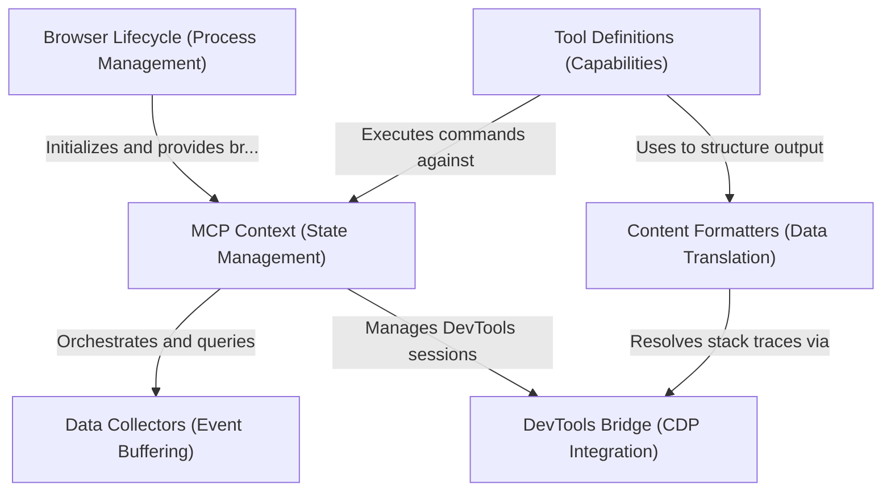

# Tutorial: chrome-devtools-mcp

This project serves as a **Model Context Protocol (MCP) server** that bridges the gap between an AI model and a **Chrome browser**. It allows the AI to act as a developer by *inspecting* the page's accessibility tree, *controlling* browser actions (clicking, typing), and *analyzing* technical details like network traffic, console logs, and performance traces via **Chrome DevTools** integration.

**Source Repository:** [https://github.com/ChromeDevTools/chrome-devtools-mcp](https://github.com/ChromeDevTools/chrome-devtools-mcp)

## Chapters

1. [Browser Lifecycle (Process Management)](01_browser_lifecycle__process_management_.md)
2. [MCP Context (State Management)](02_mcp_context__state_management_.md)
3. [Tool Definitions (Capabilities)](03_tool_definitions__capabilities_.md)
4. [Data Collectors (Event Buffering)](04_data_collectors__event_buffering_.md)
5. [Content Formatters (Data Translation)](05_content_formatters__data_translation_.md)
6. [DevTools Bridge (CDP Integration)](06_devtools_bridge__cdp_integration_.md)

---

Generated by [Code IQ](https://github.com/adityasoni99/Code-IQ)