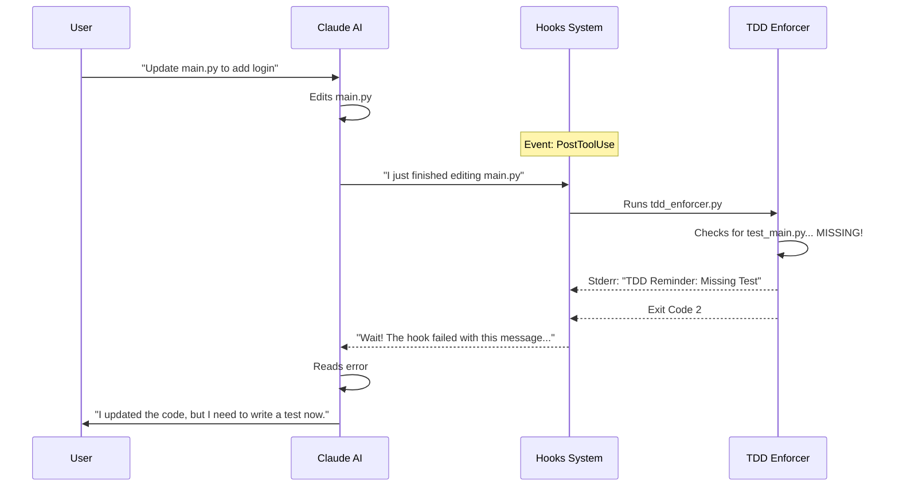

# Chapter 1: Lifecycle Hooks System

Welcome to the **Claude Pilot** project! This is the first chapter of our journey. Before we build complex agents, we need to understand how we control them.

## The Problem: Unsupervised AI

Imagine you hire a junior developer. They are fast and enthusiastic, but sometimes they:
1. Commit code without running tests.
2. Use a dangerous system command (like `rm -rf`) without asking.
3. Forget to format their code.

You wouldn't let them work without supervision. Similarly, **Claude Pilot** acts as a supervisor for the Claude Code CLI. It ensures that every action the AI takes adheres to your project's standards *automatically*.

## The Solution: The Hooks System

The **Lifecycle Hooks System** is the "nervous system" of Claude Pilot. It sits invisibly between you and the AI.

Think of it like a series of **security checkpoints** or **quality assurance gates**. When Claude tries to do something (like write a file or run a command), the system pauses and checks a list of rules defined in a configuration file.

### Key Concepts

1.  **Event**: *When* should the check happen? (e.g., `PreToolUse` is before an action, `PostToolUse` is after).
2.  **Matcher**: *Who* triggers the check? (e.g., specifically when Claude uses the `Bash` tool or `Write` tool).
3.  **Command**: *What* should we do? (Run a Python script to validate the action).

## Use Case: Enforcing TDD (Test-Driven Development)

Let's look at a concrete example used in this project: **The TDD Enforcer**.
We want to ensure that whenever Claude modifies code, it also writes a test for it. If it forgets, we want to remind it immediately.

### 1. The Configuration (`hooks.json`)

First, we tell Claude Pilot to listen for file changes. We add this to our configuration file.

```json
{
  "hooks": {
    "PostToolUse": [
      {
        "matcher": "Write|Edit",
        "hooks": [
          {
            "type": "command",
            "command": "python hooks/tdd_enforcer.py"
          }
        ]
      }
    ]
  }
}
```

**What this does:**
1.  **`PostToolUse`**: Wait until *after* Claude has successfully written or edited a file.
2.  **`matcher`**: Only trigger if the tool used was `Write` or `Edit`.
3.  **`command`**: Run our custom `tdd_enforcer.py` script.

### 2. The Script (`tdd_enforcer.py`)

Now, let's look at the script that runs. The script communicates with Claude Pilot using **Standard Input (stdin)** and **Exit Codes**.

#### Step A: Reading Data
Claude Pilot sends details about what just happened (the file path, the code written) via JSON into the script's input.

```python
import sys
import json

# Read the event data sent by Claude Pilot
try:
    hook_data = json.load(sys.stdin)
    tool_input = hook_data.get("tool_input", {})
    file_path = tool_input.get("file_path", "")
except:
    sys.exit(0) # Exit cleanly if data is bad
```

#### Step B: The Logic
We check if the file is code (e.g., `.py` or `.ts`) and if a corresponding test file exists.

```python
# Simplified logic check
def check_test_exists(file_path):
    # If editing a test, we are good!
    if "test" in file_path: 
        return True
        
    # Check if 'test_myfile.py' exists
    # (Implementation details skipped for brevity)
    return False 
```

#### Step C: The Decision (Exit Codes)
This is the most important part.
*   **Exit Code 0**: Everything is fine. Silent success.
*   **Exit Code 2**: Something is wrong. Send the error message back to Claude.

```python
if not check_test_exists(file_path):
    print("TDD Reminder: You modified code but no test exists.", file=sys.stderr)
    print("Please create a test file before continuing.", file=sys.stderr)
    
    # Exit 2 tells Claude: "Stop! Read the error above."
    sys.exit(2) 

# Exit 0 means: "Carry on."
sys.exit(0)
```

## How It Works Under the Hood

Let's visualize the flow when Claude tries to edit `main.py` without a test.



### Blocking Dangerous Tools (`PreToolUse`)

We can also block actions *before* they happen. In `pilot/hooks/tool_redirect.py`, we prevent Claude from using `WebSearch` because we want it to use a specific project tool instead.

```python
# From pilot/hooks/tool_redirect.py

def block_web_search():
    print("⛔ WebSearch is blocked.", file=sys.stderr)
    print("Please use the 'ToolSearch' alternative instead.", file=sys.stderr)
    return 2 # Exit code 2 blocks the action BEFORE it runs
```

In `hooks.json`, this is configured under `PreToolUse`. If the script returns exit code 2 here, the `WebSearch` tool never actually executes!

## Summary

The **Lifecycle Hooks System** is a powerful way to automate governance.

1.  **Configuration**: We define rules in `hooks.json`.
2.  **Scripts**: We write simple scripts that receive JSON input.
3.  **Control**: We use **Exit Code 0** to approve and **Exit Code 2** to complain/block.

By using this system, we don't have to manually check every line of code Claude writes. The system does it for us.

In the next chapter, we will learn about the **Worker Daemon**, which allows these hooks to perform complex background tasks without slowing Claude down.

[Next: Worker Daemon (Service Orchestrator)](02_worker_daemon__service_orchestrator_.md)

---

Generated by [Code IQ](https://github.com/adityasoni99/Code-IQ)