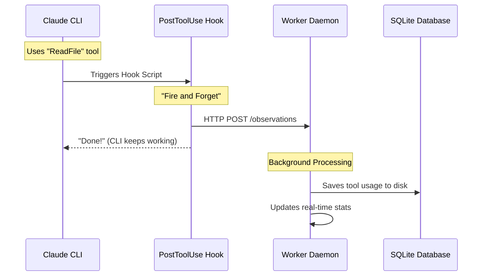

# Chapter 2: Worker Daemon (Service Orchestrator)

In the previous chapter, [Lifecycle Hooks System](01_lifecycle_hooks_system.md), we learned how to intercept Claude's actions using short scripts.

However, those scripts have a limitation: **they are short-lived.** They run for a split second and then vanish. If we want Claude to "remember" things long-term, or perform heavy tasks (like indexing a codebase) without freezing your terminal, we need something more permanent.

## The Problem: The Amnesiac CLI

Command Line Interfaces (CLIs) are usually **stateless**. When you close the terminal, the context is gone.

Imagine this scenario:
1. You ask Claude to refactor a file.
2. Claude finishes, and you close the terminal.
3. You open a new terminal. You want to see *exactly* what tools Claude used 10 minutes ago.
4. **Result:** You can't. The history is stuck in the text buffer of the old terminal.

## The Solution: The Worker Daemon

The **Worker Daemon** is the "brain" that never sleeps. It is a lightweight Node.js web server that runs in the background.

Think of it like **Ground Control** for an airplane:
*   **The Pilot (Claude)** flies the plane and makes quick decisions.
*   **Ground Control (Daemon)** records the flight path, manages the radar, and stores the black box data.

Even if the plane lands (the CLI closes), Ground Control still has all the data.

### Use Case: The "Black Box" Recorder

We want to build a system where **every tool Claude uses** (like reading a file or running a terminal command) is sent to a background database immediately.

This allows us to:
1.  Keep the CLI fast (we offload the saving logic).
2.  View the history later in a web browser.

## How It Works: The Architecture

Here is the flow of data when Claude uses a tool. notice how the **Worker Daemon** sits in the middle, coordinating everything.



## Step 1: The Server Entry Point

The Daemon is built on **Express.js**. Its job is to listen for requests from the hooks.

In `src/services/worker-service.ts`, the server starts up and prepares to receive data.

```typescript
// Simplified from src/services/worker-service.ts
async start(): Promise<void> {
  const port = getWorkerPort(); // Usually 3000 or 8080

  // 1. Start the HTTP Server
  await this.server.listen(port);
  logger.info("SYSTEM", "Worker started", { port });

  // 2. Initialize the Database
  await this.dbManager.initialize();
  
  // 3. Mark the system as ready for business
  this.coreReady = true; 
}
```

**What is happening?**
1.  **`server.listen`**: Opens the "ears" of the daemon. It waits for messages.
2.  **`dbManager`**: Connects to the SQLite database file on your hard drive.
3.  **`coreReady`**: A flag that tells the system "I am ready to accept memories."

## Step 2: The API Route

When a hook sends data, it hits an "Endpoint" (a specific URL). Let's look at how the Daemon handles an "Observation" (Claude using a tool).

This is defined in `src/services/worker/http/routes/SessionRoutes.ts`.

```typescript
// Simplified from SessionRoutes.ts
private handleObservations = (req: Request, res: Response) => {
    const { tool_name, tool_input, tool_response } = req.body;
    const sessionDbId = req.params.sessionDbId;

    // 1. Add the work to a queue (don't block!)
    this.sessionManager.queueObservation(sessionDbId, {
      tool_name,
      tool_input,
      tool_response,
    });

    // 2. Respond immediately so the Hook finishes fast
    res.json({ status: "queued" });
};
```

**Why do we queue?**
If the database is busy, we don't want Claude to freeze. The Daemon says "Got it!" immediately (`res.json`), and then saves the data to the database a few milliseconds later in the background.

## Step 3: Sending Data from the Hook

Now, let's look at the other side. How does the **Hook** talk to the **Daemon**?
This happens in the script `src/cli/handlers/observation.ts`.

```typescript
// Simplified from src/cli/handlers/observation.ts
export const observationHandler = {
  async execute(input) {
    // 1. Get the data from Claude
    const { sessionId, toolName, toolInput } = input;

    // 2. Send it to the Daemon
    await fetch(`${workerUrl}/api/sessions/observations`, {
      method: "POST",
      body: JSON.stringify({
        contentSessionId: sessionId,
        tool_name: toolName,
        tool_input: toolInput,
      }),
    });

    // 3. Finish silently
    return { continue: true, suppressOutput: true };
  },
};
```

**The Connection:**
This hook runs *inside* the CLI process. It takes the data and "throws" it over the wall to the Daemon process using `fetch`.

## Orchestration: Keeping It Alive

The Daemon isn't just a passive listener; it is an **Orchestrator**. It manages the lifecycle of the entire system.

1.  **Startup**: When you run `pilot start`, it spawns the Daemon in the background.
2.  **Health Check**: The CLI checks if the Daemon is alive before every command.
3.  **Shutdown**: When you run `pilot stop`, it ensures the database is closed safely so no data is corrupted.

### The "Pulse" of the System

The Daemon also broadcasts events. If you have a web browser open (the Console Viewer), the Daemon sends updates in real-time.

```typescript
// From src/services/worker-service.ts
broadcastProcessingStatus(): void {
  // Check how many items are in the queue
  const queueDepth = this.sessionManager.getTotalActiveWork();

  // Tell all connected clients (the frontend)
  this.sseBroadcaster.broadcast({
    type: "processing_status",
    queueDepth,
  });
}
```

## Summary

The **Worker Daemon** transforms `claude-pilot` from a simple script into a robust platform.

1.  **Persistence**: It keeps your session history safe in a database.
2.  **Performance**: It handles heavy lifting in the background using queues.
3.  **Connectivity**: It acts as the bridge between the CLI and the outside world.

Now that our Daemon is running and collecting data, we need a way to **see** it. Reading raw database files is hard. In the next chapter, we will build the visual interface.

[Next: Pilot Console Viewer (Frontend)](03_pilot_console_viewer__frontend_.md)

---

Generated by [Code IQ](https://github.com/adityasoni99/Code-IQ)