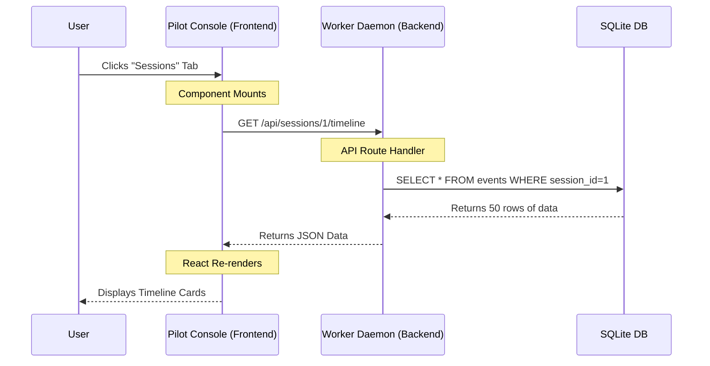

# Chapter 3: Pilot Console Viewer (Frontend)

In the previous chapter, [Worker Daemon (Service Orchestrator)](02_worker_daemon__service_orchestrator_.md), we built a "Ghost in the Machine." We created a background service that silently records everything Claude does into a database.

But a database full of raw text is hard to read. If you want to know "What did Claude do while I was getting coffee?", you don't want to run SQL queries. You want a visual dashboard.

## The Problem: Flying Blind

Command-line interfaces (CLIs) are great for speed, but terrible for **situational awareness**.
1.  **Scroll Fatigue:** To see what happened 5 minutes ago, you have to scroll up thousands of lines.
2.  **No Persistence:** Once you close the terminal window, that visual history is gone forever.
3.  **Hidden State:** You can't easily see which "Skills" or "Rules" are currently active just by looking at the flashing cursor.

## The Solution: The Pilot Console

The **Pilot Console** is a React-based web application that serves as your "Flight Deck." It connects to the Worker Daemon via HTTP to visualize the data in real-time.

It allows you to:
1.  **Replay Sessions:** View a timeline of every prompt and tool usage.
2.  **Inspect State:** See exactly what files Claude modified.
3.  **Manage Skills:** View the "Vault" of shared commands and rules.

### Use Case: The "Flight Recorder"

Imagine Claude makes a mistake and deletes a file it shouldn't have.
*   **Without Console:** You scroll up frantically, trying to find the `rm` command in a wall of text.
*   **With Console:** You open `localhost:3000`, click "Sessions," and see a clean timeline. You spot the red "observation" icon where the deletion happened and see exactly why Claude did it.

## Key Concept 1: The App Structure

The Console is a Single Page Application (SPA). The entry point is `App.tsx`. It acts as a traffic cop, deciding which "View" to show you based on the URL.

It uses a **Router** to map URLs to components.

```tsx
// Simplified from console/src/ui/viewer/App.tsx
export function App() {
  const { path } = useRouter(); // Get current URL

  // Decide what to render based on the path
  return (
    <DashboardLayout>
       {/* If path is '/', show Dashboard */}
       {path === '/' && <DashboardView />}
       
       {/* If path is '/sessions', show Timeline */}
       {path === '/sessions' && <SessionsView />}
       
       {/* If path is '/vault', show Skills */}
       {path === '/vault' && <VaultView />}
    </DashboardLayout>
  );
}
```

**How it helps:** This structure keeps the application organized. Each "page" (Dashboard, Sessions, Vault) is its own isolated component.

## Key Concept 2: Visualizing the Timeline

The most important view is the **Session Timeline**. This turns raw database rows into a readable conversation history.

It needs to distinguish between two things:
1.  **Prompts:** What *you* said (User Input).
2.  **Observations:** What *Claude* did (Tool Usage).

### Fetching the Data

The React component asks the Worker Daemon for data using `fetch`.

```tsx
// Simplified from SessionTimeline.tsx
useEffect(() => {
  async function fetchTimeline() {
    // 1. Call the Daemon's API
    const response = await fetch(`/api/sessions/${sessionId}/timeline`);
    
    // 2. Convert JSON to JavaScript Object
    const result = await response.json();
    
    // 3. Save to state so React can draw it
    setData(result);
  }
  
  fetchTimeline();
}, [sessionId]);
```

**Explanation:**
*   **`fetch`**: The browser sends a GET request to the Daemon running on your machine.
*   **`setData`**: When data arrives, React detects the change and updates the screen automatically.

### Rendering the List

Once we have the data, we loop through it to create the visual cards.

```tsx
// Simplified from SessionTimeline.tsx
{data.timeline.map((item) => (
  <div key={item.id} className="timeline-item">
  
    {/* Show a different icon based on type */}
    <Icon name={item.type === 'prompt' ? 'message' : 'brain'} />
    
    {/* Show the content */}
    <div className="content">
      <p>{item.data.title || "Untitled Action"}</p>
      <span className="timestamp">{formatTime(item.timestamp)}</span>
    </div>
    
  </div>
))}
```

**Explanation:**
*   **`map`**: This loops over every event in the history.
*   **Conditionals**: We check `item.type`. If it's a "prompt", we might show a chat bubble icon. If it's an "observation" (tool use), we show a brain icon.

## Key Concept 3: The Vault View

The **Vault** is where `claude-pilot` manages shared knowledge (commands, rules, and skills). The Frontend provides a UI to see what is installed.

In `Vault/index.tsx`, we handle the "Sync" button. This tells the Daemon to pull the latest skills from the internet (e.g., from a Git repository).

```tsx
// Simplified from Vault/index.tsx
function VaultSyncButton({ isInstalling, onInstall }) {
  return (
    <button 
      className="btn btn-primary"
      disabled={isInstalling} // Disable if busy
      onClick={onInstall}     // Trigger the sync
    >
      {isInstalling ? "Syncing..." : "Sync All"}
    </button>
  );
}
```

When you click this, it triggers a function that calls the API endpoint `/api/vault/sync`. The Daemon does the heavy lifting (git pull, npm install), and the UI simply spins a loading wheel until it finishes.

## Internal Implementation: The Data Flow

Let's visualize exactly what happens when you open the "Sessions" page in your browser.



1.  **Request**: The Frontend acts as the requester. It knows *what* it wants to show, but doesn't have the data.
2.  **Processing**: The Worker Daemon (from Chapter 2) receives the request. It acts as the "Server."
3.  **Retrieval**: The Daemon queries the permanent storage (SQLite).
4.  **Display**: The Frontend receives the raw data and makes it look pretty (colors, icons, formatting).

## Summary

The **Pilot Console Viewer** is the "face" of the operation.

1.  It is a **React Application**.
2.  It uses **API Routes** to talk to the Worker Daemon.
3.  It transforms raw logs into a **Timeline Visualization**.
4.  It provides controls to manage the **Vault**.

Now that we have a working brain (Daemon) and a face (Console), we need to give Claude a "Memory." Just recording logs isn't enough; Claude needs to be able to *search* through code to understand context.

In the next chapter, we will build the search engine for Claude's memory.

[Next: Vector Memory Sync (Semantic Search)](04_vector_memory_sync__semantic_search_.md)

---

Generated by [Code IQ](https://github.com/adityasoni99/Code-IQ)