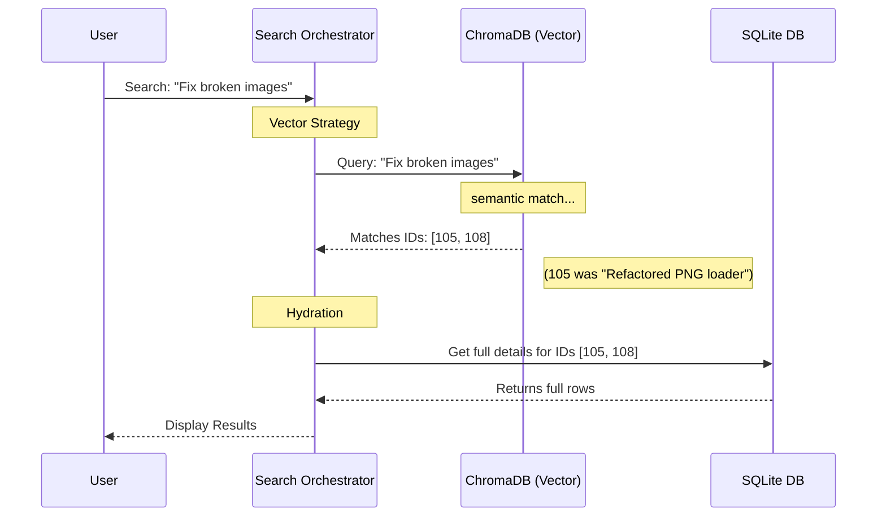

# Chapter 4: Vector Memory Sync (Semantic Search)

In the previous chapter, [Pilot Console Viewer (Frontend)](03_pilot_console_viewer__frontend_.md), we built a beautiful dashboard to see our project history. We can scroll through timelines and see logs.

However, scrolling isn't enough. As your project grows to thousands of events, you need to **search**. But standard search engines have a major flaw: they are too literal.

## The Problem: The "Exact Match" Trap

Imagine you ran into a bug last week regarding "User Authentication." Today, you want to find how you fixed it, but you don't remember the exact words.

1.  **You search:** "Login bug"
2.  **Database:** Scans for the word "Login".
3.  **Result:** **0 matches found.** (Because the log actually said "Auth failure").

This is **Keyword Search**. It's rigid. If you don't guess the exact word, you find nothing.

## The Solution: The "Fuzzy" Librarian

We need a system that understands **meaning**, not just spelling.

**Vector Memory Sync** is a service that runs alongside our SQLite database. It replicates our data into **ChromaDB**, a specialized "Vector Database."

Think of ChromaDB as a **Librarian**:
*   **SQL Database:** Organizes books by exact Title and ISBN.
*   **Vector Database (Librarian):** Organizes books by *theme*. If you ask for "scary stories," it points you to "Dracula" even though the word "scary" isn't in the title.

### Use Case: Finding the "Idea"

With this system, the scenario changes:

1.  **You search:** "Login bug"
2.  **Vector DB:** Converts "Login bug" into mathematical concepts: `{authentication, error, sign-in, issue}`.
3.  **Result:** It finds the log entry "Auth failure" because the *concept* matches.

## Key Concept 1: The Sync Service (`ChromaSync`)

The heart of this system is the `ChromaSync` class. Its job is to watch for new items in SQLite and copy them to ChromaDB.

It doesn't just copy text; it breaks it down into "Semantic Documents."

### How it breaks down data
When Claude makes an observation (like reading a file), we split that event into smaller pieces so they are easier to search.

```typescript
// Simplified from console/src/services/sync/ChromaSync.ts

// 1. We create a list of "documents" from one observation
const documents = [];

// 2. Add the main narrative (what happened)
documents.push({
  id: `obs_${id}_narrative`,
  document: obs.narrative, // e.g., "I read the auth controller."
  metadata: { type: "narrative", project: "my-app" }
});

// 3. Add the code snippets or facts separately
documents.push({
  id: `obs_${id}_fact_1`,
  document: obs.facts[0], 
  metadata: { type: "fact" }
});
```

**Explanation:**
By splitting the "Narrative" from the "Facts," we allow the search engine to be more precise. If you search for a code snippet, it matches the *fact*. If you search for an intent, it matches the *narrative*.

## Key Concept 2: The Orchestrator (`SearchOrchestrator`)

Now that we have two databases (SQLite for storage, ChromaDB for searching), we need a manager to decide which one to use. This is the **Search Orchestrator**.

It uses a "Fall-back" strategy. It tries to be smart first, but if the smart brain is offline, it falls back to the reliable one.

```typescript
// Simplified from console/src/services/worker/search/SearchOrchestrator.ts

async executeWithFallback(options) {
  // 1. Try the Vector Search (Smart) first
  if (this.vectorStrategy) {
    try {
      return await this.vectorStrategy.search(options);
    } catch (err) {
      console.log("Vector search failed, switching to backup...");
    }
  }

  // 2. If that fails (or isn't set up), use SQLite (Simple)
  return await this.sqliteStrategy.search(options);
}
```

**Why do this?**
Vector databases can be heavy or complex to install. If ChromaDB isn't running on your machine, `claude-pilot` shouldn't crash. It should just downgrade gracefully to standard keyword search.

## Internal Implementation: The Data Flow

Let's visualize how a user's vaguely worded question gets translated into a concrete result.



1.  **User Query:** The user enters a concept.
2.  **Vector Match:** Chroma returns a list of **IDs** (e.g., Observation #105) that match the concept. It does not return the full data, just the IDs and a "Distance" score (how close the match is).
3.  **Hydration:** The Orchestrator takes those IDs and asks SQLite for the full record (timestamps, file paths, full text) to display to the user.

## Deep Dive: Smart Backfill

One challenge with adding a new database is: **"What about my old data?"**
If you have been using `claude-pilot` for months and just turned on Semantic Search today, ChromaDB would be empty.

To solve this, `ChromaSync` runs a **Backfill** process on startup.

```typescript
// Simplified from console/src/services/sync/ChromaSync.ts

async ensureBackfilled() {
  // 1. Ask Chroma: "What IDs do you already have?"
  const existingIds = await this.getExistingChromaIds();

  // 2. Ask SQLite: "Give me everything EXCEPT those IDs"
  const missingData = db.getObservationsExcluding(existingIds);

  // 3. Upload the missing pieces in batches
  for (const batch of missingData) {
    await this.addDocuments(batch);
  }
}
```

**How it works:**
1.  **Efficiency:** It doesn't re-upload everything every time. It calculates the "Diff" (difference) between the two databases.
2.  **Batches:** It sends data in chunks (e.g., 100 items at a time) so it doesn't freeze your computer.

## Summary

The **Vector Memory Sync** system gives Claude Pilot "Intuition."

1.  **ChromaSync:** Automatically copies and indexes your history in the background.
2.  **Semantic Search:** Allows you to find items by concept, not just keyword.
3.  **Resilience:** The Orchestrator ensures that if the advanced search fails, the system keeps working using standard tools.

Now that we can *find* relevant history, we need to assemble it into a format Claude can actually understand during a conversation. We need to take these search results and rebuild the "Mental State" of a previous session.

In the next chapter, we will learn about the **Context Reconstruction Engine**.

[Next: Context Reconstruction Engine](05_context_reconstruction_engine.md)

---

Generated by [Code IQ](https://github.com/adityasoni99/Code-IQ)