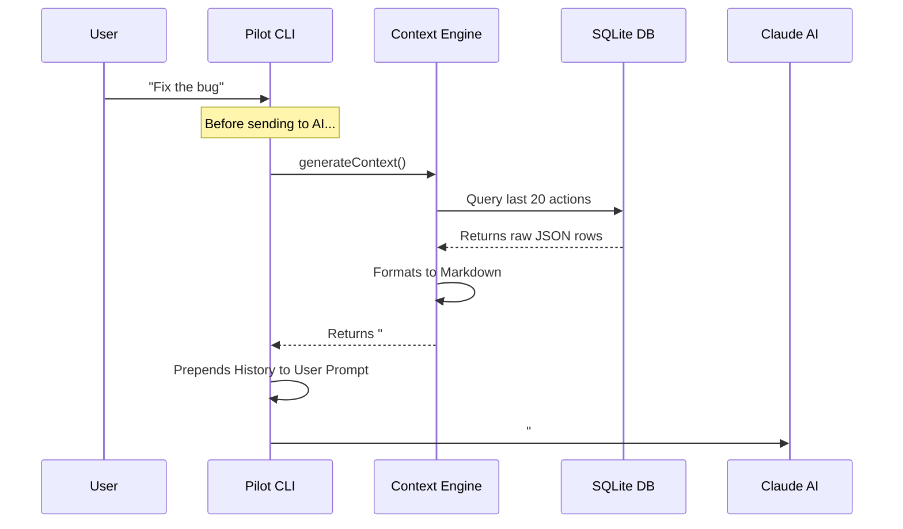

# Chapter 5: Context Reconstruction Engine

In the previous chapter, [Vector Memory Sync (Semantic Search)](04_vector_memory_sync__semantic_search_.md), we gave Claude the ability to search for "concepts" in a massive pile of data.

But finding the data is only half the battle. Imagine you find 500 relevant documents. You cannot paste all of them into the chat window because LLMs (Large Language Models) have a limit on how much text they can read at once (the **Context Window**).

We need a way to take that mountain of data and condense it into a concise, highly relevant "Briefing Packet" for Claude.

## The Problem: The "Goldfish" Memory

By default, an LLM is stateless. Every time you send a message, you have to resend the entire history of the conversation so it knows what you are talking about.

If your project history is huge, you face two problems:
1.  **Cost:** You pay per "token" (word part). Sending 1 million tokens per message is expensive.
2.  **Capacity:** If you exceed the model's limit, it simply crashes or forgets the beginning of the conversation.

## The Solution: The Context Reconstruction Engine

The **Context Reconstruction Engine** acts like an executive assistant. Before you send your message to Claude, this engine runs a quick process:

1.  **Queries** the database for the most important recent events.
2.  **Summarizes** older events to save space.
3.  **Formats** everything into a clean Markdown structure.
4.  **Injects** this "Briefing" silently into the top of your prompt.

### Use Case: "Where did we leave off?"

Imagine you worked on `auth.ts` on Monday. On Friday, you open a new terminal and type:
> "Finish the TODOs in the auth file."

Without this engine, Claude would ask: *"Which auth file? What TODOs?"*

**With this engine:**
1.  The Engine sees you are in the project folder.
2.  It looks up the last 5 sessions.
3.  It finds a summary saying: *"Monday: User started refactoring auth.ts but left 2 TODOs."*
4.  It constructs a prompt that tells Claude this context *before* your question is even asked.

## Key Concept: The Token Budget

Think of the prompt as a **Suitcase** with a weight limit. We need to pack the most valuable items first.

The Engine uses a "Token Budget" strategy:
1.  **Must-Haves:** The current file you are editing.
2.  **High Priority:** The last 5 minutes of tool usage (Observations).
3.  **Medium Priority:** Summaries of previous sessions.
4.  **Low Priority:** Old logs (discarded if the suitcase is full).

## Internal Implementation: The Assembly Line

Let's look at how the sausage is made. The main logic resides in `src/services/context/ContextBuilder.ts`.

It functions like an assembly line, building the text string piece by piece.

### Step 1: The Setup (`generateContext`)

This is the entry point. It connects to the database we built in Chapter 2.

```typescript
// From src/services/context/ContextBuilder.ts
export async function generateContext(input, useColors): Promise<string> {
  // 1. Load configuration (how many items to fetch?)
  const config = loadContextConfig();
  
  // 2. Connect to the SQLite database
  const db = initializeDatabase();
  if (!db) return "";

  // 3. Start the build process
  // ... (continues below)
}
```

**What is happening?**
We load a config file (which defines our "Suitcase size") and open a connection to the SQLite file where our memories are stored.

### Step 2: Gathering Raw Materials

Next, we need to fetch the data. We don't just grab *everything*. We use specific queries to get the right mix of "Observations" (detailed actions) and "Summaries" (high-level recaps).

```typescript
// Inside generateContext...

// Query detailed actions (e.g., "Read file X", "Ran test Y")
const observations = queryObservations(db, project, config);

// Query high-level summaries (e.g., "Session 4: Fixed login bug")
const summaries = querySummaries(db, project, config);

// If we have nothing, return an empty string
if (observations.length === 0 && summaries.length === 0) {
  return renderEmptyState(project, useColors);
}
```

**Explanation:**
The `queryObservations` function (in `ObservationCompiler.ts`) executes a SQL query that sorts by time and limits the results based on our config (e.g., "Last 50 items").

### Step 3: Assembling the Output

Now we have the raw data arrays. We need to turn them into a single string formatted as Markdown. This happens in `buildContextOutput`.

```typescript
// From src/services/context/ContextBuilder.ts
function buildContextOutput(project, observations, summaries, config) {
  const output: string[] = [];

  // 1. Calculate how much "room" we have left
  const economics = calculateTokenEconomics(observations);

  // 2. Add the Header (Project Name, Stats)
  output.push(...renderHeader(project, economics, config));

  // 3. Add the Timeline (The list of actions)
  const timeline = buildTimeline(observations, summaries);
  output.push(...renderTimeline(timeline, config));

  return output.join("\n");
}
```

**Explanation:**
*   **`calculateTokenEconomics`**: Adds up the size of the text to ensure we are safe.
*   **`renderHeader`**: Creates a pretty title block.
*   **`renderTimeline`**: Loops through the data and creates the Markdown list items.

## Deep Dive: The Observation Compiler

The heavy lifting of sorting the data happens in `src/services/context/ObservationCompiler.ts`.

It has to merge two different types of time:
1.  **Observations:** Things that happened seconds ago.
2.  **Summaries:** Things that happened days ago.

It creates a unified "Timeline" so Claude sees a chronological story.

```typescript
// From src/services/context/ObservationCompiler.ts
export function buildTimeline(observations, summaries): TimelineItem[] {
  // 1. Combine both lists into one array
  const timeline: TimelineItem[] = [
    ...observations.map((obs) => ({ type: "observation", data: obs })),
    ...summaries.map((sum) => ({ type: "summary", data: sum })),
  ];

  // 2. Sort by timestamp (Oldest -> Newest)
  timeline.sort((a, b) => {
    return a.data.created_at_epoch - b.data.created_at_epoch;
  });

  return timeline;
}
```

**Why sort?**
LLMs read top-to-bottom. We want the story to flow linearly: *"First I planned the feature, then I wrote the code, then I ran the test."* If the order is mixed up, the AI gets confused.

## Visualizing the Data Flow

Here is how a simple request from you gets transformed into a rich prompt for Claude.



## The Output Format

What does the text actually look like? The engine produces a hidden block of text that looks something like this:

```markdown
# ✈️ PILOT CONTEXT: My-Web-App

## ⏱️ Recent Timeline
- [Observation] 10:00 AM: Read file `src/app.ts` (Tokens: 150)
- [Observation] 10:02 AM: Ran command `npm test` (Failed)
- [Summary]     Yesterday: Created the database schema.

## 🧠 Memory Bank
- Previous Session Goal: Refactor the API.
- Status: In Progress.
```

By injecting this *invisibly* into the prompt, Claude acts as if it has been sitting next to you for the last week, even though it just "woke up."

## Summary

The **Context Reconstruction Engine** is the storyteller of the system.

1.  **It Queries**: Fetches raw data from SQLite.
2.  **It Budgets**: Ensures we don't overflow the token limit.
3.  **It Formats**: Creates a structured Markdown history.

This system allows `claude-pilot` to maintain continuity across days or weeks of work.

However, remembering the past is not enough. We also need to plan for the future. In the next chapter, we will look at how to guide Claude using strict specifications (Specs) rather than just open-ended chat.

[Next: Spec-Driven Agent Workflow](06_spec_driven_agent_workflow.md)

---

Generated by [Code IQ](https://github.com/adityasoni99/Code-IQ)