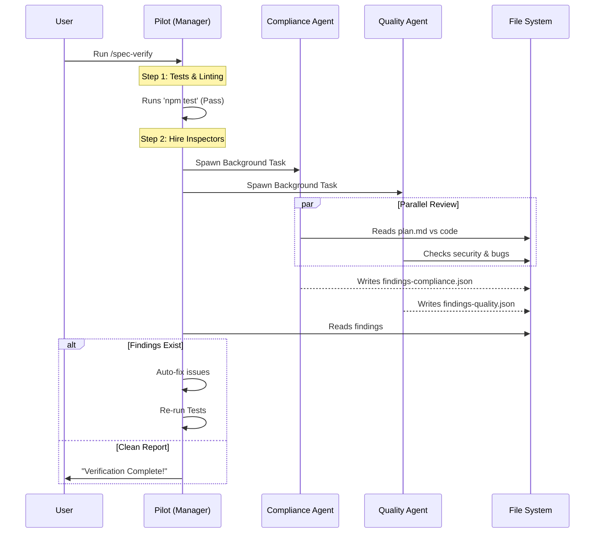

# Chapter 6: Spec-Driven Agent Workflow

In the previous chapter, [Context Reconstruction Engine](05_context_reconstruction_engine.md), we gave Claude a "Context Window" so it remembers the history of your project.

Now Claude has a Memory. But having a memory doesn't mean it has **discipline**.

## The Problem: The "Yes Man" Syndrome

Large Language Models (LLMs) are designed to be helpful. They are "people pleasers."
If you ask: *"Did you fix the bug?"*
Claude might say: *"Yes! I fixed it!"* because it *thinks* it did, or because it hallucinated a fix.

In professional software development, "I think I fixed it" isn't good enough. We need **proof**. We need rigorous testing, security checks, and code reviews before we accept a task as "Complete."

## The Solution: The Spec-Driven Workflow

The **Spec-Driven Agent Workflow** changes how you interact with `claude-pilot`. Instead of a casual chat, it enforces a strict **Standard Operating Procedure (SOP)**.

Think of it like a **Construction Site**:
1.  **The Architect (You)**: You draw the blueprints (The Spec).
2.  **The Builder (Claude)**: Tries to build the wall.
3.  **The City Inspector (Verifier Agent)**: Comes in, inspects the wall, and says, "This isn't up to code. Tear it down and do it again."

The Builder is not allowed to leave until the Inspector signs off.

### Use Case: The "Login" Feature

Imagine you want to add a Login page.
*   **Old Way:** You chat with Claude. It writes code. You paste it. It crashes. You paste the error back. Rinse and repeat.
*   **Spec-Driven Way:**
    1.  You write a `plan.md` file defining the Login feature.
    2.  Claude implements it.
    3.  **Automatically**, a second AI agent (The Inspector) wakes up, reviews the code, checks for security flaws, and forces Claude to fix them *before* telling you it's done.

## Key Concept 1: The Plan File (The Source of Truth)

Everything starts with a **Specification** (or "Spec"). This is a Markdown file that tracks the status of a feature.

```markdown
# Plan: Add User Login
Status: PENDING
Iterations: 1

## Tasks
- [ ] Create login.html
- [ ] Implement auth.ts
- [ ] Write tests
```

This file is sacred. The agents read this to know *exactly* what "Done" looks like.

## Key Concept 2: The Sub-Agents (The Inspectors)

In this workflow, the main Claude agent acts like a **Project Manager**. It hires **Sub-Agents** to do specific jobs.

We use two specific sub-agents during verification:

1.  **Compliance Reviewer**: "Did you build what the user asked for?" (Checks against the Plan).
2.  **Quality Reviewer**: "Is the code safe and clean?" (Checks against strict rules).

These agents run **in the background**. They don't chat with you; they audit the code and write reports.

## Key Concept 3: The "Must-Fix" Loop

If an Inspector finds an issue, it marks it as `must_fix`.

The workflow is a loop:
1.  **Implement**: Write Code.
2.  **Verify**: Run Inspectors.
3.  **Fail**: Inspectors find bugs. -> **Loop back to Step 1**.
4.  **Pass**: Inspectors give the green light. -> **Mark Plan as VERIFIED**.

## Internal Implementation: How It Works

Let's look at the choreography when you run the command `/spec-verify`.



### Step 1: The Manager Spawns Agents

The main agent (Pilot) uses the **Task Tool** to start the sub-agents. It creates them with `run_in_background=true` so they run in parallel.

This logic is defined in `pilot/commands/spec-verify.md`.

```python
# Pseudo-code representation of the prompt sent to Claude
Task(
  subagent_type="pilot:spec-reviewer-quality",
  run_in_background=true,
  prompt="""
    Read 'pilot/rules/standards-python.md'.
    Review the changed files.
    Write findings to 'findings-quality.json'.
  """
)
```

**Explanation:**
The `subagent_type` tells the system which "Persona" to load. The `spec-reviewer-quality` persona is trained to be mean—it looks for security holes and missing tests.

### Step 2: The Agent's Persona (`spec-reviewer-quality.md`)

How does the Quality Agent know what to look for? It has a specific system prompt defined in `pilot/agents/spec-reviewer-quality.md`.

```markdown
# Spec Reviewer - Quality
You verify code quality, security, and testing.

## Severity Levels
- **must_fix**: Security vulnerabilities, crashes, missing tests.
- **should_fix**: Performance issues, poor error handling.

## Output Format
You MUST write a JSON file containing your findings.
```

By forcing the output to be **JSON**, the Main Agent can easily read it and understand exactly what needs to be fixed.

### Step 3: The Rules (`standards-python.md`)

The agent doesn't guess what "Good Code" is. It reads a rule file. For example, `pilot/rules/standards-python.md`:

```markdown
## Python Standards

- MANDATORY: Use `uv` for package management.
- Unit tests MUST mock all external calls.
- No shell injection vulnerabilities.
```

If the agent sees `pip install` instead of `uv pip install`, it flags a **must_fix** issue immediately.

### Step 4: The Findings Report

After the sub-agent finishes, it produces a file like this:

```json
{
  "pass_summary": "Code logic is good, but security is loose.",
  "issues": [
    {
      "severity": "must_fix",
      "category": "security",
      "title": "Hardcoded Password",
      "file": "src/auth.py",
      "line": 42
    }
  ]
}
```

The Main Agent reads this file, sees the "must_fix," and automatically starts editing `src/auth.py` to remove the password. It doesn't even ask you. It just fixes it.

## Why This Matters

This workflow shifts the burden of quality assurance from **You** to the **System**.

1.  **Consistency**: Humans forget to check for SQL injection. The `spec-reviewer-quality` agent never forgets (because it's in the prompt).
2.  **Speed**: Reviews happen in the background while the main agent runs tests.
3.  **Trust**: When Pilot says "Verified," you know it actually passed a rigorous checklist, not just a vibe check.

## Summary

The **Spec-Driven Agent Workflow** transforms `claude-pilot` from a coding assistant into a coding **team**.

1.  **Plan Files** define the goal.
2.  **The Manager** orchestrates the work.
3.  **Sub-Agents** verify the work against strict Rules.
4.  **Feedback Loops** ensure nothing is marked done until it is actually correct.

We have now covered the entire software stack of Claude Pilot: The Hooks, The Daemon, The Frontend, The Memory, The Context Engine, and The Workflow.

The only thing left is: **How do we get this onto a user's computer?**

In the final chapter, we will look at the **Installer Framework** that packages all this complexity into a single command.

[Next: Installer Framework](07_installer_framework.md)

---

Generated by [Code IQ](https://github.com/adityasoni99/Code-IQ)