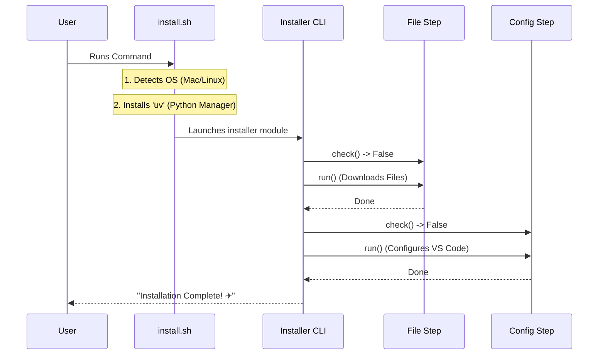

# Chapter 7: Installer Framework

In the previous chapter, [Spec-Driven Agent Workflow](06_spec_driven_agent_workflow.md), we completed the logic of our AI pilot. We have agents, databases, hooks, and a frontend.

But right now, this amazing system only exists on **your** computer. If you wanted to give it to a friend, they would need to manually install Node.js, Python, SQLite, set up environment variables, and run five different setup commands. They would likely give up before they even started.

We need a way to package this complexity into a single, simple command.

## The Problem: "It Works on My Machine"

Software installation is messy. Every user's computer is different:
1.  **OS Differences**: Mac uses different commands than Linux.
2.  **Missing Tools**: The user might not have Python installed.
3.  **Conflict**: The user might have an old, incompatible version of Node.js.

If we don't handle these problems automatically, the user has to become a system administrator just to try our tool.

## The Solution: The Installer Framework

The **Installer Framework** is a robust automation engine designed to bootstrap the `claude-pilot` environment.

It follows the **"Battery Included"** philosophy. The user runs one command, and the installer handles:
1.  Downloading the correct binaries for their OS.
2.  Setting up a contained Python environment (so we don't break their system).
3.  Configuring VS Code extensions and settings automatically.

### Use Case: The One-Line Install

We want the user experience to be exactly this simple:

```bash
curl -L https://claude-pilot.com/install.sh | bash
```

Behind that simple line of code, our framework performs a complex ballet of checks and configurations.

## Key Concept 1: The "Step" Pattern

To manage complexity, we don't write one giant script. We break the installation into **Steps**.

Each step is a self-contained unit of work. It knows how to do exactly one thing, like "Check Prerequisites" or "Download Config Files."

### The Step Interface

Every step follows a standard blueprint. It has two main methods: `check()` (Am I already done?) and `run()` (Do the work).

```python
# Simplified Concept of a Step
class BaseStep:
    name = "example_step"

    def check(self, context):
        # Return True if this step is already finished
        return False

    def run(self, context):
        # The logic to perform the installation
        pass
```

**Why this is good:**
If the installation fails halfway through (e.g., internet goes down), the user can run it again. The `check()` method ensures we skip the parts that were already successful. This property is called **Idempotency**.

## Key Concept 2: The Bootstrap Script (`install.sh`)

Before we can run Python code, we need... Python. But we can't assume the user has it.

The entry point is a **Shell Script**. Its only job is to get a minimal environment running so the "real" installer (written in Python) can take over.

### Detecting the Platform

First, the script figures out what machine it is running on.

```bash
# Simplified from install.sh
get_platform_suffix() {
    case "$(uname -s)" in
        Linux) echo "linux" ;;
        Darwin) echo "darwin" ;; # Darwin is macOS
        *) exit 1 ;;
    esac
}
```

**Explanation:**
The script asks the Operating System "Who are you?" (`uname -s`). If it's a Mac, it prepares to download the Mac version of our tools.

### The "uv" Package Manager

We use a tool called `uv` to manage Python. It is extremely fast and self-contained. The shell script installs `uv` automatically.

```bash
# Simplified from install.sh
install_uv() {
    echo "Installing uv..."
    curl -LsSf https://astral.sh/uv/install.sh | sh
    
    # Verify it worked
    if ! command -v uv; then
        echo "Failed to install uv"
        exit 1
    fi
}
```

**Explanation:**
By downloading `uv` first, we guarantee that we have a working Python environment without forcing the user to install Python globally.

## Key Concept 3: The Python CLI (`installer/cli.py`)

Once `install.sh` finishes setting up the basics, it hands control over to the Python application. This is where the complex logic lives.

The CLI acts as the **Orchestrator**. It holds the list of steps and runs them in order.

```python
# Simplified from installer/cli.py
def get_all_steps():
    return [
        PrerequisitesStep(),    # Do you have git?
        ClaudeFilesStep(),      # Download the pilot code
        DependenciesStep(),     # Install npm packages
        VSCodeExtensionsStep(), # Setup the editor
        FinalizeStep(),         # Print "Success!"
    ]
```

**How it works:**
The installer loops through this list. For each step, it checks if it needs to run, displays a spinner to the user, and handles any errors gracefully.

## Internal Implementation: The Orchestration Flow

Let's visualize what happens when you paste that `curl` command into your terminal.



## Deep Dive: Managing User Configs

One of the hardest parts of an installer is **Updates**.
If a user has customized their `settings.json`, we must not overwrite it when they upgrade to a new version of Claude Pilot.

We handle this in `ClaudeFilesStep.py` using a **Merge Strategy**.

### The Three-Way Merge

We don't just copy files blindly. We compare three things:
1.  **Baseline:** What the settings looked like when we installed them last time.
2.  **Current:** What the settings look like now (User might have changed them).
3.  **Incoming:** What the new version's settings look like.

```python
# Simplified from installer/steps/claude_files.py

def _install_settings(self, dest_path, incoming_settings):
    # 1. Load current user settings
    current = json.loads(dest_path.read_text())
    
    # 2. Merge intelligently
    # If user changed a value, keep user's value.
    # If we added a NEW value, add it.
    merged = merge_settings(current, incoming_settings)

    # 3. Save the result
    dest_path.write_text(json.dumps(merged))
```

**Why this matters:**
This respects the user. If they changed their theme or API key, the installer preserves it, while still adding new configuration options required for the update.

## Summary

The **Installer Framework** is the bridge between your code and the user's reality.

1.  **Shell Script (`install.sh`)**: The "Bootloader" that prepares the system.
2.  **Step Pattern**: Breaks complex logic into small, safe, idempotent units.
3.  **Orchestrator (`cli.py`)**: Runs the show and provides the user interface.
4.  **Smart Merging**: updates the software without deleting user data.

### Conclusion

Congratulations! You have reached the end of the **Claude Pilot** tutorial series.

We have journeyed through the entire stack:
*   **Chapter 1:** We built **Lifecycle Hooks** to intercept AI actions.
*   **Chapter 2:** We created a **Worker Daemon** to remember history.
*   **Chapter 3:** We visualized that history with the **Pilot Console**.
*   **Chapter 4:** We added **Vector Search** to give the AI a long-term memory.
*   **Chapter 5:** We built a **Context Engine** to feed that memory back to the AI.
*   **Chapter 6:** We enforced discipline with **Spec-Driven Workflows**.
*   **Chapter 7:** We packaged it all up with an **Installer Framework**.

You now understand the architecture required to build a robust, production-grade agentic workflow. The next step is yours: take this framework, write your own hooks, create your own agents, and let Claude Pilot fly. ✈️

---

Generated by [Code IQ](https://github.com/adityasoni99/Code-IQ)