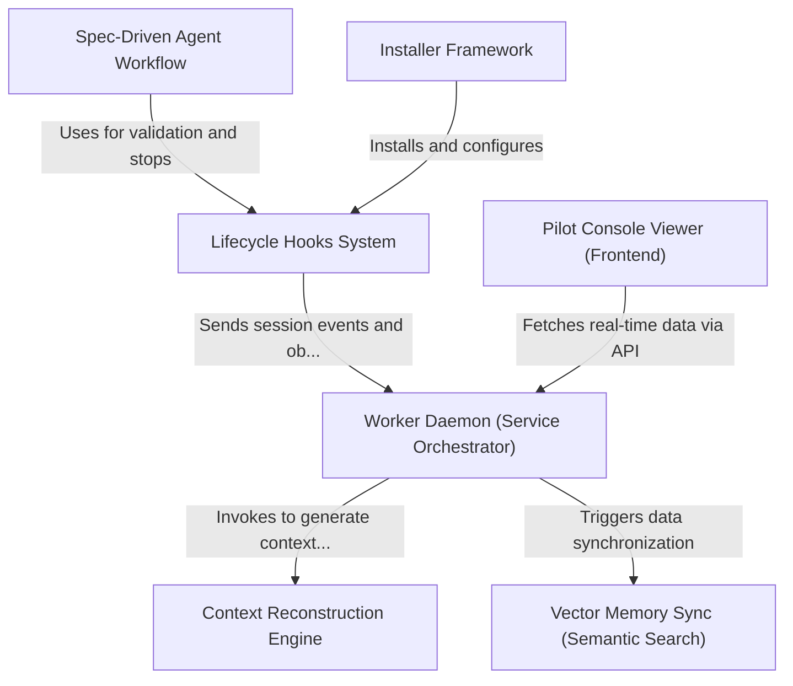

# Tutorial: claude-pilot

**Claude Pilot** is a comprehensive wrapper for the Claude Code CLI that transforms it into a persistent, memory-aware developer assistant. It uses a **Lifecycle Hooks System** to intercept CLI events and forward them to a background **Worker Daemon**, which maintains project state in a local database.

This system enables advanced features like *semantic memory retrieval* via vector databases, automated **Spec-Driven Workflows** for reliable TDD, and a visual **Pilot Console** to monitor the agent's reasoning process in real-time.

**Source Repository:** [https://github.com/maxritter/claude-pilot](https://github.com/maxritter/claude-pilot)

## Chapters

1. [Lifecycle Hooks System](01_lifecycle_hooks_system.md)
2. [Worker Daemon (Service Orchestrator)](02_worker_daemon__service_orchestrator_.md)
3. [Pilot Console Viewer (Frontend)](03_pilot_console_viewer__frontend_.md)
4. [Vector Memory Sync (Semantic Search)](04_vector_memory_sync__semantic_search_.md)
5. [Context Reconstruction Engine](05_context_reconstruction_engine.md)
6. [Spec-Driven Agent Workflow](06_spec_driven_agent_workflow.md)
7. [Installer Framework](07_installer_framework.md)

---

Generated by [Code IQ](https://github.com/adityasoni99/Code-IQ)