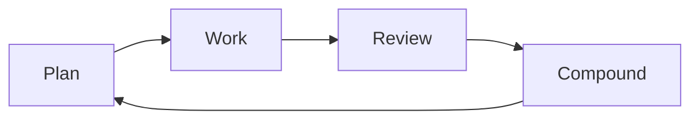
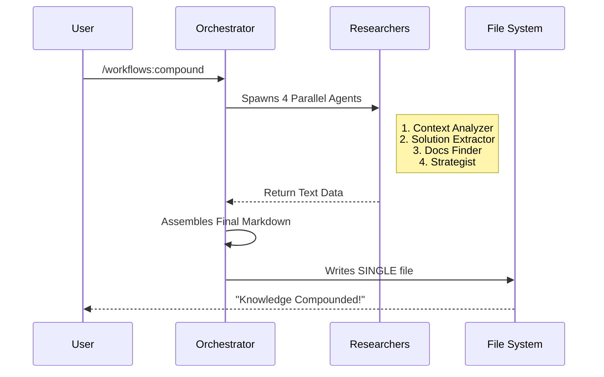

# Chapter 1: Compound Engineering Workflow

Welcome to the **Compound Engineering Plugin** tutorial! In this series, we will explore how to turn AI from a simple chat bot into a powerful, automated engineering partner.

We start with the most important concept: **The Compound Engineering Workflow**.

## The Problem: The "Linear" Trap

In traditional software development, work often feels linear. You fix a bug, close the ticket, and move on.
*   **Day 1:** You spend 4 hours debugging a tricky database issue.
*   **Day 90:** The issue returns. You forgot exactly how you fixed it, so you spend 4 hours debugging it again.

This is **Linear Engineering**. Your knowledge doesn't accumulate; it resets.

## The Solution: Compound Interest for Code

The **Compound Engineering Workflow** operates like compound interest in finance. Every time you solve a problem, you invest a small amount of effort (automated by AI) to document the solution perfectly.

When that problem—or a similar one—arises later, the AI solves it instantly using that "invested" knowledge.

### The 4-Step Cycle

Instead of just "Coding," this plugin enforces a cycle:



1.  **Plan:** The AI analyzes the task and checks past solutions.
2.  **Work:** The AI writes the code.
3.  **Review:** Specialized AI agents check the quality.
4.  **Compound:** The AI documents the solution so it never has to "think" about this specific problem from scratch again.

## Use Case: The "N+1" Query Bug

Let's look at a concrete example. You have a bug where your app is running too many database queries (an "N+1" error).

### Step 1: Solving the Problem
You use the standard workflow commands to fix it (we will cover these in later chapters).
*   You run `/workflows:plan` to analyze the error.
*   You run `/workflows:work` to apply the fix.

### Step 2: The "Compound" Moment
Once the code works, you don't just close the terminal. You run one final command:

```bash
/workflows:compound "Fixed N+1 query in the dashboard"
```

**What happens next?**
The AI doesn't just save a text file. It spins up a team of sub-agents to analyze *why* it broke, *how* it was fixed, and *how* to prevent it later. It creates a structured solution file in your project.

**The Result:**
Two weeks later, if you ask the AI to build a similar dashboard feature, it reads that file *first*. It warns you: *"I see we had N+1 issues here before; I will use `.includes(:users)` to prevent that."*

## How to Use It

The workflow is built around four specific commands.

### The Commands
| Command | Phase | Description |
| :--- | :--- | :--- |
| `/workflows:plan` | **Plan** | Creates a detailed plan, checking past learnings. |
| `/workflows:work` | **Work** | Executes the plan, modifying your code. |
| `/workflows:review` | **Review** | Runs AI agents to critique the code. |
| `/workflows:compound` | **Compound** | **The most important step.** Captures the knowledge. |

### Example: Running the Compound Command

Let's say you just finished fixing a bug. Here is how you use the abstraction:

```bash
# You just finished coding and verifying the fix.
# Now, capture the knowledge:

/workflows:compound
```

**Output:**
```text
✓ Context Analyzer: Identified performance_issue
✓ Solution Extractor: Captured the code fix
✓ Prevention Strategist: Suggested strict loading checks
✓ File created: docs/solutions/performance-issues/n-plus-one-dashboard.md
```

The system automatically detects what changed, categories it (e.g., "Performance Issue"), and writes a specialized guide for the future.

## Internal Implementation: Under the Hood

How does `/workflows:compound` actually work? It uses an **Agent Orchestration** pattern. It's not one AI working; it's a manager AI directing several worker AIs.

### Sequence of Events

When you run the command, an "Orchestrator" freezes the current state and delegates work to parallel sub-agents.



### Code Walkthrough

This workflow relies heavily on **Agent-Native Architecture**, which we will discuss in [Chapter 2](02_agent_native_architecture.md). Here is a simplified view of how the `compound` command is defined internally.

#### 1. The Command Definition
The command is defined using a YAML header. This tells the system how to interpret the user's input.

```markdown
---
name: workflows:compound
description: Document a recently solved problem
argument-hint: "[optional: brief context about the fix]"
---
# /compound
Coordinate subagents to document a solved problem.
```
*Explanation:* This registers `/workflows:compound` as a slash command in your environment.

#### 2. Phase 1: Parallel Research (The Prompt)
The Orchestrator is given a strict instruction to run sub-agents. Notice how it defines specific roles.

```xml
<parallel_tasks>
  Launch these subagents IN PARALLEL:

  1. **Context Analyzer**: Extracts conversation history & problem type.
  2. **Solution Extractor**: Identifies root cause & working code.
  3. **Prevention Strategist**: Develops strategies to avoid recurrence.
</parallel_tasks>
```
*Explanation:* This prompts the Large Language Model (LLM) to split its attention. Instead of generating one long stream of text, it simulates three distinct "experts" looking at your code.

#### 3. Phase 2: Assembly (The Execution)
The final step enforces a constraint: only the Orchestrator writes the file. This prevents the sub-agents from overwriting each other.

```xml
<sequential_tasks>
  1. Collect all text results from Phase 1.
  2. Validate YAML frontmatter against schema.
  3. Write the SINGLE final file: docs/solutions/[category]/[filename].md
</sequential_tasks>
```
*Explanation:* This ensures the output is consistent. The file is saved into a `docs/solutions/` folder, which acts as the "Long Term Memory" for the project.

## Summary

The **Compound Engineering Workflow** changes the goal of development. The goal isn't just to "finish the task," but to **finish the task and teach the system how to do it next time.**

*   **Plan:** Look at past data.
*   **Work:** Do the job.
*   **Review:** Check quality.
*   **Compound:** Save the specific solution to a knowledge base.

By using `/workflows:compound`, you are building a smarter engineering environment with every command you run.

In the next chapter, we will look at how the system actually understands these instructions using the **Agent-Native Architecture**.

[Next: Agent-Native Architecture](02_agent_native_architecture.md)

---

Generated by [Code IQ](https://github.com/adityasoni99/Code-IQ)