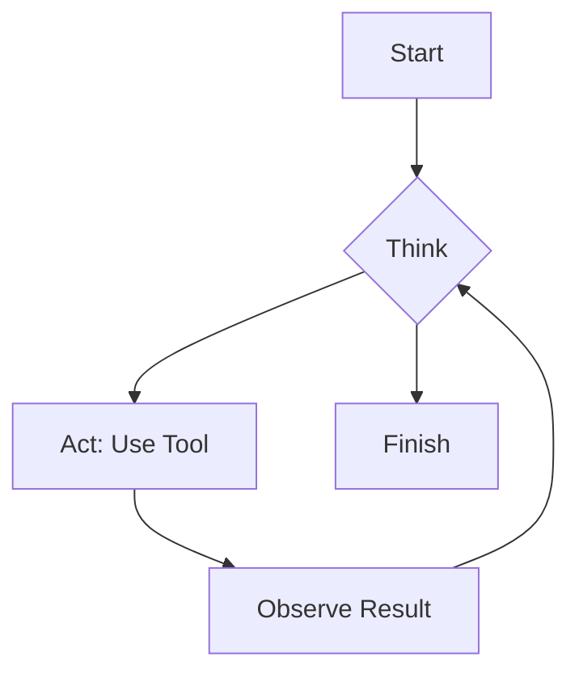
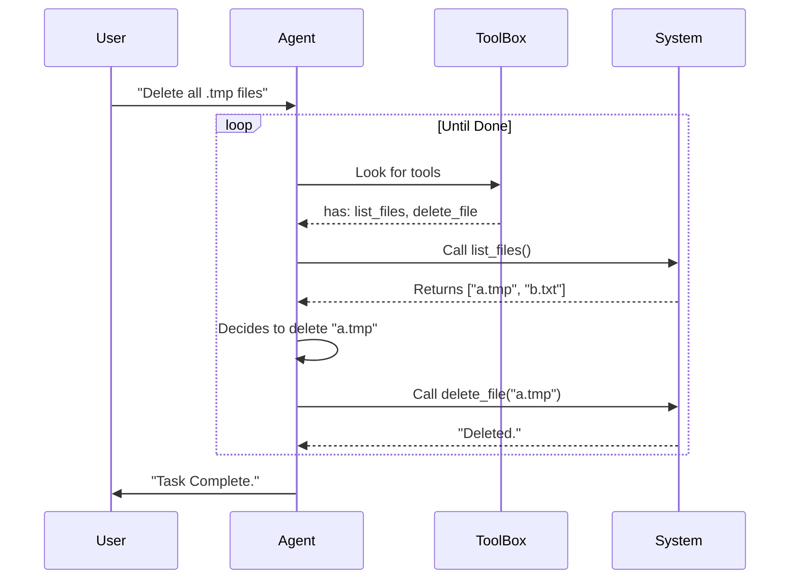

# Chapter 2: Agent-Native Architecture

In the previous chapter, [Compound Engineering Workflow](01_compound_engineering_workflow.md), we learned **what** to do: Plan, Work, Review, and Compound.

Now, we need to look at **how** to build software that lets AI do those things. This concept is called **Agent-Native Architecture**.

## The Motivation: Ramps vs. Stairs

Imagine you are building a library.
*   **Humans** walk on two legs. They like **stairs**.
*   **Robots** (agents) roll on wheels. They need **ramps**.

In traditional software, we build "stairs" (User Interfaces/GUIs). We make buttons, dropdowns, and forms.
*   **Human:** Clicks "Create File" -> Types name -> Clicks "Save".
*   **Agent:** Cannot "click." It gets stuck at the bottom of the stairs.

**Agent-Native Architecture** means building a building with both stairs *and* wide ramps. It ensures that **anything a human can do via the UI, an agent can do via a command (tool).**

## Key Concept: The Feedback Loop

In this architecture, features aren't just scripts that run from top to bottom. Instead, the agent operates in a **Loop**.



1.  **Think:** The agent looks at the user's request.
2.  **Act:** It picks a small, specific tool to use.
3.  **Observe:** It reads the output of that tool.
4.  **Repeat:** It decides what to do next based on the observation.

## Core Principle: Atomic Tools (Legos)

To make this work, we don't give the agent big, complex machines. We give it **Atomic Tools**—like Lego bricks.

### The "Bad" Way (Complex Workflow)
Imagine creating a tool called `fix_bug_and_deploy`.
*   It tries to guess where the bug is.
*   It tries to edit the code.
*   It tries to deploy.
*   **Problem:** If the deployment fails, the agent can't fix it because the logic is hidden inside the tool code.

### The "Agent-Native" Way (Atomic Tools)
Instead, we give the agent three separate tools:
1.  `read_file`
2.  `write_file`
3.  `run_deploy`

Now, the agent can compose these tools. If `run_deploy` fails, the agent can read the error, use `write_file` to fix the config, and try `run_deploy` again.

## Implementation: Under the Hood

How does the system actually handle this? Let's look at the flow when a user asks the agent to "Clean up my temporary files."

### The Process



### The Code: Defining an Atomic Tool

In the **Compound Engineering Plugin**, tools are defined using a standard format (often called MCP). Here is how simple a tool definition looks.

**Example: A tool to read a file.**

```typescript
// Define the tool name and description
tool("read_file", "Read the contents of a file",
  // Define the inputs the tool needs (using Zod for validation)
  {
    path: z.string().describe("The file path to read")
  },
  // Define what happens when the tool runs
  async ({ path }) => {
    const content = await fs.readFile(path, 'utf-8');
    return { content: [{ type: "text", text: content }] };
  }
);
```

**Explanation:**
1.  **Name:** `read_file`. The agent sees this name.
2.  **Description:** "Read the contents..." The agent reads this to know *when* to use it.
3.  **Inputs:** It takes a `path`.
4.  **Action:** It performs the raw action (reading the disk) and returns the text.

### The Logic: The Prompt

If the tool is just "Read File," where is the intelligence? Where is the "Feature"?

In Agent-Native Architecture, **the feature is the Prompt.**

Instead of writing code to "Analyze Logs," we give the agent the `read_file` tool and a System Prompt:

```markdown
## Your Job
You are a Log Analyzer.
1. Use `read_file` to open log files.
2. Look for lines containing "ERROR".
3. Summarize the errors for the user.
```

If we want to change how the feature works (e.g., look for "WARNING" too), we **don't change the code**. We just update the prompt.

## Solving the Use Case

Let's look back at the **Compound Engineering Workflow** from Chapter 1. We had a command `/workflows:compound`.

How is that built? It is NOT a giant script. It is an **Agent-Native** solution.

1.  **Tools:** The system gives the agent basic tools:
    *   `list_files`
    *   `read_file`
    *   `write_file`

2.  **The Prompt:** The `/workflows:compound` command sends this prompt to the agent:
    > "Review the changes made in the last session. Identify the problem and the solution. Create a new markdown file in `docs/solutions/` describing the fix."

3.  **The Result:** The agent figures out which files to read, extracts the knowledge, and decides where to save the file.

## Summary

**Agent-Native Architecture** is about equality.
*   **Parity:** If a user can do it, the agent gets a tool to do it.
*   **Granularity:** Tools are small primitives (`read`, `write`), not complex scripts.
*   **Composability:** Agents combine these tools to solve problems.

By building our plugin this way, we don't just build a "Bug Fixer." We build a system that can fix bugs, write docs, and refactor code, all using the same basic set of file-editing tools.

In the next chapter, we will discuss the "workers" that use these tools.

[Next: Specialized Agents](03_specialized_agents.md)

---

Generated by [Code IQ](https://github.com/adityasoni99/Code-IQ)