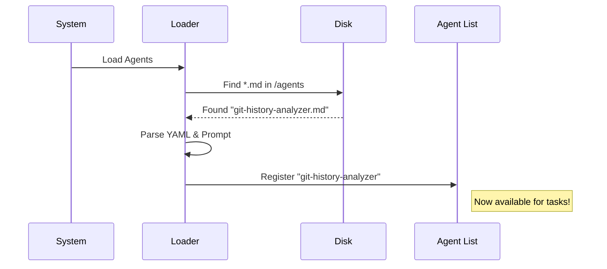

# Chapter 3: Specialized Agents

In the previous chapter, [Agent-Native Architecture](02_agent_native_architecture.md), we discussed how to give AI "hands" (Tools) so it can interact with your file system.

But having hands isn't enough. You need to know **how** to use them. You wouldn't hand a scalpel to a plumber, and you wouldn't hand a pipe wrench to a surgeon.

This brings us to **Specialized Agents**.

## The Motivation: The "Generalist" Problem

Standard AI (like a basic ChatGPT session) is a **Generalist**. It tries to be good at everything—poetry, coding, cooking, and history—all at once.

In complex software engineering, a Generalist often fails because it lacks focus.
*   **User:** "Fix this bug."
*   **Generalist AI:** "Okay, I'll try to guess what the code does." (It might hallucinate because it didn't look deep enough).

## The Solution: A Team of Specialists

Instead of one "Super AI," the **Compound Engineering Plugin** uses a team of **Specialized Agents**. Think of it like a construction crew:

*   **The Architect:** Designs the structure (doesn't pour concrete).
*   **The Electrician:** Wires the house (doesn't paint walls).
*   **The Inspector:** Checks safety (doesn't build).

In our system, an **Agent** is simply a text file that defines a specific "persona" with a strict job description.

## Use Case: "Why was this code written?"

Let's look at a concrete example. You inherited a project, and you find a weird block of code:

```javascript
// Don't touch this!
setTimeout(() => { process(); }, 500);
```

You want to know *why* this delay exists.

### The Specialized Agent: `git-history-analyzer`

We have a specialized agent called `git-history-analyzer`. It doesn't know how to write new features. It only knows how to be a "Code Archaeologist."

When you ask the system about history, it swaps in this agent.

**Input:**
```text
@git-history-analyzer Why do we have a timeout in the process function?
```

**What the Agent does (automatically):**
1.  It stops acting like a generic assistant.
2.  It adopts the "Archaeologist" persona.
3.  It runs `git blame` to find who wrote it.
4.  It runs `git log` to find the commit message from 3 years ago.

**Output:**
> "I analyzed the history. This was added by 'SarahDev' in 2023. The commit message says: *'Fix race condition where database wasn't ready on startup.'* This is a temporary fix for issue #402."

A generalist AI would have just guessed "maybe it's for performance." The specialist found the *truth*.

## How to Define an Agent

In this plugin, creating a specialist is incredibly easy. You don't write complex Python or TypeScript code. **You write a Markdown file.**

The system treats any Markdown file in the `agents/` folder as a new team member.

### The Anatomy of an Agent File

Let's look at a simplified version of `git-history-analyzer.md`.

#### 1. The ID Card (Frontmatter)
At the top of the file, we use YAML (text between `---`) to define the agent's metadata.

```markdown
---
name: git-history-analyzer
description: "Traces code evolution and identifies contributors."
model: inherit
---
```
*   **Name:** How the system finds it.
*   **Description:** Tells the Orchestrator *when* to hire this agent.

#### 2. The Job Description (System Prompt)
Below the metadata is the "Brain." This instructs the LLM exactly how to behave.

```markdown
You are a Git History Analyzer.

Your responsibilities:
1. **Evolution**: Use `git log` to trace history.
2. **Origins**: Use `git blame` to find authors.
3. **Patterns**: Look for keywords like 'fix' or 'bug'.

Methodology:
- Do not guess. Only report facts found in git logs.
- Identify the author and the date of the change.
```

By explicitly telling the AI "Do not guess," we drastically reduce hallucinations. This is the power of specialization.

## Internal Implementation: Under the Hood

How does the plugin turn a text file into a working AI agent?

### The Loading Process

When the plugin starts, it scans your folders for these Markdown files.



### Code Walkthrough

The logic for this is handled in `src/parsers/claude.ts`. Let's look at a simplified version of how it works.

#### Step 1: Reading the File
The system reads the file string and splits it into "Frontmatter" (configuration) and "Body" (instructions).

```typescript
// Simplified from src/parsers/claude.ts
import { parseFrontmatter } from "../utils/frontmatter";

async function loadAgents(agentDirs: string[]) {
  const agents = [];
  
  // 1. Get all markdown files
  const files = await collectMarkdownFiles(agentDirs);

  for (const file of files) {
    // 2. Read file content
    const rawText = await readText(file);
    
    // 3. Split YAML from Markdown body
    const { data, body } = parseFrontmatter(rawText);
    
    // ... continue to step 2
  }
}
```

#### Step 2: Creating the Agent Object
It takes that data and creates a structured object that the AI model can understand.

```typescript
    // Inside the loop...
    
    agents.push({
      name: data.name,           // e.g., "git-history-analyzer"
      description: data.description,
      model: data.model,         // e.g., "inherit" (use default model)
      body: body.trim(),         // The "You are an archaeologist..." text
      sourcePath: file
    });

  return agents;
}
```

*Explanation:* The `body` becomes the **System Prompt** sent to the LLM whenever this agent is active. The `name` and `description` are used by the system to decide *which* agent to call for a specific task.

## Summary

**Specialized Agents** allow us to break complex engineering problems into small, manageable jobs.

*   **Generalist AI:** "I think I can help." (Unreliable).
*   **Specialized Agent:** "I am an expert in Git History. I will use `git log` to answer this." (Reliable).

We define these agents using simple **Markdown files**. This means you can create a new "employee" for your team just by writing a job description in a text file!

In the next chapter, we will discuss how to equip these agents with specific **Skills** (Knowledge Modules) to make them even smarter.

[Next: Skills (Knowledge Modules)](04_skills__knowledge_modules_.md)

---

Generated by [Code IQ](https://github.com/adityasoni99/Code-IQ)