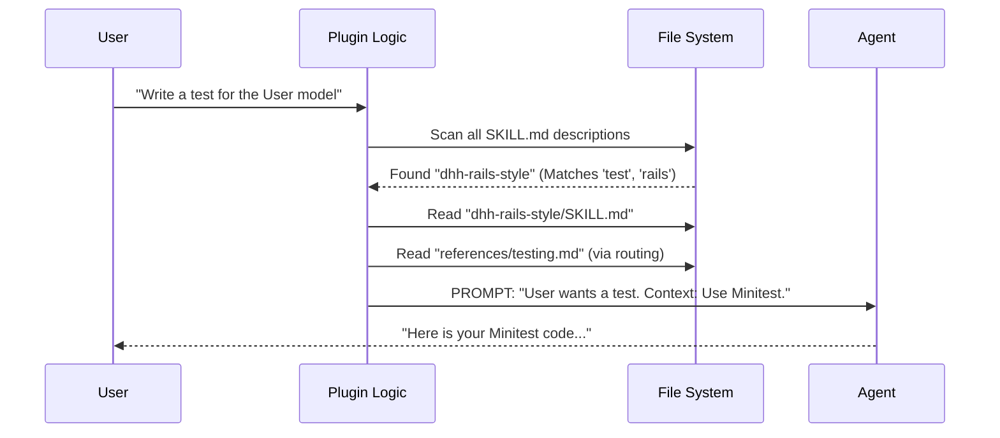

# Chapter 4: Skills (Knowledge Modules)

In the previous chapter, [Specialized Agents](03_specialized_agents.md), we built a team of digital workers. We learned how to create an "Archaeologist" agent to check git history and a "Reviewer" agent to check code.

But hiring a worker is only step one. Now, you have to **train** them.

If you hire a Junior Developer, they know *how* to code, but they don't know *your* coding style. They don't know that you hate `forEach` loops or that you prefer Minitest over RSpec.

This brings us to **Skills**.

## The Concept: "I know Kung Fu"

Do you remember the scene in *The Matrix* where Neo gets a cartridge loaded into his brain and instantly learns Kung Fu?

**Skills** work exactly like that.

*   **Agents** are the characters (the workers).
*   **Skills** are the cartridges (the knowledge).

A Skill is a modular bundle of files that teaches an agent a specific technology, a coding style, or a workflow.

### Use Case: The "Vanilla" Trap

Imagine asking your AI agent to "Build a User model."

**Without a Skill:**
The AI searches the entire internet. It sees that 80% of tutorials use a library called `Devise` for authentication. So, it installs `Devise`.

**The Problem:**
You hate `Devise`. You prefer simple, native authentication. Now you have to spend 20 minutes arguing with the AI to change it.

**With a Skill:**
You install a "My-Company-Style" skill. Now, when you say "Build a User model," the AI consults the skill first. It sees: *"Rule #1: Never use Devise."* It writes the code exactly how you would have written it.

## How to Create a Skill

A Skill isn't magic code. It is just a folder with a Markdown file inside.

To create a skill, you create a folder in `.claude/skills/` and add a `SKILL.md` file.

### Step 1: The Metadata

The top of the file uses YAML to tell the system *when* to use this skill.

```markdown
---
name: dhh-rails-style
description: Use this when writing Ruby or Rails code.
---
```

*   **Name:** The ID of the skill.
*   **Description:** This is crucial. The AI reads this to decide if it needs to "load" this knowledge. If the user asks about Python, the AI ignores this skill.

### Step 2: The Instructions

Below the metadata, you write the "Textbook." You simply describe your rules in plain English.

```markdown
# 37signals Rails Style

## Core Philosophy
1. **Vanilla Rails is plenty.** Do not use complex gems.
2. **No RSpec.** Use Minitest.
3. **Fat Models.** Keep controllers thin.

## Naming Conventions
- Use `published?` (predicate), not `is_published`.
- Use `card.close`, not `card.set_status_closed`.
```

### Step 3: Reference Files (The Library)

Sometimes, a topic is too big for one file. You don't want the AI to read a 100-page manual for every small question.

Skills allow for **Progressive Disclosure**. You can put detailed docs in a `references/` subfolder.

**Folder Structure:**
```text
skills/
└── dhh-rails-style/
    ├── SKILL.md           (The entry point)
    └── references/
        ├── models.md      (Deep dive on Models)
        └── testing.md     (Deep dive on Minitest)
```

**Linking them in `SKILL.md`:**
```markdown
<routing>
| User asks about... | Read this file... |
| :--- | :--- |
| Database, Models | [models.md](./references/models.md) |
| Tests, Minitest | [testing.md](./references/testing.md) |
</routing>
```

When the user asks about testing, the AI reads `SKILL.md`, sees the routing table, and *then* loads `testing.md`. This keeps the AI fast and focused.

## Internal Implementation: Under the Hood

How does the plugin inject this knowledge into the AI's brain?

It uses a concept called **Context Injection**. When you talk to the agent, the plugin intercepts your message.

### The Flow



### Code Walkthrough

This logic lives in `src/parsers/claude.ts`. Let's look at how the system discovers these skills.

#### 1. Loading the Skills
The system scans your `skills` directory for any `SKILL.md` file.

```typescript
// Simplified from src/parsers/claude.ts

async function loadSkills(skillsDirs: string[]) {
  // 1. Find all files named SKILL.md
  const entries = await collectFiles(skillsDirs);
  const skillFiles = entries.filter(f => f.endsWith("SKILL.md"));
  
  const skills = [];

  for (const file of skillFiles) {
    // 2. Read the text content
    const raw = await readText(file);
    
    // 3. Parse the YAML header
    const { data } = parseFrontmatter(raw);
    
    // ... push to array
  }
  return skills;
}
```

#### 2. The Resulting Object
The function returns a simple list of skill objects.

```typescript
// What the system sees in memory:
[
  {
    name: "dhh-rails-style",
    description: "Use this when writing Ruby...",
    skillPath: "/path/to/skills/dhh-rails-style/SKILL.md"
  }
]
```

When you send a message, the **Agent-Native Architecture** (from [Chapter 2](02_agent_native_architecture.md)) sends these descriptions to the LLM. The LLM decides: *"I should read that file to answer this user better."*

## Why This Matters

Skills separate **Behavior** from **Knowledge**.

*   If you want to change *how* the agent works (e.g., make it more cautious), you edit the **Agent**.
*   If you want to change *what* the agent knows (e.g., switch from React to Vue), you swap the **Skill**.

This makes your system modular. You can have a "Senior Engineer" agent, and today you give them the "Python Skill," and tomorrow you give them the "GoLang Skill."

## Summary

Skills allow you to "install" expertise into your agents.

1.  **Define:** Create a `SKILL.md` file.
2.  **Describe:** Tell the system *when* to use it in the YAML header.
3.  **Teach:** Write your coding standards or documentation in Markdown.
4.  **Extend:** Use `references/` folders for deep knowledge.

Now that we have **Agents** (workers) and **Skills** (training), we need a way to manage them all. In the next chapter, we will learn how to organize these pieces into complex workflows using **Command Orchestration**.

[Next: Command Orchestration](05_command_orchestration.md)

---

Generated by [Code IQ](https://github.com/adityasoni99/Code-IQ)