# Chapter 5: Command Orchestration

In the previous chapter, [Skills (Knowledge Modules)](04_skills__knowledge_modules_.md), we taught our individual agents *how* to do specific jobs—like using a specific testing framework or following a coding style.

Now we have a team of skilled workers. But if you have a team of 10 workers, you don't want to tap each one on the shoulder individually to give them a task. You want a Manager.

This brings us to **Command Orchestration**.

## The Motivation: The Conductor's Baton

Imagine you want to build a new feature. If you are chatting with a standard AI, the conversation usually looks like this:

1.  **You:** "Plan the feature."
2.  **AI:** "Here is the plan."
3.  **You:** "Okay, now write the code."
4.  **AI:** "Here is the code."
5.  **You:** "Now write the tests."
6.  **AI:** "Done."
7.  **You:** "Now document it."

This is tedious. You are the bottleneck.

**Command Orchestration** allows you to wrap all those steps into a single "Macro." You wave the baton once, and the entire orchestra plays the symphony.

## Use Case: The "Let's Go" (`/lfg`) Command

Let's look at the ultimate lazy developer command included in this plugin: `/lfg` (short for "Let's F***ing Go").

The goal of this command is to take a single sentence from you and perform the entire engineering lifecycle automatically.

### The User Experience
Instead of baby-sitting the AI, you type this:

```bash
/lfg "Add a dark mode toggle to the settings page"
```

And then you walk away. When you come back, the plan is written, the code is written, the tests are passed, and the video demo is ready.

## How It Works: Defining a Command Sequence

A Command in this system is just a Markdown file in the `commands/` folder. It acts like a script for the AI.

Let's look at how `/lfg` is actually defined in the source code.

### 1. The Metadata (The Setup)
First, we give the command a name and a hint for the user.

```yaml
---
name: lfg
description: Full autonomous engineering workflow
argument-hint: "[feature description]"
disable-model-invocation: true
---
```
*   **`disable-model-invocation: true`**: This is a special flag. It tells the AI: "Don't think about this file. Just do exactly what it says." This makes the command faster and cheaper.

### 2. The Sequence (The Steps)
Below the metadata, we list the steps. Notice that this command is just a list of *other* commands!

```markdown
Run these slash commands in order:

1. `/workflows:plan $ARGUMENTS`
2. `/workflows:work`
3. `/workflows:review`
4. `/compound-engineering:test-browser`
5. `/compound-engineering:feature-video`
```

When you run `/lfg`, the Orchestrator reads this list. It passes your input (`$ARGUMENTS`) to the first step. Then, it waits for that to finish before starting step 2.

## Advanced Orchestration: Parallel Agents

The `/lfg` command runs steps **Sequentially** (one after another). But sometimes, you want to go fast. You want **Parallelism**.

Let's look at the `/workflows:compound` command we introduced in Chapter 1. It uses a more complex structure to spin up multiple agents at the exact same time.

### The "Fan-Out" Pattern

We use XML-like tags to tell the Orchestrator to split the work.

```xml
<parallel_tasks>
  Launch these subagents IN PARALLEL:

  1. **Context Analyzer**: Extract history.
  2. **Solution Extractor**: Find the code fix.
  3. **Prevention Strategist**: Write test ideas.
</parallel_tasks>
```

When the LLM sees `<parallel_tasks>`, it doesn't generate one response. It generates three separate streams of thought, acting as three different experts simultaneously.

## Visualizing the Flow

Here is how the Orchestrator handles a complex command like `/workflows:compound`.

```mermaid
sequenceDiagram
    participant User
    participant Orch as Orchestrator
    participant AgentA as Analyzer
    participant AgentB as Strategist
    participant Doc as File System

    User->>Orch: /workflows:compound
    
    rect rgb(20, 20, 20)
        Note right of Orch: Phase 1: Fan-Out
        Orch->>AgentA: Start Task
        Orch->>AgentB: Start Task
        AgentA-->>Orch: "I found the error log"
        AgentB-->>Orch: "I wrote a prevention plan"
    end

    rect rgb(40, 40, 40)
        Note right of Orch: Phase 2: Fan-In
        Orch->>Orch: Combine A + B results
        Orch->>Doc: Write ONE final file
    end
    
    Doc-->>User: "Knowledge Saved!"
```



1.  **Fan-Out:** The Orchestrator delegates work to sub-agents.
2.  **Fan-In:** The Orchestrator collects the results and compiles the final output.

## Internal Implementation: Under the Hood

How does the system actually find and load these commands? It happens in `src/parsers/claude.ts`.

### Step 1: Loading the Files
The system scans the `commands/` directory for any Markdown files.

```typescript
// src/parsers/claude.ts (Simplified)

async function loadCommands(commandsDirs: string[]) {
  // 1. Find all markdown files in commands/
  const files = await collectMarkdownFiles(commandsDirs);

  const commands = [];
  
  // 2. Loop through each file
  for (const file of files) {
    // ... processing logic (see next step)
  }
}
```

### Step 2: Parsing the Configuration
It separates the YAML frontmatter from the instructions.

```typescript
    // Inside the loop...
    const raw = await readText(file);
    const { data, body } = parseFrontmatter(raw);

    commands.push({
      name: data.name,             // e.g., "lfg"
      argumentHint: data["argument-hint"], 
      disableModelInvocation: data["disable-model-invocation"],
      body: body.trim(),           // The instructions
    });
```

### Step 3: Registration
The plugin sends this list to the AI interface. Now, when you type `/`, the autocomplete menu shows `/lfg` and `/workflows:compound` because they were loaded into this array.

## Why "Disable Model Invocation"?

You might notice `disable-model-invocation: true` in the `/lfg` command.

*   **Standard Command:** The user types a command -> The LLM reads the prompt -> The LLM decides what to do.
*   **Disabled Invocation:** The user types a command -> The **Plugin Code** immediately executes the script defined in the file.

This is useful for "Macros" where you don't need the AI to be creative; you just need it to execute a list of actions rigorously.

## Summary

**Command Orchestration** turns your AI from a Chatbot into a Workflow Engine.

*   **Macros:** Use commands like `/lfg` to chain multiple steps (Plan -> Code -> Test).
*   **Parallelism:** Use tags like `<parallel_tasks>` to run multiple agents at once.
*   **Simplicity:** You define these workflows in simple Markdown files.

You now have a system that can run complex engineering tasks. But there is one problem remaining: The AI works in text and code, but sometimes we need it to output to different formats—like a PDF report, a Jira ticket, or a structured JSON file.

In the next chapter, we will look at how to handle **Multi-Target Conversion**.

[Next: Multi-Target Conversion](06_multi_target_conversion.md)

---

Generated by [Code IQ](https://github.com/adityasoni99/Code-IQ)