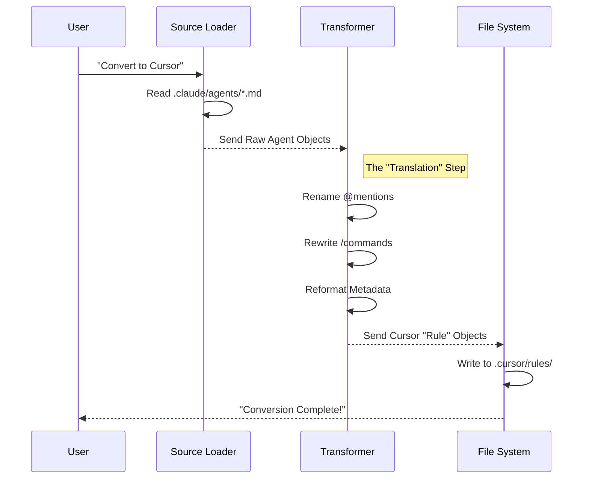

# Chapter 6: Multi-Target Conversion

In the previous chapter, [Command Orchestration](05_command_orchestration.md), we learned how to chain agents together to create powerful automated workflows like `/lfg`.

At this point, you have a sophisticated engineering system. But there is one limitation: **It is stuck inside Claude Code.**

What if your teammate uses **Cursor**? What if you want to experiment with Google's **Gemini**? Do you have to rewrite all your agents and Markdown files from scratch?

No. This brings us to **Multi-Target Conversion**.

## The Concept: The Universal Travel Adapter

Imagine you are traveling from the US to Europe. You don't buy a new hair dryer or laptop charger for every country. You buy a **Travel Adapter**.

*   **Your Plugin** is the device (the logic).
*   **The AI IDE (Claude, Cursor, Gemini)** is the wall socket.
*   **Multi-Target Conversion** is the adapter.

This feature allows you to write your agents **once** (in the simple Claude Markdown format) and automatically translate them into the specific formats required by other AI environments.

## Use Case: Sharing with a Cursor User

Let's say you built the amazing `git-history-analyzer` agent from Chapter 3. You want to give it to a coworker who uses the **Cursor IDE**.

**The Problem:**
*   Claude expects agents in `.claude/agents/*.md`.
*   Cursor expects "Rules" in `.cursor/rules/*.mdc`.
*   Claude uses commands like `/workflows:plan`.
*   Cursor doesn't have slash commands; it just reads context.

**The Solution:**
Instead of rewriting the files manually, you run the converter.

```bash
# The magic command
bunx compound-plugin convert ./my-plugin --to cursor
```

**The Result:**
The tool reads your Claude files, reformats the text, renames the files, and places them exactly where Cursor looks for them. Your coworker can now use your agent immediately.

## Key Concepts

To understand how this works, we need to look at the three stages of conversion: **Load**, **Transform**, and **Write**.

### 1. Source of Truth (Claude Format)
We use the Claude Plugin format as our "Universal Language" because it is the simplest: just Markdown files with YAML headers.

### 2. The Dialects (Targets)
Different AI tools speak different "dialects":
*   **Cursor:** Speaks "Rules." It needs specific headers to know when to trigger a rule.
*   **Gemini:** Speaks "TOML." It prefers structured configuration files for commands.
*   **OpenCode:** Speaks "JSON." It needs strict data structures.

### 3. Text Transformation
This is the most important part. The converter actually rewrites the sentences inside your prompts.
*   *Claude Dialect:* "Ask **@git-history-analyzer** to help."
*   *Cursor Dialect:* "Use the **git-history-analyzer rule** to help."

## Internal Implementation: Under the Hood

How does the tool physically move the data? It works like a factory line.

### The Assembly Line



### Code Walkthrough

Let's look at the actual code that performs this magic.

#### Step 1: The Command Entry Point
First, the CLI tool (`src/commands/convert.ts`) receives your request. It figures out which "Target" you want (e.g., Cursor, Gemini).

```typescript
// src/commands/convert.ts (Simplified)

// 1. Get the target name from the command line arguments
const targetName = args.to; // e.g., "cursor"

// 2. Load the specific converter logic for that target
const target = targets[targetName];

// 3. Load your Claude plugin files into memory
const plugin = await loadClaudePlugin(args.source);

// 4. Run the conversion
const bundle = target.convert(plugin, options);
```
*Explanation:* This is the manager. It doesn't know *how* to convert, it just coordinates the process.

#### Step 2: The Logic (Transforming Text)
This is where the brainwork happens. In `src/converters/claude-to-cursor.ts`, we use Regular Expressions (Regex) to find Claude-specific syntax and replace it.

```typescript
// src/converters/claude-to-cursor.ts (Simplified)

export function transformContentForCursor(body: string): string {
  let result = body;

  // 1. Change file paths (.claude -> .cursor)
  result = result.replace(/\.claude\//g, ".cursor/");

  // 2. Change @mentions (@agent -> the agent rule)
  // This helps Cursor's AI understand it should look for a Rule file.
  result = result.replace(
    /@([a-z-]+)/gi, 
    "the $1 rule"
  );

  return result;
}
```
*Explanation:* 
*   Input: *"Please check `.claude/config` and ask `@reviewer`."*
*   Output: *"Please check `.cursor/config` and ask `the reviewer rule`."*

#### Step 3: Writing the Output
Finally, we need to save the files. Different targets need different folder structures. Here is how **Gemini** handles it in `src/targets/gemini.ts`.

```typescript
// src/targets/gemini.ts (Simplified)

export async function writeGeminiBundle(root: string, bundle: any) {
  // Gemini expects commands in a 'commands' folder as TOML files
  const commandsDir = path.join(root, ".gemini", "commands");
  
  for (const cmd of bundle.commands) {
    // Create the path: .gemini/commands/my-command.toml
    const filePath = path.join(commandsDir, `${cmd.name}.toml`);
    
    // Write the file content
    await writeText(filePath, cmd.content);
  }
}
```
*Explanation:* The plugin creates the `.gemini` folder automatically and organizes the files exactly how Gemini likes them.

## Supported Targets

Currently, the plugin supports converting to:

| Target | File Format | Output Location |
| :--- | :--- | :--- |
| **Cursor** | `.mdc` (Markdown Rules) | `.cursor/rules/` |
| **Gemini** | `.toml` & `.md` | `.gemini/` |
| **OpenCode** | `.json` | `~/.config/opencode/` |
| **Codex** | `.md` (Prompts) | `~/.codex/prompts/` |

## Summary

**Multi-Target Conversion** frees your code from being locked into a single AI tool.

1.  **Write Once:** You define your Engineering Workflow (Agents, Skills, Commands) in simple Markdown.
2.  **Convert:** You use the CLI to translate that logic.
3.  **Run Anywhere:** You can switch between Claude, Cursor, and Gemini without losing your customized workflow.

This completes the core functionality of the plugin. However, software changes constantly. If you update a Skill in your personal library, how do you make sure all your projects get the update?

In the final chapter, we will discuss **Configuration Synchronization**.

[Next: Configuration Synchronization](07_configuration_synchronization.md)

---

Generated by [Code IQ](https://github.com/adityasoni99/Code-IQ)