# Chapter 7: Configuration Synchronization

In the previous chapter, [Multi-Target Conversion](06_multi_target_conversion.md), we learned how to translate your project's specific agents so they can run in different AI environments.

However, there is one piece of the puzzle left. You don't just have project files; you have **Global Settings**. You have a personal toolkit of skills and database connections that you use across *every* project.

This brings us to the final concept: **Configuration Synchronization**.

## The Motivation: The "New Computer" Feeling

Imagine you have spent months customizing your web browser. You have all your bookmarks, extensions, and saved passwords perfectly set up.

Then, you open a different browser. It feels empty. It's "dumb." You have to manually re-enter everything.

This happens constantly in AI Engineering:
*   You configure a **Postgres MCP Server** in **Claude Code** to talk to your database.
*   You open **Cursor** to edit some code.
*   **Problem:** Cursor doesn't know your database exists. You have to copy-paste the configuration manually.

**Configuration Synchronization** solves this. It acts like "Cloud Sync" for your AI tools. It ensures that if you teach a skill to Claude, your other environments (Cursor, Pi, Droid) learn it instantly.

## Key Concept: The "Source of Truth"

In this system, we treat your **Claude Home Directory** (`~/.claude/`) as the Master Copy (Source of Truth).

The synchronization tool looks at two specific things in your home directory:

1.  **Global Skills:** The markdown files in `~/.claude/skills/` that define your personal coding style.
2.  **MCP Servers:** The tools defined in `~/.claude/settings.json` (like database access or filesystem control).

The tool reads these and **projects** them into the configuration folders of other tools.

### Visual Analogy
Think of a projector.
*   **The Slide:** Your Claude Config.
*   **The Screen:** Your Cursor or Pi Config.
*   **The Projector:** The `sync` command.

If you change the slide (Claude Config), the image on the screen (Cursor) changes automatically.

## Use Case: Syncing to Cursor

Let's look at the most common scenario. You want to move your "AI Toolkit" from the terminal (Claude Code) to your IDE (Cursor).

### Step 1: Your Claude Setup
You have an MCP server set up in Claude that allows the AI to run terminal commands.

**File:** `~/.claude/settings.json`
```json
{
  "mcpServers": {
    "local-terminal": {
      "command": "npx",
      "args": ["-y", "@modelcontextprotocol/server-terminal"]
    }
  }
}
```

### Step 2: Running the Sync
You run a single command in your terminal:

```bash
bunx @every-env/compound-plugin sync --target cursor
```

**Output:**
```text
Syncing 5 skills, 1 MCP servers...
✓ Synced to cursor: /Users/you/project/.cursor
```

### Step 3: The Result
You open Cursor. Suddenly, Cursor can use the terminal! The plugin automatically created a `.cursor/mcp.json` file and linked your skills. You didn't have to copy-paste a thing.

## Internal Implementation: Under the Hood

How does this actually work? It's not just copying files; it's translating formats.

### The Flow

```mermaid
sequenceDiagram
    participant User
    participant SyncTool as Sync Command
    participant Claude as ~/.claude
    participant Cursor as .cursor/

    User->>SyncTool: Run Sync
    SyncTool->>Claude: 1. Read settings.json (MCP)
    SyncTool->>Claude: 2. List Skills folders
    
    rect rgb(30, 30, 30)
        Note right of SyncTool: Transformation
        SyncTool->>SyncTool: Convert MCP format
        SyncTool->>SyncTool: Check for Secrets (Safety)
    end
    
    SyncTool->>Cursor: 3. Create Symlinks for Skills
    SyncTool->>Cursor: 4. Write mcp.json
    
    Cursor-->>User: Ready to use!
```



### Code Walkthrough

Let's look at the code that handles this. It is located in `src/commands/sync.ts` and `src/sync/cursor.ts`.

#### 1. Safety First (Secret Detection)
Before syncing, the tool checks if you are accidentally sharing API keys. It scans your environment variables for words like "key" or "token".

```typescript
// src/commands/sync.ts (Simplified)

function hasPotentialSecrets(mcpServers): boolean {
  // Regex to catch sensitive variable names
  const sensitive = /key|token|secret|password/i;
  
  for (const server of Object.values(mcpServers)) {
    // Check the server's environment variables
    const envKeys = Object.keys(server.env || {});
    if (envKeys.some(key => sensitive.test(key))) {
      return true; // Danger!
    }
  }
  return false;
}
```
*Explanation:* If this returns true, the CLI prints a warning: *"⚠️ Warning: MCP servers contain env vars that may include secrets."* This reminds you to be careful.

#### 2. Translating for Cursor
Cursor uses a specific file called `mcp.json`. The sync tool reads your Claude settings and rewrites them into this format.

```typescript
// src/sync/cursor.ts (Simplified)

export async function syncToCursor(config, outputDir) {
  // 1. Prepare the data structure Cursor expects
  const cursorConfig = {
    mcpServers: config.mcpServers // Copied from Claude
  };

  // 2. Define where it goes
  const mcpPath = path.join(outputDir, "mcp.json");

  // 3. Write the file
  await fs.writeFile(
    mcpPath, 
    JSON.stringify(cursorConfig, null, 2)
  );
}
```

#### 3. Symlinking Skills (The "Live Link")
For skills (knowledge), we don't just copy the files. We create a **Symbolic Link** (a shortcut).

Why? If you update a skill in Claude (e.g., "Always use TypeScript"), you want that update to apply to Cursor *immediately* without running `sync` again.

```typescript
// src/sync/cursor.ts (Simplified)

for (const skill of config.skills) {
  // The destination in the Cursor folder
  const dest = path.join(outputDir, "skills", skill.name);

  // Create a shortcut (symlink) pointing back to Claude
  // instead of copying the actual file.
  await fs.symlink(skill.sourceDir, dest);
}
```

## Supported Targets

You can sync your personal configuration to several different environments:

| Target | Command Flag | What gets synced? |
| :--- | :--- | :--- |
| **Cursor** | `--target cursor` | Skills (Symlinked) & MCP Servers |
| **OpenCode** | `--target opencode` | Skills, Agents, & MCP Servers |
| **Pi** | `--target pi` | Skills & MCP Porter config |
| **Droid** | `--target droid` | Skills only |

## Tutorial Conclusion

Congratulations! You have completed the **Compound Engineering Plugin** tutorial series.

Let's recap what we have built together:

1.  **[Compound Engineering Workflow](01_compound_engineering_workflow.md):** We learned to stop coding linearly and start compounding knowledge using Plan, Work, Review, and Compound.
2.  **[Agent-Native Architecture](02_agent_native_architecture.md):** We saw how to give AI tools (hands) instead of just text.
3.  **[Specialized Agents](03_specialized_agents.md):** We hired a team of experts (like the History Analyzer) instead of relying on one generalist.
4.  **[Skills](04_skills__knowledge_modules_.md):** We taught those agents our specific preferences and rules.
5.  **[Command Orchestration](05_command_orchestration.md):** We became managers, creating macros like `/lfg` to run the whole team.
6.  **[Multi-Target Conversion](06_multi_target_conversion.md):** We learned to export our project logic to other tools.
7.  **[Configuration Synchronization](07_configuration_synchronization.md):** We learned to sync our personal toolkit everywhere we go.

You now have a system where every bug you fix makes the next bug easier to solve. Your AI is no longer just a chatbot; it is an engineering partner that grows with you.

**Happy Compounding!**

---

Generated by [Code IQ](https://github.com/adityasoni99/Code-IQ)