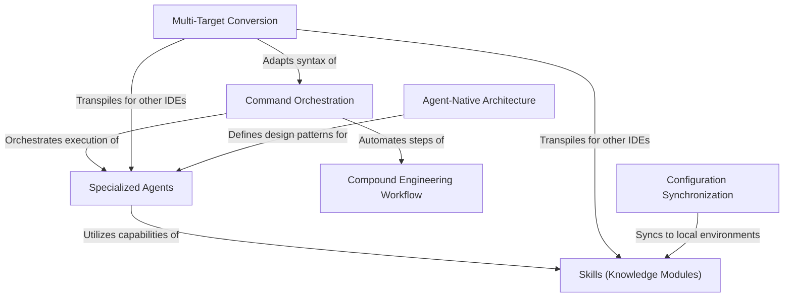

# Tutorial: compound-engineering-plugin

The **Compound Engineering Plugin** is a comprehensive toolkit for AI-assisted software development that enforces a *Plan → Work → Review → Compound* cycle to ensure engineering work becomes easier over time. It provides a CLI to **transform** and **sync** these AI tools (agents, skills, and commands) from Claude Code into formats compatible with other environments like Cursor, OpenCode, and Gemini, while establishing an **Agent-Native Architecture** where AI agents operate as first-class citizens alongside developers.

**Source Repository:** [https://github.com/EveryInc/compound-engineering-plugin](https://github.com/EveryInc/compound-engineering-plugin)

## Chapters

1. [Compound Engineering Workflow](01_compound_engineering_workflow.md)
2. [Agent-Native Architecture](02_agent_native_architecture.md)
3. [Specialized Agents](03_specialized_agents.md)
4. [Skills (Knowledge Modules)](04_skills__knowledge_modules_.md)
5. [Command Orchestration](05_command_orchestration.md)
6. [Multi-Target Conversion](06_multi_target_conversion.md)
7. [Configuration Synchronization](07_configuration_synchronization.md)

---

Generated by [Code IQ](https://github.com/adityasoni99/Code-IQ)