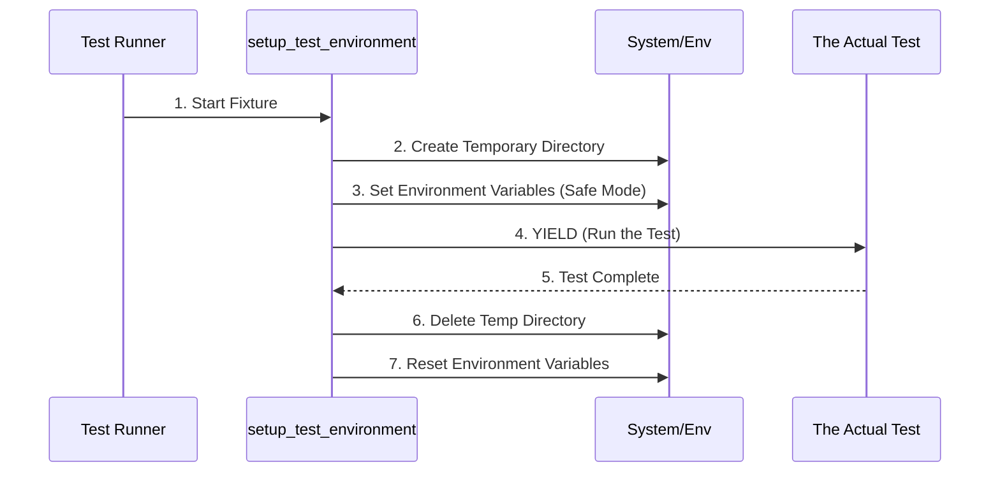

# Chapter 1: setup_test_environment

Welcome to the first chapter of the CrewAI testing tutorial! 

Before we can start recording network requests or testing complex AI agents, we need a **clean workspace**. Imagine trying to paint a masterpiece on a canvas that someone else has already scribbled on—it would be a disaster!

In software testing, we need a "fresh canvas" for every single test. This ensures that one test doesn't accidentally break another. In `crewAI`, this fresh canvas is provided by the `setup_test_environment` abstraction.

## The Motivation: Why do we need this?

**The Use Case:** 
Imagine you are testing an AI agent that saves its conversation history to a file. 
1. If you run the test on your actual computer, the agent might create a messy file like `history.txt` in your project folder.
2. If you run the test 100 times, you might overwrite important data or run out of specific permissions.
3. If you run two tests at the same time, they might fight over who gets to write to that file.

**The Solution:**
We need a temporary, isolated sandbox that exists *only* while the test is running and disappears immediately after.

## What is a Fixture?

In Python's testing framework (`pytest`), we use something called a **fixture**. Think of a fixture as the "Setup Crew" and "Cleanup Crew" at an event.

1.  **Setup:** They arrange the chairs and set the lights (Initialize variables/files).
2.  **The Event:** The test runs.
3.  **Teardown:** They pack everything up and sweep the floor (Delete files/reset variables).

The `setup_test_environment` concept is exactly this type of crew.

## How It Works: High-Level Overview

When a test in CrewAI starts, this abstraction performs a specific sequence of actions to ensure safety.



1.  **Create Temp Directory:** Make a folder in a safe place (like `/tmp/random_id`) that the operating system manages.
2.  **Set Environment:** Tell CrewAI "We are in testing mode!" by setting variables like `CREWAI_TESTING`.
3.  **Run Test:** The actual test code executes.
4.  **Cleanup:** Everything created in step 1 and 2 is erased or reset.

## Under the Hood: The Code

Let's look at how this is implemented in `conftest.py`. We will break it down into small, digestible pieces.

### Part 1: The Decorator

```python
@pytest.fixture(autouse=True, scope="function")
def setup_test_environment() -> Generator[None, Any, None]:
    """Setup test environment for crewAI workspace."""
    # ... logic continues ...
```

*   **`@pytest.fixture`**: This tells Python "This function is a testing helper."
*   **`autouse=True`**: This is magical! It means **every single test function** will automatically use this setup without you having to ask for it. It forces a clean environment globally.
*   **`scope="function"`**: The setup and cleanup happen for *each individual test function*, ensuring maximum isolation.

### Part 2: Creating the Sandbox

Inside the function, we first create the physical space for files.

```python
    with tempfile.TemporaryDirectory() as temp_dir:
        storage_dir = Path(temp_dir) / "crewai_test_storage"
        storage_dir.mkdir(parents=True, exist_ok=True)
```

*   **`tempfile.TemporaryDirectory()`**: Creates a folder that is guaranteed to be unique.
*   **`storage_dir`**: We create a specific sub-folder where the AI agents will "think" they are saving real data.

### Part 3: Safety Checks

Before proceeding, the code checks if the sandbox works.

```python
        try:
            test_file = storage_dir / ".permissions_test"
            test_file.touch()
            test_file.unlink()
        except (OSError, IOError) as e:
            # Error handling logic...
            raise RuntimeError(f"Storage not writable: {e}")
```

*   **`touch()` and `unlink()`**: This tries to create a dummy file and immediately delete it.
*   **Why?**: It confirms we actually have permission to write in this temporary folder before running the real test.

### Part 4: Setting Global Variables

Now we configure the "mindset" of the application using Environment Variables.

```python
        os.environ["CREWAI_STORAGE_DIR"] = str(storage_dir)
        os.environ["CREWAI_TESTING"] = "true"
```

*   **`CREWAI_STORAGE_DIR`**: Tells the app "If you need to save files, put them in that temp folder we just made, not in the real project."
*   **`CREWAI_TESTING`**: Tells the app "We are running a test, so behave deterministically (don't send random analytics, etc)."

### Part 5: The Yield and Cleanup

This is the most critical pattern in pytest fixtures: the `yield` keyword.

```python
        try:
            yield # <--- The Test runs right here!
        finally:
            os.environ.pop("CREWAI_TESTING", "true")
            os.environ.pop("CREWAI_STORAGE_DIR", None)
            # ... pops other variables ...
```

*   **`yield`**: This pauses the setup function and lets the *actual test* run.
*   **`finally`**: This block runs **after** the test finishes (whether it passed or failed).
*   **`os.environ.pop`**: Removes the settings we added. This restores your computer's environment to exactly how it was before the test started.

## Summary

In this chapter, we learned about `setup_test_environment`:

1.  It is a **pytest fixture** that runs automatically before every test.
2.  It creates a **temporary directory** so tests don't leave garbage files on your computer.
3.  It sets **environment variables** to switch CrewAI into "Test Mode".
4.  It automatically **cleans up** everything when the test is done.

This ensures that every time you run a test, you are starting with a fresh, clean slate!

Now that our environment is clean and safe, we need to handle how our tests interact with the outside world (like network requests to OpenAI). We don't want to pay for API calls every time we test!

In the next chapter, we will learn how to configure "VCR," a tool that records and replays network requests.

[Next Chapter: vcr_config](02_vcr_config.md)

---

Generated by [Code IQ](https://github.com/adityasoni99/Code-IQ)