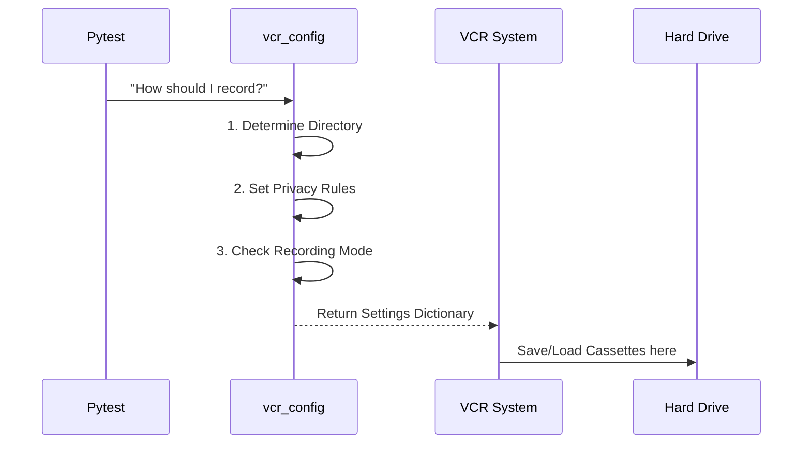

# Chapter 2: vcr_config

Welcome to Chapter 2! 

In the previous chapter, [setup_test_environment](01_setup_test_environment.md), we learned how to create a clean, isolated "sandbox" for our tests so they don't mess up our local files.

Now that our workspace is clean, we face a new problem: **External Networks.**

## The Motivation: Why do we need this?

**The Use Case:**
You are testing a CrewAI agent that uses OpenAI's GPT-4 to write a poem. 
1.  **Cost:** Every time you run the test, you pay OpenAI real money.
2.  **Speed:** Calling an API takes seconds. If you have 100 tests, your suite takes minutes to run.
3.  **Consistency:** GPT-4 might write a poem about a cat today, but a dog tomorrow. How do you write a test assertion if the output keeps changing?

**The Solution: VCR.py**
We use a tool called **VCR** (Video Cassette Recorder). 
1.  **First Run:** It lets the network request go through, "records" the response to a file (a cassette), and saves it.
2.  **Future Runs:** It intercepts the request, blocks the network connection, and "replays" the saved response from the file.

The `vcr_config` concept we are discussing today is the **Settings Menu** for this recorder. It tells the recorder *where* to save the tapes and *how* to handle sensitive data like API keys.

## What is `vcr_config`?

In our codebase, `vcr_config` is a **module-scoped fixture**. 

*   **Fixture:** A helper that prepares data for tests.
*   **Module-scoped:** It runs once per test file (module), effectively setting the rules for all tests in that file.
*   **Returns:** A Python Dictionary containing configuration settings.

## How It Works: The Settings Menu

Let's look at how `pytest-vcr` (the plugin we use) asks for instructions.



1.  **Determine Directory:** Where should we stack the tapes?
2.  **Set Privacy Rules:** If we record a request, we must scrub out the API Keys so we don't accidentally publish them to GitHub.
3.  **Check Recording Mode:** Are we allowed to make new recordings, or just replay old ones?

## Under the Hood: The Code

Let's look at `conftest.py` to see how this configuration is built. We will break it down into small steps.

### Step 1: Defining the Fixture

```python
@pytest.fixture(scope="module")
def vcr_config(vcr_cassette_dir: str) -> dict[str, Any]:
    """Configure VCR with organized cassette storage."""
    # Logic starts here...
```

*   **`@pytest.fixture(scope="module")`**: This config is calculated once for every test file.
*   **`vcr_cassette_dir`**: Note that this function asks for *another* fixture as an input. This is dependency injection! We will learn about `vcr_cassette_dir` in [Chapter 3: vcr_cassette_dir](03_vcr_cassette_dir.md).

### Step 2: Basic Configuration

Inside the function, we start building the dictionary.

```python
    config = {
        "cassette_library_dir": vcr_cassette_dir,
        "record_mode": os.getenv("PYTEST_VCR_RECORD_MODE", "once"),
        "match_on": ["method", "scheme", "host", "port", "path"],
        # ... more settings ...
    }
```

*   **`cassette_library_dir`**: The folder path where the recordings live.
*   **`record_mode`**: Usually set to `"once"`.
    *   *Once:* If a tape exists, play it. If not, record a new one.
*   **`match_on`**: How does VCR know if a request matches a recording? It checks if the HTTP Method (GET/POST), the Host (openai.com), and the Path (/v1/chat/completions) are identical.

### Step 3: Privacy Filters (The Censors)

We cannot save raw requests because they contain your private `sk-proj-...` OpenAI keys.

```python
        "filter_headers": [(k, v) for k, v in HEADERS_TO_FILTER.items()],
        "before_record_request": _filter_request_headers,
        "before_record_response": _filter_response_headers,
```

*   **`filter_headers`**: A simple list of headers to scrub. We define these in [HEADERS_TO_FILTER](04_headers_to_filter.md).
*   **`before_record_request`**: A function that runs *before* writing a request to disk. We use `_filter_request_headers` (Chapter 5) to clean the data.
*   **`before_record_response`**: A function that runs *before* writing the server's response to disk. We use `_filter_response_headers` (Chapter 6).

### Step 4: The CI/CD Safety Check

Finally, we have a special check for when the code runs on GitHub Actions (the cloud).

```python
    if os.getenv("GITHUB_ACTIONS") == "true":
        config["record_mode"] = "none"

    return config
```

*   **`GITHUB_ACTIONS`**: If we are running in the cloud, we don't have API keys set up.
*   **`record_mode = "none"`**: This tells VCR: "Only replay tapes. If a test tries to make a *new* network request, crash immediately." This prevents tests from silently failing or hanging.

## Putting it all together

When you write a test in CrewAI, you don't call `vcr_config` directly. `pytest-vcr` finds this fixture automatically.

**Example of what `vcr_config` returns:**

```json
{
    "cassette_library_dir": "/path/to/crewai/tests/cassettes/llms",
    "record_mode": "once",
    "filter_headers": [
        ["authorization", "AUTHORIZATION-XXX"],
        ["api-key", "X-API-KEY-XXX"]
    ],
    "match_on": ["method", "scheme", "host", "port", "path"]
}
```

Because of this configuration:
1.  Your API keys are replaced with `XXX`.
2.  Your recordings are organized in specific folders.
3.  Your tests run fast because they don't hit the real internet.

## Summary

In this chapter, we learned:
1.  **`vcr_config`** is the master settings file for our network recorder.
2.  It uses **filters** to ensure no secrets are recorded.
3.  It changes behavior based on where it's running (Local computer vs. GitHub Actions).

But wait—how does it know *where* to put those cassette files? We saw a variable called `vcr_cassette_dir` passed into our config. In the next chapter, we will see how that path is calculated dynamically to keep our project organized.

[Next Chapter: vcr_cassette_dir](03_vcr_cassette_dir.md)

---

Generated by [Code IQ](https://github.com/adityasoni99/Code-IQ)