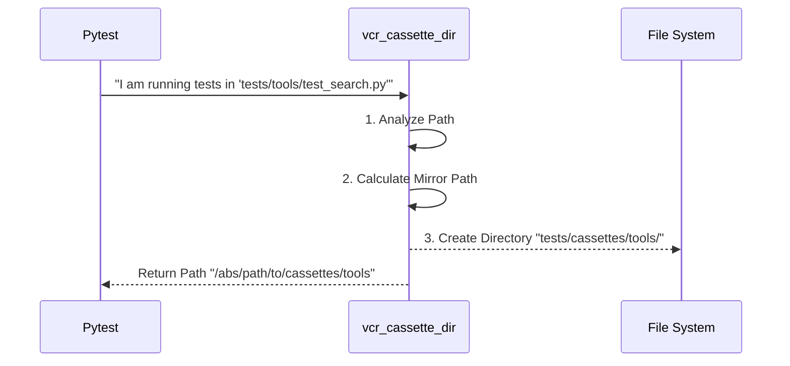

# Chapter 3: vcr_cassette_dir

Welcome to Chapter 3!

In the previous chapter, [vcr_config](02_vcr_config.md), we set up the "Rules of Engagement" for our network recorder. We told it to record new requests and replay old ones.

However, we left one question unanswered: **Where exactly do we put all these recordings?**

If we just threw every recording into one giant folder, it would be a disaster. You would have hundreds of files like `test_1.yaml`, `test_2.yaml`, and good luck finding the one you need!

## The Motivation: Why do we need this?

**The Use Case:**
Imagine your project is like a large library. You have tests for different parts of your code:
1.  Tests for AI Agents (`tests/agents/test_worker.py`)
2.  Tests for Google Tools (`tests/tools/google/test_search.py`)
3.  Tests for Memory (`tests/memory/test_storage.py`)

**The Problem:**
If `test_worker.py` and `test_search.py` both try to save a recording named `cassette.yaml` in the same folder, they will overwrite each other.

**The Solution:**
We need a dynamic "Filing System." If a test lives in `tests/tools/google/`, its recordings should automatically go into `tests/cassettes/tools/google/`.

This is exactly what `vcr_cassette_dir` does. It mirrors your test folder structure into a cassette folder structure.

## How It Works: The Smart Librarian

The `vcr_cassette_dir` abstraction is a **module-scoped fixture**. This means it runs once for every test file.

Think of it as a Librarian that looks at the book you are holding (the test file) and decides exactly which shelf (directory) the backup copy should go to.



## Example: Inputs and Outputs

Here is how the fixture transforms inputs (your test file location) into outputs (storage locations):

| Test File Location | Resulting Cassette Directory |
| :--- | :--- |
| `crewai/tests/test_agent.py` | `crewai/tests/cassettes` |
| `crewai/tests/tools/test_search.py` | `crewai/tests/cassettes/tools` |
| `crewai/tests/llms/openai/test_gpt.py` | `crewai/tests/cassettes/llms/openai` |

As you can see, it keeps everything perfectly organized!

## Under the Hood: The Code

Let's look at `conftest.py` to see how this path calculation works.

### Part 1: Finding the Test File

First, the fixture needs to know *who* is asking for the directory.

```python
@pytest.fixture(scope="module")
def vcr_cassette_dir(request: Any) -> str:
    """Generate cassette directory path based on test module location."""
    
    # Get the path of the test file currently running
    test_file = Path(request.fspath)
    # ... logic continues ...
```

*   **`request`**: A special pytest object that contains information about the currently running test.
*   **`request.fspath`**: The absolute path to the test file (e.g., `/Users/you/project/tests/test_agent.py`).

### Part 2: Finding the Project Root

The code is designed for a "monorepo" (a repository with multiple packages, like `crewai` and `crewai-tools`). It needs to find where the package starts.

```python
    # Iterate up the folder tree to find the package root
    for parent in test_file.parents:
        if (
            parent.name in ("crewai", "crewai-tools", "crewai-files")
            and parent.parent.name == "lib"
        ):
            package_root = parent
            break
    else:
        # Fallback if standard structure isn't found
        package_root = test_file.parent
```

*   **The Loop**: It climbs up the folder tree (`parent`, `parent.parent`, etc.).
*   **The Check**: It looks for known package names like `crewai`. This ensures we anchor our path correctly, even if the project is nested deep in your computer.

### Part 3: Calculating the Relative Path

Now that we know where the package starts and where the test is, we calculate the middle part.

```python
    tests_root = package_root / "tests"
    test_dir = test_file.parent

    if test_dir != tests_root:
        # Example: if test is in tests/tools/google
        # relative_path becomes "tools/google"
        relative_path = test_dir.relative_to(tests_root)
        cassette_dir = tests_root / "cassettes" / relative_path
    else:
        cassette_dir = tests_root / "cassettes"
```

*   **`relative_to`**: This subtracts the root path from the full path, leaving us with just the subfolders (e.g., `tools/google`).
*   **`cassette_dir`**: We build the new path by injecting `/cassettes/` into the structure.

### Part 4: Creating the Folder

Finally, we ensure the folder actually exists before returning the path.

```python
    # Create the directory if it doesn't exist
    cassette_dir.mkdir(parents=True, exist_ok=True)

    return str(cassette_dir)
```

*   **`mkdir(parents=True)`**: This is like the command `mkdir -p`. If `cassettes/tools/google` is needed, it creates `cassettes`, then `tools`, then `google` automatically.
*   **Return**: We return the path as a string so the `vcr_config` (from Chapter 2) can use it.

## Summary

In this chapter, we learned about `vcr_cassette_dir`:

1.  It solves the problem of **organizing recording files**.
2.  It uses **pytest introspection** (`request.fspath`) to see where the test is located.
3.  It **automatically mimics** your test folder structure inside a `cassettes` folder.
4.  It ensures the directory **physically exists** before the test runs.

Now we have a clean environment (Chapter 1), a configured recorder (Chapter 2), and an organized filing system (Chapter 3).

But there is still a major security risk. If we record a request to OpenAI, the recording file will contain your secret API Key: `Authorization: Bearer sk-12345...`. We cannot save this to a file!

In the next chapter, we will define a list of secrets that must be scrubbed from our recordings.

[Next Chapter: HEADERS_TO_FILTER](04_headers_to_filter.md)

---

Generated by [Code IQ](https://github.com/adityasoni99/Code-IQ)