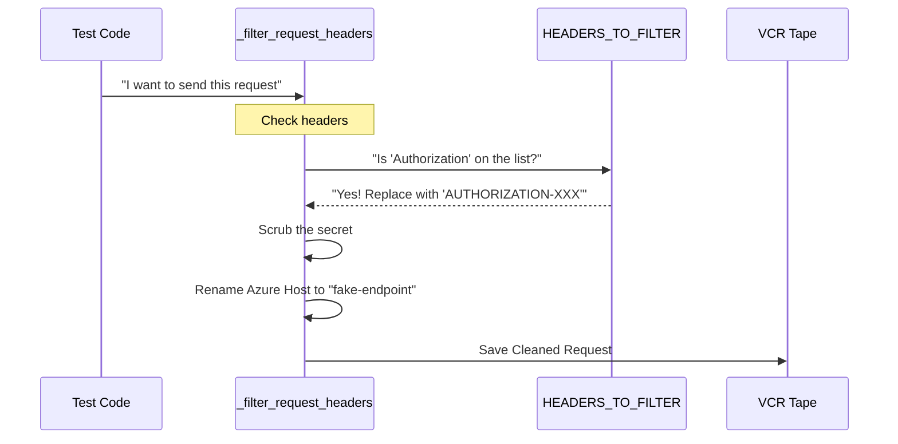

# Chapter 5: _filter_request_headers

Welcome to Chapter 5!

In the previous chapter, [HEADERS_TO_FILTER](04_headers_to_filter.md), we created a "Blacklist"—a dictionary of sensitive words like `authorization` and `api-key` that we never want to save in our recordings.

 However, a list is just a piece of paper. It cannot protect you by itself. We need a **Security Guard** who actively looks at every outgoing message, checks the list, and scrubs out the secrets.

That Security Guard is the function `_filter_request_headers`.

## The Motivation: Why do we need this?

**The Use Case:**
1.  **Security:** You send a request to OpenAI using `sk-12345-secret`. If VCR records this directly, your key is stolen.
2.  **Consistency (The Azure Problem):** You are using Microsoft Azure OpenAI. Today, your server is named `my-company-east-us.azure.com`. Tomorrow, you might move to `my-company-west-us.azure.com`.
    *   If the server name changes, VCR thinks it's a completely new website and won't play the old recording.
    *   Your tests fail just because you changed regions, even though the logic is the same.

**The Solution:**
We need a helper function that:
1.  **Redacts** secrets using the list from Chapter 4.
2.  **Fakes** the Azure server name so the recording looks the same regardless of which region you use.

## How It Works: The Security Checkpoint

This function acts like a checkpoint at the border. Every request trying to leave your computer must stop here first.



## Internal Implementation: The Code

Let's look at `conftest.py` to see how this function is implemented. It takes a `request` object, modifies it in place, and returns it.

### Step 1: Scrubbing the Secrets

First, we loop through the dictionary we created in the previous chapter.

```python
def _filter_request_headers(request: Request) -> Request:
    """Filter sensitive headers from request before recording."""
    
    # 1. Loop through every secret we want to hide
    for header_name, replacement in HEADERS_TO_FILTER.items():
        # Check "key", "KEY", and "Key" to be safe
        for variant in [header_name, header_name.upper(), header_name.title()]:
            if variant in request.headers:
                # Replace the real value with the safe placeholder
                request.headers[variant] = [replacement]
```

*   **`request.headers`**: A dictionary containing things like `User-Agent` and `Authorization`.
*   **The Loop**: We check if any banned words are in the headers. We check uppercase and lowercase versions just to be safe.
*   **The Replacement**: If found, we overwrite the value with the replacement (e.g., `AUTHORIZATION-XXX`).

### Step 2: Standardizing the Method

We ensure the HTTP method (GET, POST, PUT) is always uppercase. This avoids confusion between `get` and `GET`.

```python
    # 2. Ensure method is uppercase (e.g., 'get' -> 'GET')
    request.method = request.method.upper()
```

### Step 3: The Azure Switcheroo

This is a clever trick for Azure users. We replace the specific server name with a generic one.

```python
    # 3. Check if we are talking to Azure OpenAI
    if request.host and request.host.endswith(".openai.azure.com"):
        original_host = request.host
        placeholder_host = "fake-azure-endpoint.openai.azure.com"
        
        # Rewrite the URL to use the fake host
        request.uri = request.uri.replace(original_host, placeholder_host)

    return request
```

*   **The Problem:** Your private Azure endpoint is `company-a.openai.azure.com`.
*   **The Fix:** We change the URL in the recording to `fake-azure-endpoint.openai.azure.com`.
*   **The Result:** If you share this recording with a friend who uses `company-b.openai.azure.com`, the test will still pass because the recording uses the generic name!

## Example: Before and After

Let's see what happens to a request when it passes through this function.

**Input (Real Request):**
```http
POST https://my-private-server.openai.azure.com/v1/chat
Authorization: Bearer sk-real-secret-123
User-Agent: my-computer
```

**Output (Recorded Request):**
```http
POST https://fake-azure-endpoint.openai.azure.com/v1/chat
Authorization: AUTHORIZATION-XXX
User-Agent: my-computer
```

## Summary

In this chapter, we learned about `_filter_request_headers`:

1.  It is the **active worker** that applies the security rules.
2.  It uses the **blacklist** from Chapter 4 to scrub secrets.
3.  It **normalizes** Azure URLs so tests are portable between different environments.

We have now successfully secured the *outgoing* message (the Request). But what about the *incoming* message (the Response)?

Sometimes, the server sends back sensitive data, or data that changes every time (like "Time taken: 0.5s"). If we record that, our tests might become "flaky" (randomly failing).

In the next chapter, we will learn how to clean up the data coming back from the server.

[Next Chapter: _filter_response_headers](06__filter_response_headers.md)

---

Generated by [Code IQ](https://github.com/adityasoni99/Code-IQ)