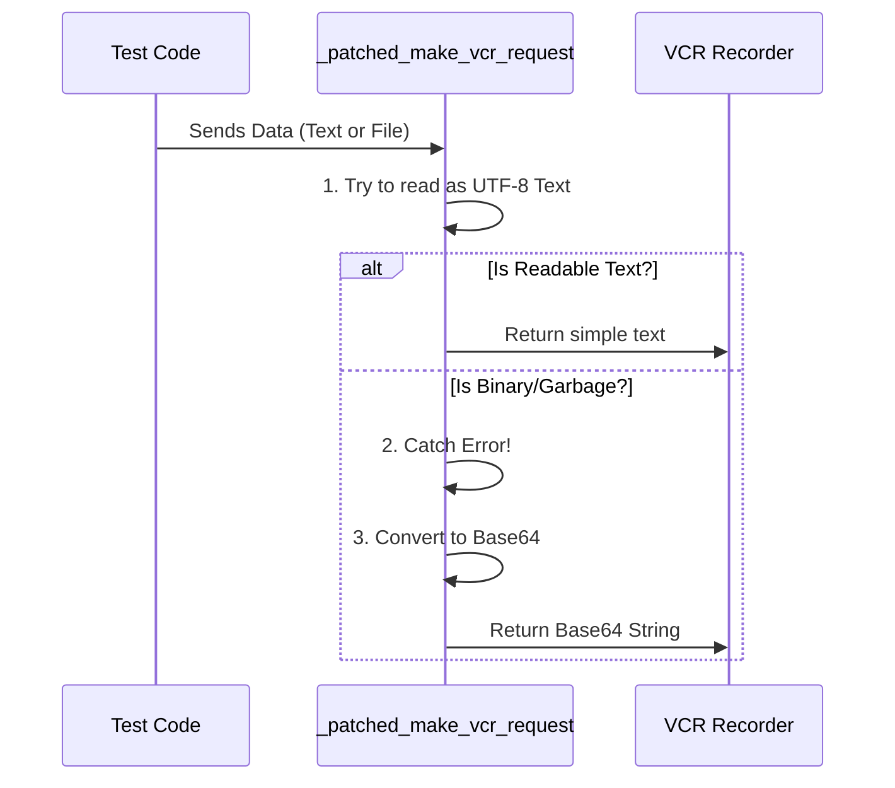

# Chapter 7: _patched_make_vcr_request

Welcome to Chapter 7!

In the previous chapter, [_filter_response_headers](06__filter_response_headers.md), we learned how to clean up the data coming **back** from the server. We made sure compressed data was unzipped and secrets were hidden.

Now, we have a clean recording system. But we have a new problem. CrewAI is powerful—it doesn't just chat; it can read files, analyze PDFs, and process images.

The standard VCR tool was built mostly for text. When you try to send a "binary" file (like an image) through it, the standard VCR crashes. It tries to read the image as if it were a novel, gets confused by the strange characters, and throws an error.

We need to fix this bug in the library without waiting for the library authors to update it.

## The Motivation: Why do we need this?

**The Use Case:**
Imagine you are testing a CrewAI agent that reads a PDF document to summarize it.
1.  **The Action:** The agent uploads `document.pdf` to the AI API.
2.  **The Crash:** Standard VCR tries to save the request to a text file. It opens the PDF, expects English letters (UTF-8), but finds "binary garbage" (machine code).
3.  **The Result:** Python throws a `UnicodeDecodeError`, and your test crashes instantly.

**The Solution:**
We need to write a "Patch." Think of a patch like putting a spare tire on a car. The original tire (function) is broken, so we swap it out for a robust one that handles both Text (for chatting) and Binary (for files).

## The Concept: Text vs. Binary

To understand this fix, you need to understand how computers see data.

1.  **UTF-8 (Text):** This is readable human text. "Hello World."
2.  **Binary (Raw):** This is how images and PDFs are stored. It looks like `\x89PNG\r\n\x1a...`.
3.  **Base64 (The Translator):** This is a way to turn Binary data into safe text characters so it can be saved in a text file without crashing.

## How It Works: The Decision Maker

Our patched function acts as a smart translator. It looks at the data you are sending and makes a decision.



1.  **Try:** Attempt to read the data as standard text.
2.  **Catch:** If that fails (crashes), catch the error before it stops the program.
3.  **Fallback:** Convert the binary data into Base64 (a text-safe format) and save that instead.

## Under the Hood: The Code

Let's look at the implementation in `conftest.py`. This function replaces the original VCR logic.

### Part 1: The Attempt

First, we grab the raw bytes from the request and try the "Happy Path" (assuming it's text).

```python
def _patched_make_vcr_request(httpx_request: Any, **kwargs: Any) -> Any:
    """Patched handler that supports binary content."""
    
    # 1. Get the raw bytes from the network request
    raw_body = httpx_request.read()
    
    try:
        # 2. Try to decode it as normal text (UTF-8)
        body = raw_body.decode("utf-8")
```

*   **`httpx_request.read()`**: Grabs the payload (what you are sending to the server).
*   **`.decode("utf-8")`**: Tries to turn those bytes into a string. If this is an image, this line crashes!

### Part 2: The Fallback

If the code above crashes, we jump into the `except` block.

```python
    except UnicodeDecodeError:
        # 3. If it crashed, it must be binary (like an image/PDF)
        # Encode it into Base64 so it can be saved as text
        body = base64.b64encode(raw_body).decode("ascii")
```

*   **`UnicodeDecodeError`**: This is the specific error Python throws when you try to read an image as text.
*   **`base64.b64encode`**: Turns the raw image bytes into a safe string of letters and numbers (e.g., `aGVsbG8gd29ybGQ=`).

### Part 3: Rebuilding the Request

Finally, we wrap up the safe body into a Request object that VCR can understand.

```python
    # 4. Get the URL and Headers
    uri = str(httpx_request.url)
    headers = dict(httpx_request.headers)

    # 5. Return a safe, recordable Request object
    return Request(httpx_request.method, uri, body, headers)
```

## Applying the Patch (Monkey Patching)

Writing the function is only half the battle. We now have to tell Python: "Don't use the library's function. Use mine instead."

This technique is called **Monkey Patching**. We are changing the behavior of a library while the program is running.

```python
# Import the internal part of the VCR library
try:
    import vcr.stubs.httpx_stubs as httpx_stubs
except ModuleNotFoundError:
    # Handle different versions of the library
    import vcr.stubs.httpcore_stubs as httpx_stubs

# THE SWAP: Replace their function with our function
httpx_stubs._make_vcr_request = _patched_make_vcr_request
```

*   **`httpx_stubs`**: This is the file inside the VCR library that handles requests.
*   **The assignment (`=`)**: We literally overwrite the function in the library with our `_patched_make_vcr_request`. Now, whenever VCR runs, it unknowingly uses our code!

## Summary

In this chapter, we learned about `_patched_make_vcr_request`:

1.  It solves the **Binary Crash** problem when agents upload files.
2.  It uses a **Try/Except** pattern to auto-detect if data is Text or Binary.
3.  It converts binary data to **Base64** so it can be safely recorded in text files.
4.  We used **Monkey Patching** to force the external library to use our fix.

Now our VCR is fully operational! It handles environment setup, config, file organization, security (redaction), and even complex binary file uploads.

However, CrewAI is an event-driven system. It keeps track of "Events" (like an agent starting a task). If we run Test A, it might leave some event counters running. When Test B starts, it might get confused by Test A's leftover numbers.

We need to wipe the event system's memory between tests.

[Next Chapter: reset_event_state](08_reset_event_state.md)

---

Generated by [Code IQ](https://github.com/adityasoni99/Code-IQ)