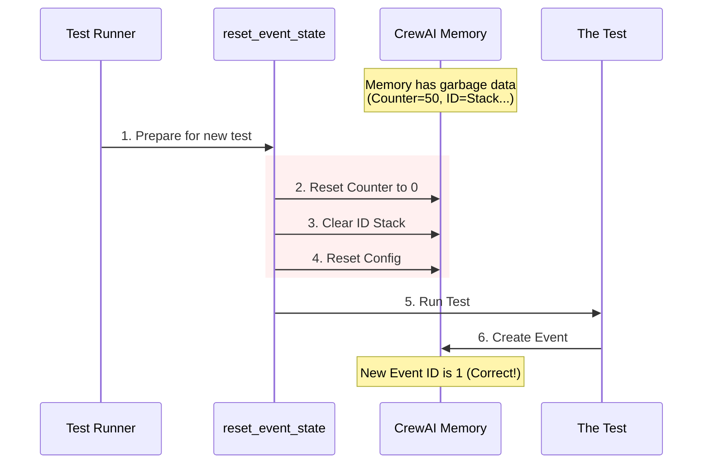

# Chapter 8: reset_event_state

Welcome to Chapter 8!

In the previous chapter, [_patched_make_vcr_request](07__patched_make_vcr_request.md), we performed some advanced "surgery" on our network recorder to handle binary file uploads. We ensured that our external interactions (talking to OpenAI) are safe, recorded, and replayable.

Now that the **External World** is stable, we need to look at the **Internal World** of CrewAI.

CrewAI keeps track of what is happening using an "Event System." It counts actions, tracks which task belongs to which agent, and maintains a history. If we don't clean this up between tests, one test might accidentally confuse the next one.

## The Motivation: Why do we need this?

**The Use Case:**
Imagine you are a referee at a basketball game (Test A).
1.  The game finishes. The score is **98-95**.
2.  The next game (Test B) is about to start.
3.  **The Problem:** If you don't reset the scoreboard, the second game starts with the score 98-95! The players will be confused, and the final results will be wrong.

**The Software Equivalent:**
CrewAI has an internal counter that assigns an ID to every event:
*   **Test A runs:** It creates 5 events. The internal counter is now at **5**.
*   **Test B starts:** It expects its first event to be ID #1.
*   **The Crash:** Instead, it gets ID #6. The test fails because "6 is not equal to 1."

**The Solution:**
We need a fixture that walks over to the scoreboard and presses the **RESET** button before every single match.

## What is `reset_event_state`?

This is a **function-scoped fixture**. It runs automatically before every test function to wipe the internal memory of the CrewAI event system.

It resets three specific things:
1.  **Emission Counter:** The "Scoreboard" (counts how many events happened).
2.  **Event ID Stack:** The "Family Tree" (tracks which event caused another event).
3.  **Context Configuration:** The "Game Rules" (current settings).

## How It Works: The Reset Button

Here is the flow of how this fixture ensures a clean slate for every test.



## Under the Hood: The Code

Let's look at `conftest.py`. This code is very short, but it touches critical parts of the system.

### Part 1: The Setup

First, we define the fixture and import the internal tools we need to reset.

```python
@pytest.fixture(autouse=True, scope="function")
def reset_event_state() -> None:
    """Reset event system state before each test for isolation."""
    # Import internal tools that manage state
    from crewai.events.base_events import reset_emission_counter
    # ... more imports ...
```

*   **`autouse=True`**: This is crucial. You never have to call this fixture manually. It runs before *every* test automatically. We want safety by default!
*   **`scope="function"`**: We reset before every single function, not just once per file.

### Part 2: Resetting the Counter

The first step is setting the "Scoreboard" back to zero.

```python
    # 1. Reset the counter that generates Event IDs
    reset_emission_counter()
```

*   **`reset_emission_counter()`**: This function sets the internal integer variable back to `0`. Now, the first event in your test will be `ID=1`.

### Part 3: Clearing the Stack

Next, we clear the "Call Stack." This is used for tracing—knowing that "Agent B did this because Agent A told him to."

```python
    from crewai.events.event_context import _event_id_stack

    # 2. Clear the history of active events
    _event_id_stack.set(())
```

*   **`_event_id_stack`**: This is a special variable (a `ContextVar`) that tracks the hierarchy of events.
*   **`.set(())`**: We set it to an empty tuple `()`. This means "No events are currently running."

### Part 4: Resetting Configuration

Finally, we ensure no weird configuration settings from a previous test stick around.

```python
    from crewai.events.event_context import (
        EventContextConfig, 
        _event_context_config
    )

    # 3. Reset configuration to default defaults
    _event_context_config.set(EventContextConfig())
```

*   **`EventContextConfig()`**: This creates a brand new, clean configuration object with default settings.
*   **`_event_context_config.set(...)`**: We replace whatever old configuration existed with this fresh one.

## Why is this important for you?

As a beginner writing tests for CrewAI, you might write a test like this:

```python
def test_agent_start():
    agent = Agent(...)
    # Run the agent
    result = agent.execute_task(...)
    
    # Check if this was the first event
    assert result.event_id == 1
```

Without `reset_event_state`, this test might pass when you run it alone, but **fail** when you run "All Tests".

*   **Why?** Because a previous test used up `event_id` 1 through 10. Your test would receive `event_id` 11.
*   **The Fix:** With this fixture, `event_id` is guaranteed to be 1, every single time.

## Summary

In this chapter, we learned about `reset_event_state`:

1.  It is the **Reset Button** for CrewAI's internal memory.
2.  It prevents **Test Pollution**, where one test messes up the numbers for the next test.
3.  It resets the **Counter**, the **Stack**, and the **Configuration**.
4.  It runs **automatically** (`autouse=True`) so you don't have to worry about it.

We have cleaned the external network (VCR) and the internal counters (Event State). But there is one last thing hanging around.

The Event System allows "Handlers" (listeners) to subscribe to events. If Test A registers a listener ("Print 'Hello' when a task finishes"), that listener might stick around. When Test B runs, it might suddenly print 'Hello' out of nowhere!

We need to fire these lingering listeners.

[Next Chapter: cleanup_event_handlers](09_cleanup_event_handlers.md)

---

Generated by [Code IQ](https://github.com/adityasoni99/Code-IQ)