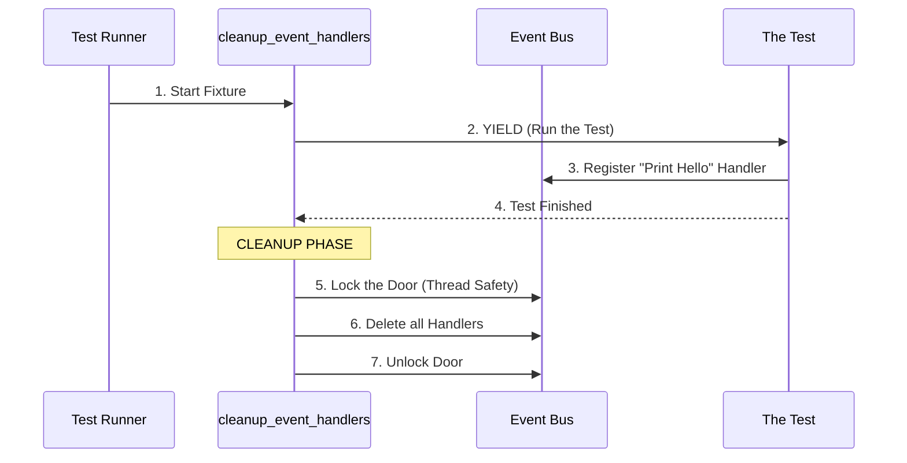

# Chapter 9: cleanup_event_handlers

Welcome to Chapter 9! This is the final chapter of our testing tutorial series.

In the previous chapter, [reset_event_state](08_reset_event_state.md), we learned how to reset the "scoreboard" (counters and IDs) of the CrewAI event system. We ensured that every test starts with `Event ID #1`.

However, resetting the score isn't enough. We also need to clear out the **audience**.

## The Motivation: Why do we need this?

**The Use Case:**
Imagine you are testing a notification system in CrewAI.
1.  **Test A:** You create a rule: *"Every time an Agent finishes a task, print 'GOOD JOB!' to the console."*
2.  Test A runs successfully and finishes.
3.  **Test B:** You run a silent test that checks for errors.
4.  **The Problem:** Suddenly, Test B prints "GOOD JOB!" to the console. Why?

**The Reason:**
The "rule" (Handler) you created in Test A was registered to a global system (the Event Bus). Even though Test A is over, the Event Bus still remembers that rule. The "listener" is still sitting in the room, waiting for events.

**The Solution:**
We need a bouncer. After every single party (test), the bouncer needs to clear the room, forcing all listeners to leave. This ensures Test B starts with an empty room.

## What is `cleanup_event_handlers`?

This is a **function-scoped fixture** in `pytest`.

*   **Function-scoped:** It runs for every single test function.
*   **Cleanup-focused:** It doesn't do much *before* the test; its main job happens *after* the test finishes.
*   **Job:** It finds the global Event Bus and deletes all registered listeners (handlers).

## How It Works: The "Clear the Room" Protocol

Here is the lifecycle of a test using this fixture.



1.  **Yield:** The fixture steps aside and lets the test run.
2.  **Pollution:** The test adds handlers (listeners) to the Event Bus.
3.  **Cleanup:** Once the test stops, the fixture wakes up.
4.  **Lock & Clear:** It locks the bus (so no one adds anything while it's cleaning) and wipes the lists.

## Under the Hood: The Code

Let's look at `conftest.py`. This implementation deals with **Global State** and **Thread Safety**, but we can break it down into simple steps.

### Step 1: The Setup and Yield

```python
@pytest.fixture(autouse=True, scope="function")
def cleanup_event_handlers() -> Generator[None, Any, None]:
    """Clean up event bus handlers after each test."""
    
    # 1. Yield control immediately. 
    # We don't need to do anything BEFORE the test.
    yield
```

*   **`autouse=True`**: Just like the previous chapter, this runs automatically. You don't need to ask for it.
*   **`yield`**: This is the dividing line. Everything above `yield` happens before the test. Everything below happens after. Since we only care about cleaning up the mess *after*, we yield immediately.

### Step 2: Accessing the Global Bus

After the test finishes, we need to find the mess.

```python
    try:
        # 2. Import the global event bus
        # This is where the handlers are hiding.
        from crewai.events.event_bus import crewai_event_bus
```

*   **`crewai_event_bus`**: This is a Singleton (a variable that is shared across the entire application). This is where the pollution lives.

### Step 3: Thread Safety (The Lock)

CrewAI supports running agents in parallel (using threads). Because of this, we have to be careful not to delete a list while another thread is trying to read it.

```python
        # 3. Lock the bus so no one else touches it
        with crewai_event_bus._rwlock.w_locked():
            
            # 4. Clear the Synchronous handlers
            crewai_event_bus._sync_handlers.clear()
            
            # 5. Clear the Asynchronous handlers
            crewai_event_bus._async_handlers.clear()
```

*   **`_rwlock.w_locked()`**: This stands for "Read-Write Lock (Write Locked)". It's like putting a "Cleaning in Progress" sign on the door and locking it. It ensures no background threads crash because we deleted their data.
*   **`.clear()`**: This empties the Python list. It deletes every listener inside it.

### Step 4: Safety First

Finally, we wrap it in a try-catch block to ensure the test suite doesn't crash if something goes wrong during cleanup.

```python
    except Exception:
        # If cleanup fails, don't fail the test
        pass
```

## Summary of the Series

Congratulations! You have completed the entire tutorial on the `crewAI` testing infrastructure.

Let's recap the journey we took to build a robust, professional testing environment:

1.  **[setup_test_environment](01_setup_test_environment.md)**: We created a clean sandbox file system for every test.
2.  **[vcr_config](02_vcr_config.md)**: We configured a "VCR" to record and replay network requests, saving money and time.
3.  **[vcr_cassette_dir](03_vcr_cassette_dir.md)**: We organized our recording files into a neat folder structure.
4.  **[HEADERS_TO_FILTER](04_headers_to_filter.md)**: We created a "Blacklist" of secrets (like API keys) to hide.
5.  **[_filter_request_headers](05__filter_request_headers.md)**: We built a security guard to scrub outgoing secrets.
6.  **[_filter_response_headers](06__filter_response_headers.md)**: We built a mail clerk to clean incoming responses and unzip files.
7.  **[_patched_make_vcr_request](07__patched_make_vcr_request.md)**: We fixed a bug in the library to allow binary file uploads (images/PDFs).
8.  **[reset_event_state](08_reset_event_state.md)**: We reset the internal counters and IDs between tests.
9.  **[cleanup_event_handlers](09_cleanup_event_handlers.md)**: We removed lingering event listeners to prevent side effects.

With these 9 tools working together in `conftest.py`, you can now write tests for AI Agents that are **fast**, **cheap**, **secure**, and **reliable**.

Happy Testing!

---

Generated by [Code IQ](https://github.com/adityasoni99/Code-IQ)