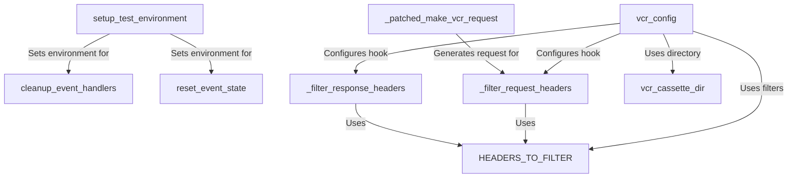

# Tutorial: crewAI

**crewAI** is a framework designed for orchestrating **AI agents**, enabling them to work together using various LLM providers like OpenAI, Azure, and Anthropic. The provided code configures the project's **test environment**, focusing on a **VCR (Video Cassette Recorder)** system that records and replays HTTP requests to ensure deterministic testing. It includes mechanisms for handling **binary data**, **filtering sensitive headers** (like API keys), and managing **event bus** state to prevent test pollution.

**Source Repository:** [https://github.com/crewAIInc/crewAI](https://github.com/crewAIInc/crewAI)

## Chapters

1. [setup_test_environment](01_setup_test_environment.md)
2. [vcr_config](02_vcr_config.md)
3. [vcr_cassette_dir](03_vcr_cassette_dir.md)
4. [HEADERS_TO_FILTER](04_headers_to_filter.md)
5. [_filter_request_headers](05__filter_request_headers.md)
6. [_filter_response_headers](06__filter_response_headers.md)
7. [_patched_make_vcr_request](07__patched_make_vcr_request.md)
8. [reset_event_state](08_reset_event_state.md)
9. [cleanup_event_handlers](09_cleanup_event_handlers.md)

---

Generated by [Code IQ](https://github.com/adityasoni99/Code-IQ)