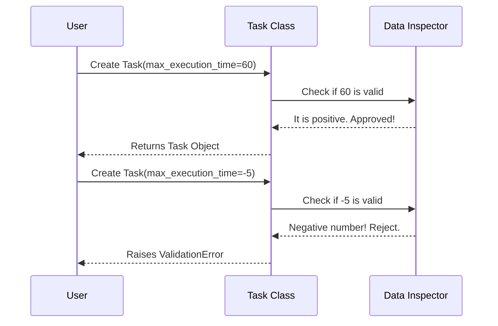

# Chapter 1: lib/crewai/src/crewai/task.py

Welcome to the first chapter of your journey into **CrewAI**! 

In this framework, we orchestrate "Crews" of AI agents to do work for us. But before we can hire agents, we need to define exactly **what** needs to be done.

This brings us to our first core concept: the **Task**.

## The Motivation

Imagine you are a manager. You give an employee a job, like "Search the internet for funny cat videos." 

Without constraints, that employee might search for 10 hours straight! In the world of AI, this costs money and blocks other work. You need a way to say: **"Do this task, but if it takes longer than 60 seconds, stop immediately."**

This chapter focuses on adding a safety feature to our Tasks: **Max Execution Time**.

## Central Use Case: The Timed Research

Let's say we want to create a task for an AI agent to "Summarize the news." We want this to be quick.

**The Goal:** Define a Task that automatically invalidates itself if it runs for too long.

## Key Concepts

To understand how we build this, we need to understand two simple concepts:

1.  **The Task Model**: This is a blueprint. It describes what the task is (description), what the result should look like (expected output), and now, how long it is allowed to take.
2.  **Validation**: This is a quality check. If you tell the system the time limit is "-50 seconds", that doesn't make sense. Validation ensures the rules are followed (e.g., time must be a positive number).

## How to Use It

Here is how you, as a user of CrewAI, will use this new feature.

We are going to define a simple task with a `max_execution_time`.

```python
from crewai import Task

# Define a task that must finish in 60 seconds
research_task = Task(
    description="Find the latest stock prices.",
    expected_output="A list of top 5 stocks.",
    max_execution_time=60
)
```

**What happens here?** 
You created a task object. You told CrewAI that if the agent assigned to this task spends more than 60 seconds working on it, the framework should intervene (stop execution).

### Handling Invalid Inputs

What if we make a mistake?

```python
# This will cause an error!
bad_task = Task(
    description="Impossible task",
    expected_output="Nothing",
    max_execution_time=-100  # You can't have negative time!
)
```

**The Output:**
The code above will raise a `ValidationError`. CrewAI protects you from setting up a task that makes no sense physically.

## Internal Implementation: Under the Hood

Now, let's look at `lib/crewai/src/crewai/task.py`. This is where the magic happens.

When you run the code above, CrewAI doesn't just save the number. It runs a **Validation Process**.

### The Sequence

Imagine a "Task Factory." When you submit an order for a Task, it goes through a specialized inspector.



### The Code Implementation

Let's look at the actual Python code inside `lib/crewai/src/crewai/task.py`. 

We use a library called `Pydantic` which helps strict data validation.

#### Step 1: Adding the Field

First, we need to add the `max_execution_time` slot to our blueprint.

```python
# lib/crewai/src/crewai/task.py
from pydantic import BaseModel, Field

class Task(BaseModel):
    # ... other existing fields like description ...
    
    # We add the new field here. 
    # It is optional (int | None).
    max_execution_time: int | None = Field(default=None)
```

**Explanation:**
*   `int | None`: This means the value can be a whole number (Integer) OR it can be empty (None) if we don't care about a time limit.
*   `Field(default=None)`: If the user doesn't provide a value, it defaults to having no limit.

#### Step 2: Adding the Validator

Now we need the "Inspector" logic to ensure the number is positive.

```python
# lib/crewai/src/crewai/task.py
from pydantic import field_validator

class Task(BaseModel):
    # ... fields defined above ...

    @field_validator('max_execution_time')
    @classmethod
    def _validate_max_execution_time(cls, v):
        # 'v' is the value the user provided (e.g., 60 or -5)
        if v is not None and v <= 0:
            raise ValueError(
                'max_execution_time must be a positive integer'
            )
        return v
```

**Explanation:**
1.  `@field_validator`: This decorator tells Python, "Run this function whenever someone tries to set `max_execution_time`."
2.  `if v is not None`: We only check if a value was actually provided.
3.  `and v <= 0`: If the value is zero or negative...
4.  `raise ValueError`: Stop everything! Tell the user they made a mistake.

## Summary

In this chapter, we learned:
1.  **Tasks** are the units of work in CrewAI.
2.  We added a `max_execution_time` to prevent agents from working indefinitely.
3.  We used a **Validator** to ensure users don't input negative time limits.

You now have a robust definition of work to be done. However, a Task is just a piece of paper without someone to execute it. We need a worker.

In the next chapter, we will learn about the entity responsible for executing these tasks: the **Agent**.

[lib/crewai/src/crewai/agent/core.py](02_lib_crewai_src_crewai_agent_core_py.md)

---

Generated by [Code IQ](https://github.com/adityasoni99/Code-IQ)