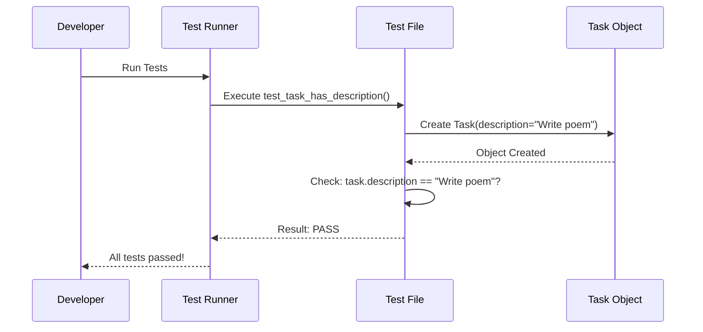

# Chapter 1: lib/crewai/tests/test_task.py

Welcome to your journey with **crewAI**! In this first chapter, we are going to look at the foundation of reliability: **Testing**. Specifically, we will explore `lib/crewai/tests/test_task.py`.

## Why does this file exist?

Imagine you are building a robot to clean your house. Before you turn it on and let it roam free, you want to make sure that when you say "sweep the floor," it understands the command and doesn't try to wash the dishes instead.

In programming, this "safety check" is called a **Test**.

The file `lib/crewai/tests/test_task.py` is a collection of safety checks. It ensures that the **Task** concept in crewAI works exactly as expected.

### The Central Use Case
We want to verify that when we create a **Task** (a job for an AI agent), it actually saves the instructions we gave it.

**Goal:** Create a test that confirms a task has the correct description.

## Key Concepts

Before we look at the code, let's learn two simple concepts:

1.  **The Task:** This is a unit of work. Think of it like a "To-Do" sticky note. It has a description (what to do) and an expected output (what the result looks like).
2.  **The Assertion:** This is the "grading" part of the test. It compares **what we got** versus **what we expected**. If they match, the test passes!

## Solving the Use Case

Let's write a simple test case similar to what you would find in `lib/crewai/tests/test_task.py`. We will check if a Task remembers its description.

### Step 1: Importing the Tools
First, we need to bring in the `Task` blueprint so we can test it.

```python
# We need the Task class to test it
from crewai.task import Task
from crewai.agent import Agent
```
*Explanation:* We are grabbing the `Task` tool from the crewAI toolbox. We also grab `Agent` because every task usually needs someone to do it.

### Step 2: Creating a Dummy Agent
A task usually needs an Agent. For our test, we just need a simple placeholder agent.

```python
# Create a simple agent for the test
test_agent = Agent(
    role='Tester',
    goal='Run tests',
    backstory='I love testing code'
)
```
*Explanation:* We create a generic agent named "Tester". This agent will be assigned to our task.

### Step 3: Defining the Test Function
In Python testing, we usually write functions that start with `test_`.

```python
def test_task_has_description():
    # 1. Setup
    my_description = "Write a poem about coding"
    
    # 2. Create the Task
    task = Task(
        description=my_description,
        agent=test_agent
    )
```
*Explanation:* We define a function `test_task_has_description`. Inside, we define what we want the task to be ("Write a poem...") and then we create the `Task` object.

### Step 4: The Assertion (The Check)
Now, we check if the task actually remembered the description.

```python
    # 3. Assert (Verify)
    # Check if the task's description matches what we set
    assert task.description == "Write a poem about coding"
```
*Explanation:* The `assert` keyword is the judge. It looks at `task.description`. If it is exactly "Write a poem about coding", the test passes. If not, it creates an error.

## Under the Hood

What happens when we run this file? It's not magic, it's a step-by-step process.

### The Flow
1.  **Test Runner** (a program like `pytest`) looks for files starting with `test_`.
2.  It finds `test_task.py`.
3.  It looks for functions starting with `test_`.
4.  It runs our function.
5.  It creates a **Task Object** in memory.
6.  It compares the data inside that object to our expectations.

Here is a diagram of that conversation:



### Deep Dive: Implementation Details

The `test_task.py` file is critical because it reproduces issues. If a user reports a bug (e.g., "Tasks forget their descriptions!"), developers write a test here to reproduce that bug, and then fix the code until the test passes.

Let's look at how the file might check for required fields.

**Checking Defaults:**
Sometimes we test what happens if we *don't* give information.

```python
def test_task_defaults():
    # Create a minimal task
    task = Task(description="Just a job")
    
    # Verify default execution setting
    # By default, async_execution should be False
    assert task.async_execution is False
```
*Explanation:* Here, we check the *internal implementation* of the `Task` class. We didn't tell it to run asynchronously (in the background), so we expect the default to be `False`.

**Testing Validation:**
The test file also checks if the Task complains when we give it bad data.

```python
import pytest

def test_task_requires_description():
    # Trying to create a task without a description
    # should cause an error
    with pytest.raises(ValueError):
        Task(agent=test_agent)
```
*Explanation:* This block says: "I expect a `ValueError` (an error) when I try to make a Task with no description." If the error happens, the test passes! This ensures the `Task` class is strictly enforcing rules.

## Conclusion

In this chapter, we explored `lib/crewai/tests/test_task.py`. You learned that:
1.  **Tests are safety checks** that verify our code works.
2.  We use `assert` to compare **actual results** with **expectations**.
3.  This specific file ensures that `Task` objects hold their data correctly and follow the rules.

Understanding how to test a Task gives you confidence that when you build complex crews later, the basic building blocks are solid!

Since this is the only chapter currently available, you have completed the tutorial! Happy coding with crewAI!

---

Generated by [Code IQ](https://github.com/adityasoni99/Code-IQ)