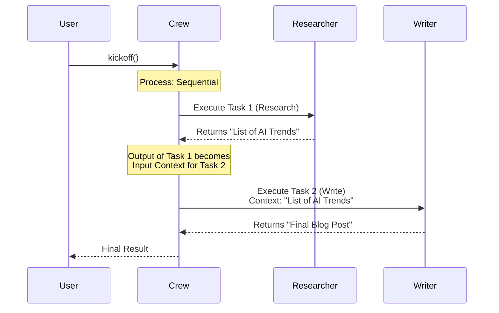

# Chapter 1: Sequential Process

Welcome to the world of **crewAI**! If you are just starting out, you are in the right place. 

In this first chapter, we are going to learn about the default way your AI agents work together: the **Sequential Process**.

## Why do we need a Sequential Process?

Imagine you are planning a blog post. Usually, the workflow looks like this:
1.  **Research:** Find the facts.
2.  **Write:** Draft the content based on the facts.
3.  **Edit:** Polish the writing.

You cannot write the post before you find the facts, and you certainly can't edit the post before it is written. This is a **linear dependency**. 

The **Sequential** process solves the problem of order. It ensures that tasks are executed one after another, in a specific order, just like a relay race. The first agent runs their lap and passes the baton (the information) to the next agent.

### The Central Use Case: "The Relay Race"
Our goal in this chapter is to build a simple crew that:
1.  **Researches** a topic (e.g., "The future of AI").
2.  **Writes** a summary based *only* on that research.

If we don't use a sequential process, the Writer might start writing before the Researcher has found any information!

---

## How it Works

To make this happen, we use four key ingredients:
1.  **Agents**: The workers (Researcher, Writer).
2.  **Tasks**: The specific jobs they need to do.
3.  **Process**: The rules of how tasks are distributed.
4.  **Crew**: The container that holds it all together.

### Step 1: Define Your Agents
First, we need to import our tools and create the workers.

```python
from crewai import Agent, Task, Crew, Process

# Create the Researcher agent
researcher = Agent(
  role='Researcher',
  goal='Find key facts about the topic',
  backstory='You are an expert at gathering data.'
)
```
*Explanation:* We created an Agent named `researcher`. Think of this as hiring an employee and giving them a job title and a goal.

```python
# Create the Writer agent
writer = Agent(
  role='Writer',
  goal='Write a story based on research',
  backstory='You can turn complex data into a good story.'
)
```
*Explanation:* Now we have our second employee, the `writer`. They are waiting for work to do.

### Step 2: Define Your Tasks
Now we need to define the "To-Do" list. The order here is very important!

```python
# Define the first task
task1 = Task(
  description='Research the latest trends in AI.',
  agent=researcher
)
```
*Explanation:* `task1` is assigned to the researcher. This is the first leg of our relay race.

```python
# Define the second task
task2 = Task(
  description='Write a blog post using the research provided.',
  agent=writer
)
```
*Explanation:* `task2` is assigned to the writer. Notice the description says "using the research provided." In a sequential process, `task2` will automatically receive the output of `task1`.

### Step 3: Create the Crew
This is where the magic happens. We assemble the team and define the `process`.

```python
# Assemble the Crew
my_crew = Crew(
  agents=[researcher, writer],
  tasks=[task1, task2],
  process=Process.sequential  # <--- The key setting
)
```
*Explanation:* We list our agents and our tasks. By setting `process=Process.sequential`, we tell crewAI: "Do `task1` first. When it finishes, take the result and give it to `task2`."

### Step 4: Kickoff!
Let's start the engine.

```python
# Start the process
result = my_crew.kickoff()

print("Final Output:")
print(result)
```
*Explanation:* The `kickoff()` method starts the execution. 
1. The Researcher works.
2. The output is passed to the Writer.
3. The Writer works.
4. The final blog post is printed as the `result`.

---

## Under the Hood: Internal Implementation

What actually happens when you run `kickoff()` with a sequential process? 

It is essentially a loop. The Crew takes the list of tasks you provided and goes through them one by one. The "secret sauce" is context passing: the result of the previous task is automatically appended to the context of the next task.

### Visualizing the Sequence

Here is a diagram showing the flow of information:



### A Peek at the Code Logic
*Note: This is a simplified view of what happens inside the `crew.py` file to help you understand the logic.*

The sequential process relies on a simple iteration over the tasks list.

```python
# Simplified internal logic for Sequential Process
def kickoff(self):
    previous_output = ""

    for task in self.tasks:
        # Pass the result of the previous task to the current one
        result = task.execute(context=previous_output)
        
        # Update the variable for the next iteration
        previous_output = result

    return previous_output
```
*Explanation:* 
1. We start with an empty `previous_output`.
2. We loop through every task in the list `self.tasks`.
3. We execute the task, giving it the `previous_output` as context.
4. The result of the current task becomes the `previous_output` for the next one.

This ensures that the Writer (Task 2) always knows what the Researcher (Task 1) found!

---

## Conclusion

The **Sequential** process is the most straightforward way to coordinate agents. It is perfect when step B cannot happen without step A.

**Key Takeaways:**
*   Tasks are executed in the order they are listed.
*   The output of one task is passed as context to the next.
*   It behaves like a relay race.

However, sometimes a strict line isn't enough. What if you need a manager to delegate tasks dynamically? Or what if you want your agents to vote on a decision?

In the next chapter, we will explore how to add a manager to the mix.

[Next Chapter: hierarchical](02_hierarchical.md)

---

Generated by [Code IQ](https://github.com/adityasoni99/Code-IQ)