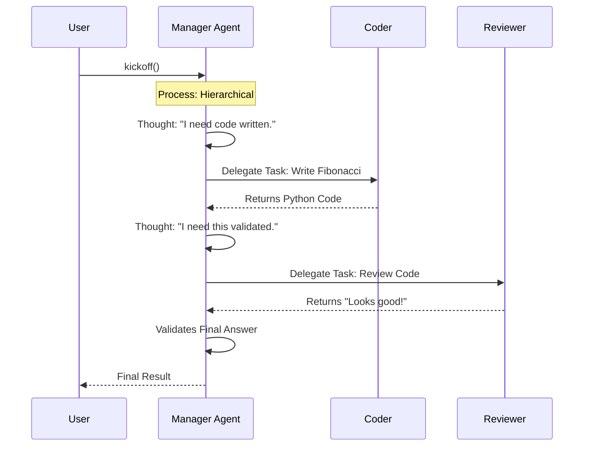

# Chapter 2: Hierarchical Process

Welcome back! In the previous [Chapter 1: Sequential Process](01_sequential.md), we learned how to run a "relay race" where Agent A passes work to Agent B in a strict line.

But real life isn't always a straight line. Sometimes, you need a boss.

In this chapter, we will explore the **Hierarchical Process**. This is where things get smarter. Instead of following a strict list, we introduce a **Manager** who oversees the work, delegates tasks to the right people, and checks the quality of the results.

## Why do we need a Manager?

Let's look at our **Central Use Case: "The Software Studio"**.

Imagine you are building a small software feature. You have:
1.  **A Junior Coder:** Writes the code.
2.  **A Reviewer:** Checks the code for errors.

In a **Sequential** process (Chapter 1), the Coder writes, passes it to the Reviewer, and the Reviewer says "Okay" or "Bad". But what if the code is bad? In a strict line, the process just ends with bad code.

In a **Hierarchical** process, we have a **Manager**.
1.  The Manager tells the Coder to write code.
2.  The Coder finishes.
3.  The Manager asks the Reviewer to check it.
4.  If the Reviewer says "Fix this," the **Manager sends it back to the Coder**.

The Manager acts as a smart router and a quality gatekeeper.

---

## How it Works

To use the hierarchical process, you don't need to create a specific "Manager Agent" yourself. **crewAI creates the manager for you** automatically! 

You just need to provide the brain (the LLM) that this manager will use.

### Step 1: Define Your Agents
Just like before, we define our workers.

```python
from crewai import Agent, Task, Crew, Process
from langchain_openai import ChatOpenAI

# 1. The Coder Agent
coder = Agent(
    role='Junior Coder',
    goal='Write python code solutions',
    backstory='You are learning to write clean code.',
    allow_delegation=False
)
```
*Explanation:* We create the worker who does the actual writing. Note `allow_delegation=False`—the junior coder acts, they don't boss others around.

```python
# 2. The Reviewer Agent
reviewer = Agent(
    role='Code Reviewer',
    goal='Ensure code quality',
    backstory='You are a strict senior engineer.',
    allow_delegation=False
)
```
*Explanation:* We create the reviewer. They are an expert at spotting mistakes.

### Step 2: Define Your Tasks
We define the work to be done.

```python
task_write = Task(
    description='Write a python function to calculate Fibonacci numbers.',
    agent=coder
)

task_review = Task(
    description='Review the code. If it is not optimal, ask for changes.',
    agent=reviewer
)
```
*Explanation:* We have two distinct tasks. In a hierarchical process, the Manager looks at these tasks and decides who is best suited to execute them and in what order, or simply manages the flow between them.

### Step 3: Create the Crew with a Manager
This is the most important step. We need to switch the `process` and provide a `manager_llm`.

```python
# Define the Manager's Brain (LLM)
manager_model = ChatOpenAI(model_name="gpt-4")

# Create the Crew
my_crew = Crew(
    agents=[coder, reviewer],
    tasks=[task_write, task_review],
    process=Process.hierarchical,  # <--- Enable Hierarchy
    manager_llm=manager_model      # <--- The Manager's Brain
)
```
*Explanation:* 
1. `Process.hierarchical`: This tells crewAI, "Don't run in a straight line. Let the manager coordinate."
2. `manager_llm`: Since crewAI creates the manager agent automatically, it needs to know which AI model to use for the boss's logic.

### Step 4: Kickoff!
We start the studio.

```python
# Start the project
result = my_crew.kickoff()

print("Final Code Solution:")
print(result)
```
*Explanation:* When you run this, you won't just see Task 1 then Task 2. You might see the Manager instructing the Coder, then asking the Reviewer for feedback, and validating the output.

---

## Under the Hood: Internal Implementation

What is the "Manager" actually doing?

In the Sequential process, the logic was a simple loop (`for task in tasks`). In the **Hierarchical** process, the logic changes to a **delegation loop**.

The Manager is a special "Meta-Agent". It looks at the user's input and the available tools (which are the other agents!). 

### Visualizing the Hierarchy



### A Peek at the Code Logic

*Note: This is a simplified concept of how the Manager operates inside the library.*

The Manager treats the other agents as "tools" it can call upon.

```python
# Simplified internal logic for Hierarchical Process
def kickoff(self):
    # The system creates a temporary Manager Agent
    manager = self.create_manager_agent()
    
    # The Manager treats other agents as tools
    # e.g., tools = [call_coder, call_reviewer]
    
    # The Manager executes the main goal
    final_answer = manager.execute_task(
        task=self.tasks, 
        available_tools=self.agents
    )

    return final_answer
```
*Explanation:*
1. Instead of iterating through tasks 1-2-3, crewAI initiates the **Manager**.
2. The Manager is given a list of your agents (`coder`, `reviewer`) as if they were software functions (tools).
3. The Manager uses its LLM brain to decide: "I should call the Coder tool now."
4. The Manager reviews the output and decides the next step.

---

## Conclusion

The **Hierarchical** process adds intelligence to your automation. It allows for validation, delegation, and complex coordination.

**Key Takeaways:**
*   Use `Process.hierarchical` when you need a "boss" to oversee quality.
*   You must provide a `manager_llm` so the boss has a brain.
*   The Manager treats other agents as tools to be used to accomplish the goal.

So far, we have covered strict lines (Sequential) and boss-employee structures (Hierarchical). But what if you want a true democracy where agents collaborate without a boss?

In the next chapter, we will discuss the Consensual process (coming soon in future updates), but for now, you have mastered the two core flows of crewAI!

[Next Chapter: consensual](03_consensual.md)

---

Generated by [Code IQ](https://github.com/adityasoni99/Code-IQ)