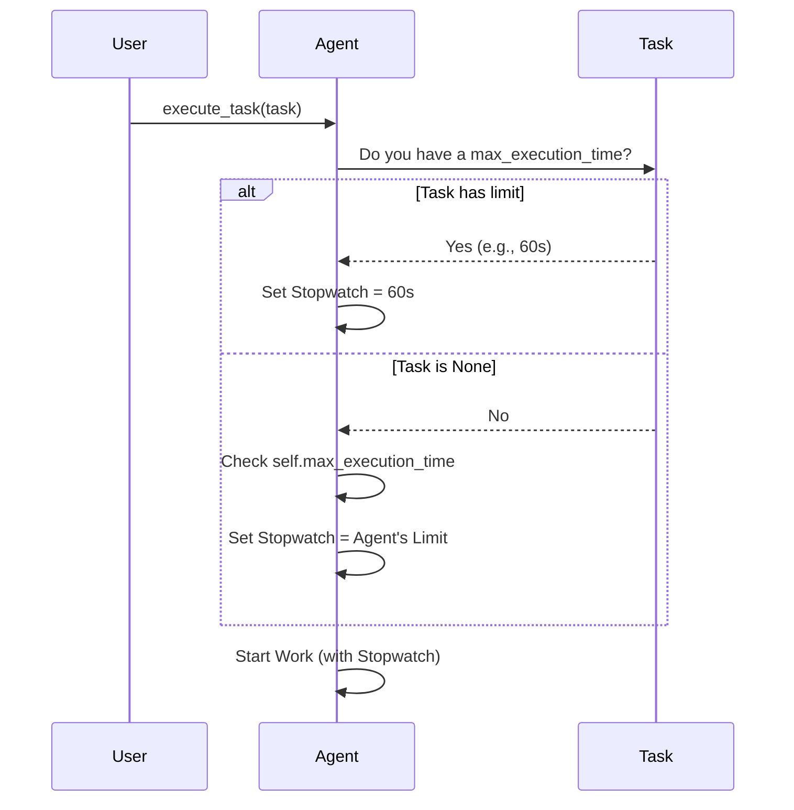

# Chapter 2: lib/crewai/src/crewai/agent/core.py

Welcome back! In the previous chapter, [lib/crewai/src/crewai/task.py](01_lib_crewai_src_crewai_task_py.md), we defined a "Task" and gave it a `max_execution_time`. We created a blueprint for work that *should* stop if it takes too long.

But a blueprint cannot build itself. It sits there until a worker picks it up.

In this chapter, we meet the worker: **The Agent**.

## The Motivation

Imagine you wrote "Complete in 60 seconds" on a sticky note (the Task) and handed it to an employee (the Agent).

If the employee ignores the note and works for an hour, your instruction was useless. The employee needs to:
1.  **Read** the sticky note.
2.  **Check** if there is a time limit.
3.  **Set** their stopwatch accordingly.

However, the employee might also have a general rule: *"I never work on ANY task for more than 1 hour, unless told otherwise."*

We need a system that decides which rule to follow. This chapter explains how the Agent decides how long to work.

## Central Use Case: The Strict Researcher

Let's stick to our "Summarize News" example.

1.  **Specific Case:** You have a breaking news task. You want the Agent to spend max **60 seconds** on it.
2.  **General Case:** The Agent is a "Deep Researcher." Usually, they spend **1 hour** on tasks.

**The Goal:** When the Agent picks up the specific breaking news task, they must respect the **60-second** limit, overriding their usual 1-hour habit.

## Key Concepts

To solve this, we introduce **Priority Logic**.

When an Agent gets ready to execute a task, it looks for the "Stopwatch Setting" in this order:

1.  **Task Setting (First Choice):** Does the specific task have a limit? If yes, use it.
2.  **Agent Setting (Fallback):** If the task has *no* limit, does the Agent have a general limit? If yes, use it.

## How to Use It

Let's see this in action. We will create an Agent with a long general time limit, but give them a Task with a short specific limit.

```python
from crewai import Agent, Task

# 1. Create an Agent with a general 1-hour limit (3600s)
researcher = Agent(
    role="Researcher",
    goal="Analyze data deeply",
    backstory="I am thorough.",
    max_execution_time=3600 
)
```

**Explanation:**
We created a `researcher`. If you give them a normal task without instructions, they will work for up to 3600 seconds.

Now, let's create the urgent task.

```python
# 2. Create a Task with a specific 60-second limit
urgent_task = Task(
    description="Quickly find Apple's stock price.",
    expected_output="The current price.",
    max_execution_time=60 
)
```

Finally, the Agent executes the task.

```python
# 3. The Agent executes the task
# Internally, the Agent will choose 60s, NOT 3600s.
researcher.execute_task(urgent_task)
```

**The Outcome:** The Agent respects the specific instruction on the Task. The process will timeout after 60 seconds.

## Internal Implementation: Under the Hood

How does the code actually make this decision? Let's visualize the decision-making process inside the Agent's brain when `execute_task` is called.

### The Sequence



### The Code Implementation

Now, let's look at `lib/crewai/src/crewai/agent/core.py`. We are interested in the `execute_task` method.

We will break this method down into simple steps.

#### Step 1: Retrieving the Task Limit

When execution starts, the Agent first looks at the Task.

```python
# lib/crewai/src/crewai/agent/core.py

def execute_task(self, task, context=None, tools=None):
    """
    Executes a specific task.
    """
    # First, assume the limit is whatever the task says
    time_limit = task.max_execution_time
```

**Explanation:**
*   We define the variable `time_limit`.
*   We grab the value directly from the `task` object we learned about in Chapter 1.

#### Step 2: The Fallback Logic

Next, we check if the Task actually *had* a limit. If not, we use the Agent's limit.

```python
    # If the task didn't specify a time, check the Agent's settings
    if not time_limit:
        time_limit = self.max_execution_time
```

**Explanation:**
*   `if not time_limit`: This checks if the task's time is `None` (empty).
*   `self.max_execution_time`: This refers to the limit defined on the Agent itself.

#### Step 3: Running the Execution

Finally, the Agent starts the actual work (using a library like `LiteLLM` or `LangChain` internally), passing along the calculated time limit.

```python
    # Pass the final calculated time_limit to the runner
    result = self.agent_executor.invoke(
        inputs,
        timeout=time_limit  # This is where the rule is enforced!
    )

    return result
```

**Explanation:**
*   `self.agent_executor.invoke`: This is the engine that runs the AI loop.
*   `timeout=time_limit`: We pass the number we calculated (60s or 3600s) to the engine. If the AI takes longer than this, the engine cuts the power.

### Async Execution

Agents can also work asynchronously (doing multiple things at once). The file also contains `aexecute_task`. The logic is exactly the same!

```python
async def aexecute_task(self, task, context=None, tools=None):
    # Same logic applies here
    time_limit = task.max_execution_time

    if not time_limit:
        time_limit = self.max_execution_time
    
    # ... execute asynchronously ...
```

## Summary

In this tutorial, we successfully built a safety mechanism for our AI workforce.

1.  In **Chapter 1**, we updated the **Task** blueprint to allow a specific time limit.
2.  In **Chapter 2**, we updated the **Agent** to respect that limit, falling back to its own settings only if necessary.

You now understand how `crewAI` orchestrates control between the instructions (Task) and the worker (Agent). The Agent is smart enough to know that a specific instruction on a task is more important than its general routine.

**You have completed the Beginner's Guide to Time Management in CrewAI!** You are now ready to build Crews that are efficient and respect your time constraints.

---

Generated by [Code IQ](https://github.com/adityasoni99/Code-IQ)