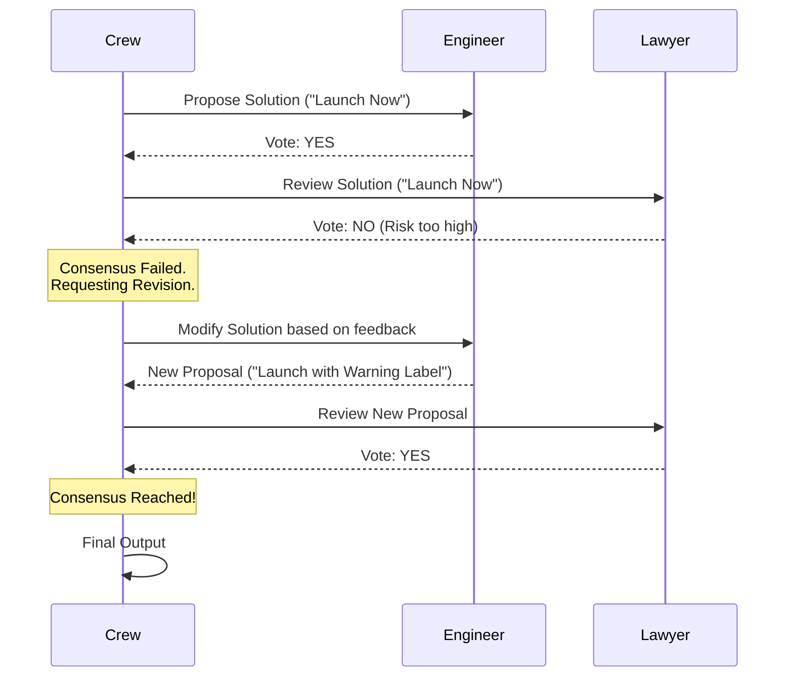

# Chapter 3: Consensual Process

Welcome to the cutting edge of **crewAI**!

In the previous [Chapter 2: Hierarchical Process](02_hierarchical.md), we learned how to use a "Manager" to boss agents around and ensure quality. Before that, in [Chapter 1: Sequential Process](01_sequential.md), we learned how to run tasks in a straight line.

But what if you don't want a boss? What if you want a **Democracy**?

In this chapter, we will explore the concept of the **Consensual Process**.

> 🚧 **Note:** The Consensual Process is currently a **planned feature** (experimental). It represents the future direction of crewAI. This chapter explores the *concept* and design behind it, so you are ready when it launches!

## Why do we need Consensus?

Imagine our **Central Use Case: "The Product Launch"**.

You are launching a new software product. To approve the launch, you need agreement from three different departments:
1.  **Engineering:** "Is the code stable?"
2.  **Marketing:** "Is the website ready?"
3.  **Legal:** "Are we compliant with the law?"

If you use a **Sequential** process, Legal might say "Yes" to the law, but ignore that Engineering says the code is broken.
If you use a **Hierarchical** process, a Manager decides, but the Manager might override the Engineer's safety concerns.

In a **Consensual** process, **everyone must agree**. If the Engineer says "No," the launch stops, and the team must fix the problem until *everyone* says "Yes."

### The Analogy: "Ordering Pizza"
Imagine you and two friends are choosing a pizza.
*   Friend A wants Pepperoni.
*   Friend B is Vegetarian.
*   Friend C hates mushrooms.

You cannot order until you find a topping that satisfies **all three** constraints. You discuss, propose options, and vote until you reach a **Consensus**.

---

## How it Works (Conceptual)

In this workflow, agents act like a committee. They don't just do work; they evaluate the work of others and have veto power.

### Step 1: Define Your Agents
We need a team with different viewpoints.

```python
from crewai import Agent, Task, Crew, Process

# 1. The Engineer (Focus: Stability)
engineer = Agent(
  role='Lead Engineer',
  goal='Ensure the system is stable',
  backstory='You say NO if there are bugs.'
)
```
*Explanation:* The Engineer is programmed to care about stability.

```python
# 2. The Lawyer (Focus: Compliance)
lawyer = Agent(
  role='Legal Advisor',
  goal='Ensure we do not get sued',
  backstory='You say NO if there is risk.'
)
```
*Explanation:* The Lawyer doesn't care about bugs, only legal risk.

### Step 2: Define the Task
The task is shared. It requires approval.

```python
# The Shared Task
launch_task = Task(
  description='Review the product for launch.',
  expected_output='A "GO" or "NO GO" decision based on agreement.',
  agent=engineer # Assigned to lead, but needs consensus
)
```
*Explanation:* While one agent might lead the task, the output isn't valid until the others sign off.

### Step 3: Create the Crew (Future Syntax)
Here is how you would theoretically set up the consensual process.

```python
# Create the Democratic Crew
my_crew = Crew(
  agents=[engineer, lawyer],
  tasks=[launch_task],
  process=Process.consensual  # <--- The Future Feature
)
```
*Explanation:* By selecting `Process.consensual`, you are telling crewAI: "Do not finish this task until the agents agree on the output."

---

## Under the Hood: Internal Implementation

How does a computer program reach a "consensus"? It isn't magic; it is a loop of **Proposal** and **Voting**.

When you run a consensual process, the system enters a "Negotiation Phase."

### Visualizing the Negotiation



### A Peek at the Logic
*Note: This is a conceptual implementation of how the logic would handle the loop.*

The system needs a `while` loop that continues as long as there is a disagreement.

```python
# Conceptual logic for Consensual Process
def kickoff(self):
    proposal = self.generate_initial_proposal()
    consensus = False

    while not consensus:
        # Ask all agents to vote on the proposal
        votes = self.collect_votes(proposal, self.agents)
        
        if all(vote == "YES" for vote in votes):
            consensus = True
        else:
            # If someone says NO, ask agents to improve the proposal
            proposal = self.refine_proposal(proposal, feedback=votes)
            
    return proposal
```
*Explanation:*
1.  **Generate Proposal:** The agents create a draft.
2.  **Collect Votes:** The system asks every agent: "Is this acceptable based on your goal?"
3.  **Check:** If `all` agents say YES, we are done.
4.  **Refine:** If anyone says NO, the system takes the criticism and asks the agents to rewrite the proposal.
5.  **Repeat:** This loops until everyone is happy (or a limit is reached).

---

## Conclusion

The **Consensual** process is the holy grail of autonomous AI collaboration. It moves beyond simple "do this, then that" (Sequential) or "do what I say" (Hierarchical) into true **collaboration**.

**Key Takeaways:**
*   **Sequential:** Relay race (A $\to$ B $\to$ C).
*   **Hierarchical:** Pyramid (Manager controls A, B, and C).
*   **Consensual:** Round Table (A, B, and C must agree).

Although this feature is currently in the experimental stage of crewAI's development, understanding it helps you see the future of AI Agents: teams that think, debate, and agree just like humans do.

You have now completed the core tutorial on crewAI Processes! You understand how to structure teams in lines, pyramids, and circles.

Happy coding with your new AI crews!

---

Generated by [Code IQ](https://github.com/adityasoni99/Code-IQ)