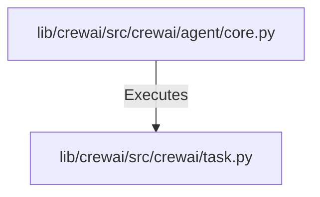

# Tutorial: crewAI

**CrewAI** is a framework for orchestrating **autonomous AI agents** that collaborate as **Crews** to complete complex objectives. It allows developers to build efficient, production-ready systems by combining flexible agent interactions with structured, event-driven **Flows** for precise control over workflows.

**Source Repository:** [https://github.com/crewAIInc/crewAI](https://github.com/crewAIInc/crewAI)

## Chapters

1. [lib/crewai/src/crewai/task.py](01_lib_crewai_src_crewai_task_py.md)
2. [lib/crewai/src/crewai/agent/core.py](02_lib_crewai_src_crewai_agent_core_py.md)

---

Generated by [Code IQ](https://github.com/adityasoni99/Code-IQ)