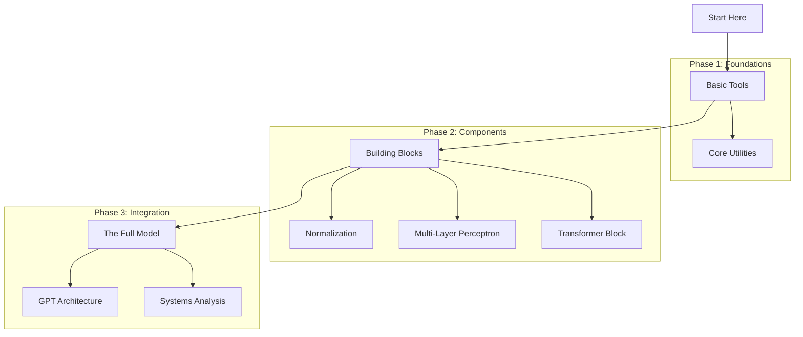
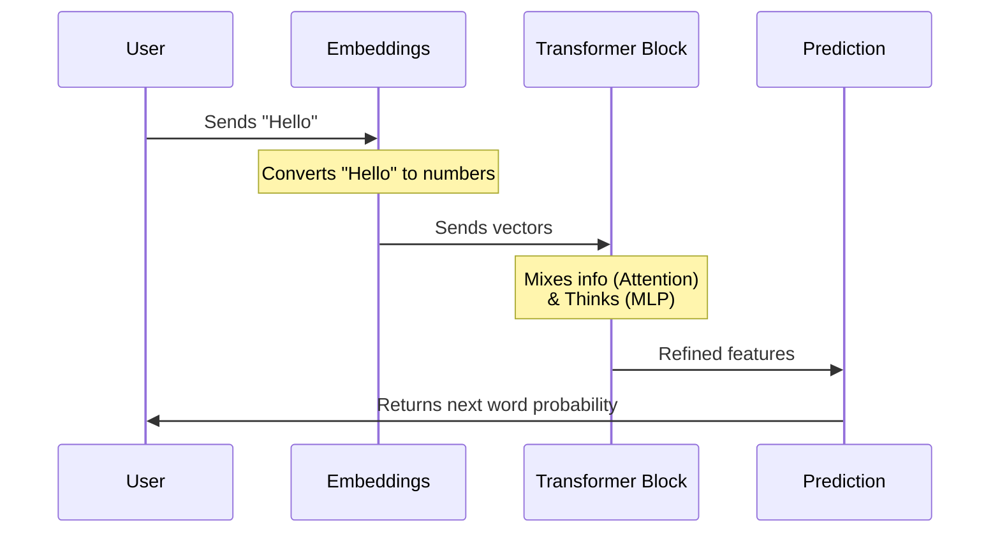

# Chapter 1: Module Introduction

Welcome to the **Transformer Architecture** module! 

If you have ever wondered how systems like ChatGPT, Claude, or Gemini actually work under the hood, you are in the right place. In this series of chapters, we aren't just going to read about them; we are going to **build one** from scratch using our `TinyTorch` framework.

## The Big Mission: Understanding Language

Imagine you are trying to read a book, but you are only allowed to see one word at a time through a tiny hole in a piece of paper. You have to remember every previous word to understand the current one. If the sentence is long, you might forget the beginning by the time you reach the end.

This is how older AI models (like RNNs) used to read. It was slow and they often "forgot" context.

**The Solution: The Transformer**
The Transformer architecture changed everything. Instead of reading word-by-word, it looks at the **entire sentence at once**. It can see how the first word relates to the last word instantly. This is called *attention*, and it allows modern AI to understand complex context and generate human-like text.

### Our Use Case: A Mini-GPT
By the end of this module, we will build a small Generative Pre-trained Transformer (GPT). 

**The Goal:** Give the model a starting phrase, and it will complete it.
*   **Input:** "The systems engineer..."
*   **Output:** "...optimized the code."

---

## The Roadmap

Building a Transformer is like building a LEGO castle. You can't just snap the whole thing together at once; you need to build specific blocks first. 

Here is how we will construct our system, chapter by chapter:



### 1. The Foundation
Before we build the brain, we need tools.
*   **[Core Utilities](02_core_utilities.md)**: We will set up the configuration and helper functions needed to manage our model's settings.

### 2. The Components
A Transformer is made of repeating layers. We will build them one by one:
*   **[Layer Normalization](03_layer_normalization.md)**: Imagine a teacher calming down a class so everyone speaks at the same volume. This layer keeps the numbers in our math stable.
*   **[Multi-Layer Perceptron](05_multi_layer_perceptron.md)**: This is the "processing" part of the brain that thinks about the information.
*   **[Transformer Block](07_transformer_block.md)**: We combine attention (looking at relationships) with the MLP (thinking) to create a single "block."

### 3. The Assembly
*   **[GPT Architecture](09_gpt_architecture.md)**: We stack multiple Transformer Blocks on top of each other to create the full GPT model.

### 4. Verification and Analysis
*   **Tests**: Throughout the book (like in [Layer Normalization Tests](04_layer_normalization_tests.md) and [GPT Tests](10_gpt_tests.md)), we will run code to prove our components work.
*   **[Systems Analysis](11_systems_analysis.md)**: We won't just build it; we will measure how much memory it uses and how fast it runs.

---

## A Sneak Peek at the Code

In the final chapters, you will be able to run code that looks like this. Don't worry if you don't understand the specific commands yet—that's what we are here to learn!

```python
# A preview of how we will use our model later
import torch
from tinytorch import GPT

# 1. Create the model
model = GPT()

# 2. Create a dummy input (representing words)
input_data = torch.randint(0, 100, (1, 10)) # Batch size 1, 10 words

# 3. The model predicts the next words
output = model(input_data)

print(f"Input shape: {input_data.shape}")
print(f"Output shape: {output.shape}")
```

**What is happening here?**
1.  We initialize our `GPT` brain.
2.  We give it random numbers (computers see text as numbers).
3.  The model processes these numbers through all the layers we are about to build and spits out predictions.

---

## How It Works: The High-Level Flow

Before we write a single line of code in the next chapter, let's visualize the journey of data through our system.

Imagine you are passing a message through a factory assembly line:

1.  **Input:** The raw text enters.
2.  **Embedding:** Text is converted into a list of numbers (vectors).
3.  **Transformer Blocks:** The data passes through several blocks. Each block refines the understanding of the text.
4.  **Output:** The system calculates the probability of the next word.



## Why build this from scratch?

You might ask, "Why not just use a library like PyTorch's built-in functions?"

In **AI Engineering**, knowing *how* to use a tool is good, but knowing *how the tool is built* is a superpower. By building the Transformer component-by-component:
1.  You will understand **performance bottlenecks**.
2.  You will know how to **debug** strange errors.
3.  You will appreciate the **systems constraints** (like memory and speed) discussed in [Systems Analysis](11_systems_analysis.md).

## Conclusion

We have set our goal: building a GPT model from the ground up. We have mapped out the journey from basic utilities to the final architecture.

Now, it is time to lay the first brick. We need a way to manage the settings (like model size and vocabulary) so our code stays clean.

Let's move to **[Core Utilities](02_core_utilities.md)**.

---

Generated by [Code IQ](https://github.com/adityasoni99/Code-IQ)