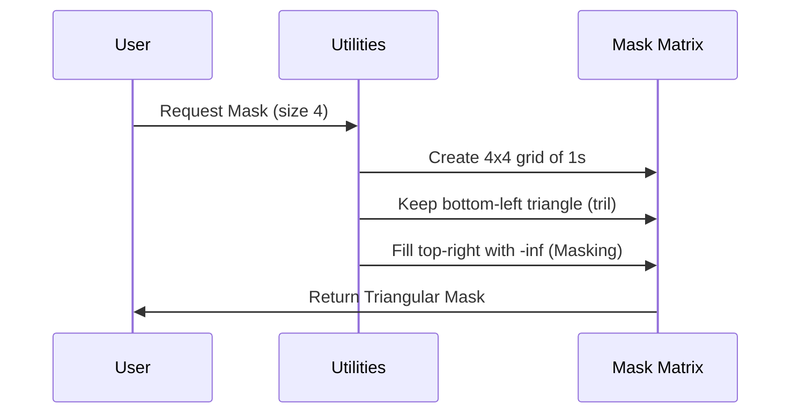

# Chapter 2: Core Utilities

In the [Module Introduction](01_module_introduction.md), we outlined our mission: to build a Generative Pre-trained Transformer (GPT) from scratch. We saw the big picture of how data flows through the system.

Now, before we start building the heavy machinery, we need to set up our workshop. In programming, this means setting up our **Core Utilities**.

## Motivation: The Blueprint and The Blinders

Building a complex AI model without a plan is like building a house without a blueprint. You don't want to decide how many rooms the house has halfway through construction.

We need to solve two specific problems right now:

1.  **The Blueprint (Configuration):** We need a single place to write down the "rules" of our model (like how big it is or how many words it knows). This prevents confusion later.
2.  **The Blinders (Causal Masking):** Our goal is to predict the *next* word. If the model can see the future words during training, it's cheating! We need a utility to "hide" the future.

---

## Part 1: The Blueprint (`GPTConfig`)

In AI, the settings that define the shape of your model are called **Hyperparameters**. Instead of passing these numbers into every single function manually, we group them into a "Configuration" object.

Think of this as the DNA of your model.

### Key Concepts
*   **vocab_size**: The dictionary size. How many unique words (or tokens) does the model know?
*   **block_size**: The attention span. How many previous words can the model look at to make a prediction?
*   **n_embd**: The width of the model. How detailed is the representation of each word?

### Using the Configuration

We use a Python feature called a `dataclass` to store these settings neatly.

```python
from dataclasses import dataclass

@dataclass
class GPTConfig:
    block_size: int = 1024 # Context length
    vocab_size: int = 50257 # Number of words in vocabulary
    n_layer: int = 12       # Number of transformer blocks
    n_head: int = 12        # Number of attention heads
    n_embd: int = 768       # Vector dimension size
```

**Explanation:**
1.  We define `GPTConfig`.
2.  We set defaults (like `1024` for block size).
3.  Now, we can pass `config` around our code instead of 5 different variables.

---

## Part 2: The Blinders (Causal Mask)

This is a critical concept for GPT models.

Imagine you are taking a test where you have to complete a sentence:
*"The quick brown fox jumps over the..."*

If you could see the next word ("lazy") on the answer key, you would get 100%, but you wouldn't learn anything.

To force the model to learn, we apply a **Causal Mask**. It is a grid of numbers that tells the model: *"You can look at past words, but you are forbidden from looking at future words."*

### Visualizing the Mask

In computer math, we often use a matrix of `1`s (allowed) and `0`s (forbidden). For a sequence of 4 words, it looks like a triangle:

| | Word 1 | Word 2 | Word 3 | Word 4 |
|---|---|---|---|---|
| **Prediction 1** | **1** (See self) | 0 (Hidden) | 0 (Hidden) | 0 (Hidden) |
| **Prediction 2** | **1** (See prev) | **1** (See self) | 0 (Hidden) | 0 (Hidden) |
| **Prediction 3** | **1** | **1** | **1** | 0 |
| **Prediction 4** | **1** | **1** | **1** | **1** |

Notice the shape? It's a **Lower Triangular Matrix**.

---

## Internal Implementation

Let's look at how we build this mask in our code.

### The Flow

When the model asks for a mask, we generate a grid where the top-right corner is filled with "infinity" (which means "forbidden" in our math) or zeros.



### Implementing the Mask Logic

We use `torch.tril` (Triangle Lower) to create this shape.

```python
import torch

def get_causal_mask(size):
    # 1. Create a square matrix filled with ones
    mask = torch.ones((size, size))
    
    # 2. Keep only the lower triangle (set upper to 0)
    mask = torch.tril(mask)
    
    return mask
```

**What is happening?**
1.  `torch.ones`: Creates a square grid full of `1`s.
2.  `torch.tril`: "Triangular Lower". It keeps the bottom-left triangle and wipes out the top-right triangle.

### Seeing it in Action

If we run the code above with `size=3`, the output represents the allowed connections:

```python
# Example Usage
mask = get_causal_mask(3)
print(mask)

# Output:
# tensor([[1., 0., 0.],  <-- Word 1 sees only Word 1
#         [1., 1., 0.],  <-- Word 2 sees Word 1 and 2
#         [1., 1., 1.]]) <-- Word 3 sees Word 1, 2, and 3
```

This simple matrix ensures our GPT model learns to predict the future based *only* on the past.

---

## Why this matters

We have established two pillars for our project:

1.  **Consistency:** With `GPTConfig`, we ensure every part of our model agrees on the sizes and shapes of our data.
2.  **Integrity:** With `get_causal_mask`, we ensure our model learns valid patterns instead of memorizing the answer key.

Now that we have our tools, we need to start processing the data itself. The first step in a Transformer is ensuring the numbers we feed into it are stable and well-behaved.

To do that, we need to build our first neural network layer: **[Layer Normalization](03_layer_normalization.md)**.

---

Generated by [Code IQ](https://github.com/adityasoni99/Code-IQ)