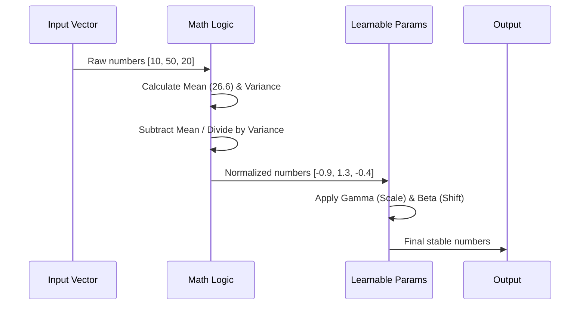

# Chapter 3: Layer Normalization

In [Core Utilities](02_core_utilities.md), we laid the foundation by creating our configuration and masking tools. Now, it is time to start building the actual layers of the Transformer.

The first component we need is the **Layer Normalization** (or LayerNorm).

## Motivation: The Problem of Unstable Numbers

Imagine you are trying to teach a robot to cook.
*   Ingredient A is measured in **grams** (numbers like 500, 1000).
*   Ingredient B is measured in **teaspoons** (numbers like 1, 2).

If the robot looks at just the numbers, it thinks Ingredient A is 500 times more important than Ingredient B. This confuses the robot.

In Neural Networks, numbers (gradients) flow through many layers. If some numbers are huge and others are tiny, the math becomes unstable. The network struggles to learn because it can't find a balance.

**The Solution: Normalization**
We force the numbers into a standard range. We make the average (mean) **0** and the spread (variance) **1**. This puts all "ingredients" on the same scale.

---

## How It Works: The "Curve" and the "Shift"

Layer Normalization performs a 4-step process on every list of numbers (vector) that passes through it.

### Step 1 & 2: Normalize
First, we apply a "grading curve" to the data.
1.  **Calculate Mean:** Find the average of the numbers.
2.  **Calculate Variance:** Find how spread out the numbers are.
3.  **Normalize:** Subtract the mean and divide by the spread.
    *   *Result:* A list of numbers where the average is 0 and spread is 1.

### Step 3 & 4: Rescale (The Learnable Part)
Sometimes, forcing everything to be exactly 0 and 1 is too restrictive. Maybe the network *needs* the numbers to be a little higher or more spread out to make a good prediction.

We give the layer two learnable tools (parameters) to adjust the final output:
1.  **Gamma ($\gamma$):** A multiplier (scale). "Make the spread wider or narrower."
2.  **Beta ($\beta$):** An addition (shift). "Move the average up or down."

These parameters are learned during training, just like the rest of the brain!

---

## Visualizing the Process

Here is what happens to a single word's data (a vector) as it passes through.



---

## Implementing LayerNorm

Let's build this in Python using PyTorch. We will write the math manually so you understand exactly what is happening under the hood.

### 1. The Setup

We define a class called `LayerNorm`. We inherit from `nn.Module`, which is the standard building block in PyTorch.

```python
import torch
import torch.nn as nn

class LayerNorm(nn.Module):
    def __init__(self, ndim, bias):
        super().__init__()
        # gamma: The "Scale" parameter (starts as 1.0)
        self.weight = nn.Parameter(torch.ones(ndim))
        # beta: The "Shift" parameter (starts as 0.0)
        self.bias = nn.Parameter(torch.zeros(ndim)) if bias else None
```

**Explanation:**
*   `ndim`: The size of the input vector (from our `GPTConfig`).
*   `nn.Parameter`: This tells PyTorch, "These are magic numbers that the AI should learn and update over time."
*   `torch.ones`: We start scaling at 1 (no change).
*   `torch.zeros`: We start shifting at 0 (no change).

### 2. The Forward Pass (The Math)

Now we write the function that actually processes the data.

```python
    def forward(self, input):
        # 1. Calculate the layer implementation method
        return torch.nn.functional.layer_norm(
            input, 
            self.weight.shape, 
            self.weight, 
            self.bias, 
            1e-5
        )
```

**Wait!**
Using `torch.nn.functional.layer_norm` is great for production, but we want to learn *how* it works. Let's write the "From Scratch" version to see the math explicitly.

### 3. The "From Scratch" Implementation

Here is the manual version of the math we discussed above.

```python
    def forward(self, x):
        # 1. Calculate the Mean (average) of the vector
        # keepdim=True keeps the shape compatible for subtraction later
        mean = x.mean(-1, keepdim=True)
        
        # 2. Calculate the Variance (how spread out it is)
        var = x.var(-1, keepdim=True, unbiased=False)
        
        # 3. Normalize: (x - mean) / sqrt(variance + epsilon)
        # 1e-5 is a tiny number to prevent dividing by zero!
        x_norm = (x - mean) / torch.sqrt(var + 1e-5)
        
        # 4. Apply our learnable parameters (Scale and Shift)
        output = self.weight * x_norm + self.bias
        return output
```

**Key Details:**
*   `x.mean(-1)`: Calculates the average across the last dimension (the embedding dimension).
*   `1e-5` (Epsilon): Imagine if the variance was 0 (all numbers were the same). We would try to divide by zero, which crashes the computer. Adding `0.00001` prevents this crash.
*   `self.weight * x_norm + self.bias`: This is the standard line equation ($y = mx + b$).

---

## Example Usage

Let's see how we would use this in a real script.

```python
# 1. Create a dummy input (e.g., 2 words, each represented by 5 numbers)
input_data = torch.tensor([
    [10.0, 20.0, 30.0, 40.0, 50.0], # Word 1 (Numbers vary a lot)
    [ 1.0,  1.1,  1.2,  1.3,  1.4]  # Word 2 (Numbers vary a little)
])

# 2. Initialize LayerNorm with dimension 5
ln = LayerNorm(ndim=5, bias=True)

# 3. Pass data through
output = ln(input_data)

print("Input Mean:", input_data.mean(dim=1))
print("Output Mean:", output.mean(dim=1)) # Should be close to 0
```

**What happens?**
Even though Word 1 had huge numbers (10 to 50) and Word 2 had tiny numbers (1.0 to 1.4), the `output` for both will be scaled to roughly the same range. This makes it much easier for the subsequent layers to understand the *pattern* rather than the *magnitude*.

---

## Conclusion

We have built a component that acts as a "stabilizer" for our network. It takes in wild, messy numbers and outputs clean, standardized data, while also allowing the network to learn its own preferred scale and shift.

Without LayerNorm, training a deep Transformer like GPT is nearly impossible because the math becomes too unstable.

Now that we have stabilized the data, we need to verify that our math is correct. In the next chapter, we will write a simple test suite to prove our code works.

Next Step: **[Layer Normalization Tests](04_layer_normalization_tests.md)**

---

Generated by [Code IQ](https://github.com/adityasoni99/Code-IQ)