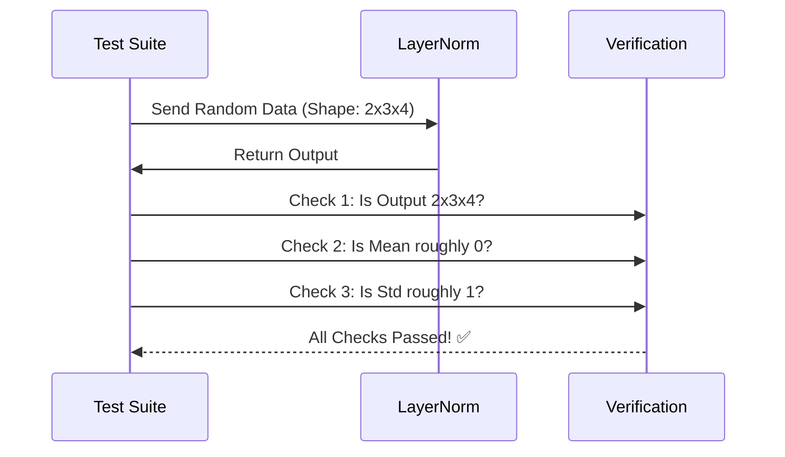

# Chapter 4: Layer Normalization Tests

In the previous chapter, **[Layer Normalization](03_layer_normalization.md)**, we built a crucial component to stabilize the numbers flowing through our network. We learned how to force data into a standard range (mean of 0, variance of 1) so our AI can learn effectively.

But here is the scary part about AI programming: **Code can run without crashing, but still be mathematically wrong.**

## Motivation: The Silent Bug

Imagine you are building a calculator. If you program `2 + 2` and it outputs `Error`, you know something is wrong. But if it outputs `5`, the calculator "works" (it didn't crash), but the answer is wrong.

In Neural Networks, we call these **Silent Bugs**. If our Normalization layer calculates the wrong average, the model will train for days and learn nothing. We won't know why until it's too late.

**The Solution: Unit Tests**
We need to write a small script that acts like a "Quality Control Inspector." It will feed known numbers into our layer and strictly check if the output matches the math we expect.

---

## What are we testing?

We need to verify three specific things to trust our `LayerNorm`:

1.  **Shape Integrity:** Does the data come out the same size it went in?
2.  **Statistical Correctness:** Is the output actually normalized (Mean $\approx$ 0, Std $\approx$ 1)?
3.  **Initialization:** Do the learnable parameters start at the right values?

Let's visualize the testing process:



---

## Test 1: The Shape Sanity Check

The most basic rule of Layer Normalization is that it should **not** change the shape of the data. If we feed in a sentence of 10 words, we should get out a sentence of 10 words.

### The Code

We use `torch.randn` to create "dummy" data. These are just random numbers that simulate the vectors inside a GPT model.

```python
import torch
from tinytorch import LayerNorm  # The class we built in Chapter 3

def test_shape():
    # 1. Setup: Batch=2, Sequence Length=10, Dimensions=32
    x = torch.randn(2, 10, 32)
    ln = LayerNorm(ndim=32, bias=True)

    # 2. Run the layer
    out = ln(x)

    # 3. Verify: Input shape must equal Output shape
    assert x.shape == out.shape
    print("✅ Shape Test Passed")

test_shape()
```

**Explanation:**
*   `torch.randn(2, 10, 32)`: Creates a fake batch of data.
*   `assert`: This is Python's way of saying "If this is False, stop everything and scream."
*   If the code prints the success message, we know the data isn't getting scrambled.

---

## Test 2: The Math Verification

This is the most important test. We need to prove that our math forces the average to 0 and the spread to 1.

### The Challenge of Floating Point Math
Computers aren't perfect at decimals. Sometimes $0$ is stored as $0.00000001$.
Because of this, we cannot check if `mean == 0`. We must check if `mean` is **close to** 0 (e.g., less than $1e-5$).

### The Code

```python
def test_statistics():
    # 1. Create data and layer
    x = torch.randn(2, 100, 32) # 100 words
    ln = LayerNorm(ndim=32, bias=True)
    out = ln(x)

    # 2. Calculate actual mean and std of the output
    # We check the last dimension (-1) because that's where we normalized
    mean = out.mean(dim=-1)
    std = out.std(dim=-1)

    # 3. Verify: Mean should be near 0, Std near 1
    # atol means "Absolute Tolerance"
    assert torch.allclose(mean, torch.zeros_like(mean), atol=1e-5)
    assert torch.allclose(std, torch.ones_like(std), atol=1e-5)
    print("✅ Math Test Passed")

test_statistics()
```

**Explanation:**
*   `dim=-1`: We calculate the statistics for *each word's vector* individually.
*   `torch.allclose`: A helper function that asks, "Are these numbers close enough?"
*   If this passes, we know our manual implementation of `(x - mean) / sqrt(var)` from the previous chapter is correct.

---

## Test 3: Parameter Initialization

In **[Layer Normalization](03_layer_normalization.md)**, we decided that:
*   **Gamma (Weight)** should start as **1s** (don't scale yet).
*   **Beta (Bias)** should start as **0s** (don't shift yet).

If these start at random numbers, our training might explode at the very beginning.

### The Code

```python
def test_parameters():
    # 1. Initialize the layer
    ln = LayerNorm(ndim=32, bias=True)

    # 2. Verify Gamma (Weight) is all 1s
    assert torch.allclose(ln.weight, torch.ones(32))

    # 3. Verify Beta (Bias) is all 0s
    assert torch.allclose(ln.bias, torch.zeros(32))
    
    print("✅ Parameter Test Passed")

test_parameters()
```

**Explanation:**
*   We check `ln.weight` and `ln.bias` directly.
*   We ensure they match `torch.ones` and `torch.zeros` respectively.

---

## Putting It All Together

In a real engineering project, we group these into a single file (often using a library like `pytest`). Here is how you can run all your checks at once to "green light" the component.

```python
if __name__ == "__main__":
    print("Testing Layer Normalization...")
    
    test_shape()
    test_statistics()
    test_parameters()
    
    print("🎉 All LayerNorm tests passed! The component is safe to use.")
```

### Why this matters for the rest of the book
As we move forward, the components will get more complex. If we didn't test the **Layer Normalization** now, and later on our GPT model output garbage, we wouldn't know if the problem was in the complex brain (Attention) or the simple stabilizer (Normalization).

By verifying this now, we can rule it out as a cause of future errors.

---

## Conclusion

We have successfully verified our stabilizer.
1.  It keeps data shapes consistent.
2.  It mathematically centers and scales the data.
3.  It initializes parameters safely.

With a stable foundation, we are ready to build the "thinking" part of the Transformer block. This is where the model actually processes information.

Next, we will build the neural network layers that allow the model to "think."

Let's move to **[Multi-Layer Perceptron](05_multi_layer_perceptron.md)**.

---

Generated by [Code IQ](https://github.com/adityasoni99/Code-IQ)