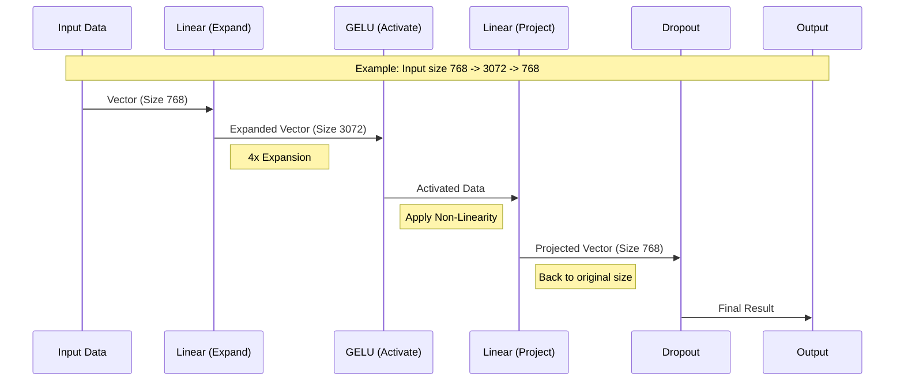

# Chapter 5: Multi-Layer Perceptron

In the previous chapters, we established our [Core Utilities](02_core_utilities.md) and built the [Layer Normalization](03_layer_normalization.md) component to keep our numbers stable. We even verified it in [Layer Normalization Tests](04_layer_normalization_tests.md).

Now, we are ready to build the part of the brain that "thinks."

## Motivation: The "Thinking" Layer

If the **Attention** mechanism (which we will build later) is like looking around a room to see who is talking to whom, the **Multi-Layer Perceptron (MLP)** is the brain processing that information.

Imagine you are translating a sentence.
1.  **Attention:** You look at the words "Bank" and "River" together.
2.  **MLP:** You think, "Ah, 'Bank' here means the side of a river, not a place to store money."

The MLP is a feed-forward network. It takes the information gathered by the model, processes it individually for each word, and extracts higher-level meaning.

### The "Wide" Strategy
To process this information effectively, the MLP uses a specific strategy:
1.  **Expand:** It takes the data and projects it into a much larger space (usually 4 times larger). This is like spreading out a crumbled map onto a large table to see the details better.
2.  **Activate:** It applies a non-linear function (the "thinking" spark).
3.  **Contract:** It projects the data back down to its original size to pass it to the next layer.

---

## Key Concepts

Before we write the code, let's understand the three ingredients of our MLP sandwich.

### 1. Linear Layers (The Projection)
A Linear layer is a simple matrix multiplication. It connects every input number to every output number with a weight.
*   **Up-Projection:** We multiply our input (size `n_embd`) to make it bigger (size `4 * n_embd`).
*   **Down-Projection:** We multiply the big result to shrink it back (size `n_embd`).

### 2. GELU Activation (The Spark)
If we only used Linear layers, our AI would just be one giant multiplication problem. It couldn't learn complex things like sarcasm or grammar.

We need an **Activation Function** to introduce "curves" into our math. We use **GELU** (Gaussian Error Linear Unit).
*   **ReLU (Old way):** If a number is negative, make it zero.
*   **GELU (Modern way):** Similar to ReLU, but "smoother" around zero. It allows for more subtle gradients, which helps GPT models train better.

### 3. Dropout (The Toughening)
Imagine a student who only studies by memorizing the textbook. They fail when the test questions are slightly different.
**Dropout** randomly "turns off" some neurons during training. This forces the model to learn robust patterns rather than memorizing specific paths.

---

## Internal Implementation: The Flow

Let's visualize how a single word (represented as a vector of numbers) travels through the MLP.



---

## Implementing the MLP

We will build this using PyTorch's `nn.Module`. We need our configuration from [Core Utilities](02_core_utilities.md) to know how big the layers should be.

### Step 1: The Initialization

We define the layers. Notice how we calculate `4 * config.n_embd`.

```python
import torch.nn as nn
from tinytorch import GPTConfig

class MLP(nn.Module):
    def __init__(self, config: GPTConfig):
        super().__init__()
        # The "Up" projection: 768 -> 3072
        self.c_fc = nn.Linear(config.n_embd, 4 * config.n_embd)
        
        # The Activation Function
        self.act = nn.GELU()
        
        # The "Down" projection: 3072 -> 768
        self.c_proj = nn.Linear(4 * config.n_embd, config.n_embd)
        
        # Regularization
        self.dropout = nn.Dropout(config.dropout)
```

**Explanation:**
*   `c_fc`: Stands for "Current Fully Connected". This is the expansion layer.
*   `c_proj`: Stands for "Current Projection". This shrinks the data back down.

### Step 2: The Forward Pass

Now we connect the components. This is the path the data takes.

```python
    def forward(self, x):
        # 1. Expand and Activate
        x = self.c_fc(x)
        x = self.act(x)
        
        # 2. Project back down
        x = self.c_proj(x)
        
        # 3. Apply Dropout
        x = self.dropout(x)
        return x
```

**Explanation:**
*   Input `x` comes in with shape `(Batch, Time, Channels)`.
*   It gets huge in the middle (Channels * 4).
*   It returns to `(Batch, Time, Channels)` at the end.

---

## How to use it

Let's look at how we would use this component in our main program. We treat it like a black box that processes vectors.

```python
# 1. Setup the configuration
config = GPTConfig(n_embd=768) # Our vector size is 768

# 2. Create the MLP
mlp = MLP(config)

# 3. Create dummy data (1 batch, 10 words, 768 dim)
import torch
dummy_input = torch.randn(1, 10, 768)

# 4. Pass it through
output = mlp(dummy_input)

print(f"Input shape:  {dummy_input.shape}")
print(f"Output shape: {output.shape}")
```

**Expected Output:**
```text
Input shape:  torch.Size([1, 10, 768])
Output shape: torch.Size([1, 10, 768])
```

Even though the data expanded to size 3072 inside the MLP, the outside world only sees it return as 768. This allows us to stack these blocks on top of each other easily!

---

## Summary

We have built the **Multi-Layer Perceptron (MLP)**.

1.  It acts as the "reasoning" engine for each word individually.
2.  It uses an **Expand -> Activate -> Contract** pattern.
3.  It uses **GELU** for smooth activation and **Dropout** to prevent overfitting.

However, just like with our normalization layer, we can't just assume this works. We need to verify that the shapes are correct and that the gradients flow properly.

In the next chapter, we will write tests for this component.

Next Step: **[MLP Tests](06_mlp_tests.md)**

---

Generated by [Code IQ](https://github.com/adityasoni99/Code-IQ)