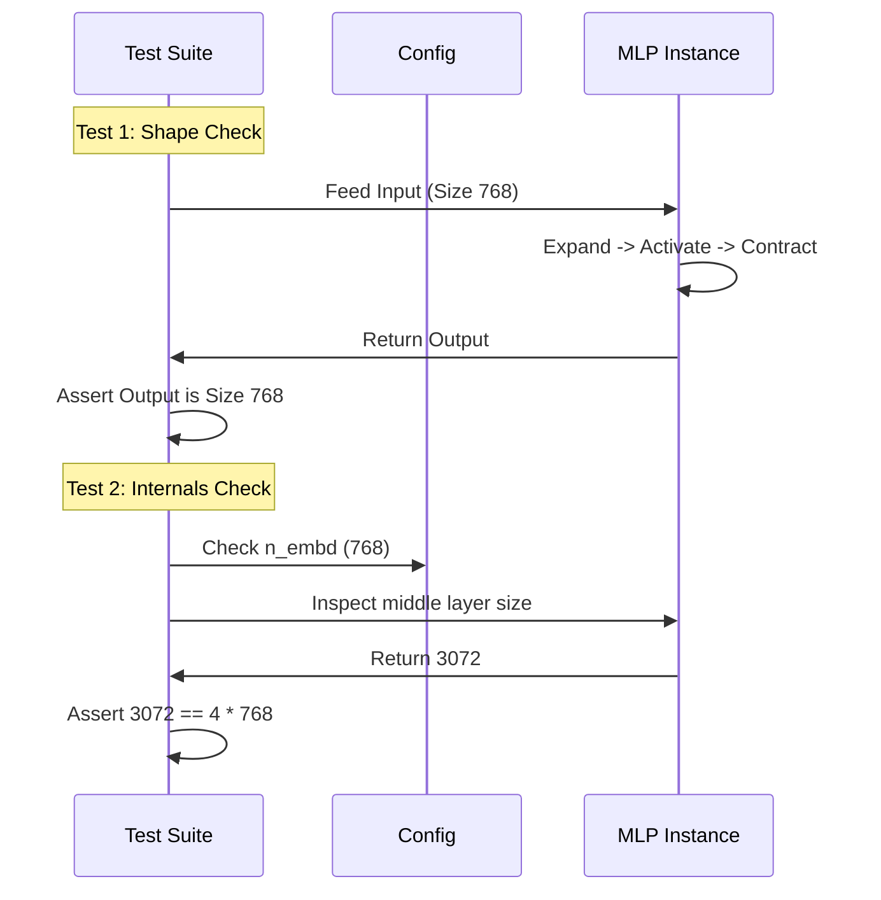

# Chapter 6: MLP Tests

In the previous chapter, **[Multi-Layer Perceptron](05_multi_layer_perceptron.md)**, we built the "thinking" engine of our Transformer. We designed a neural network that expands information, applies a spark of nonlinearity (GELU), and projects it back down.

But as with any engine, we shouldn't put it in the car until we've tested it on the bench.

## Motivation: The Silent Expansion Error

In GPT models, the Multi-Layer Perceptron (MLP) has a very specific rule: **The hidden layer must be 4 times larger than the input.**

If we accidentally set the expansion to **3x** or **5x**, the code will still run! Python won't crash. However, our model will be architecturally wrong, and we won't know why it is behaving strangely compared to standard papers.

**The Goal of this Chapter:**
We will write a test suite that acts as a "mechanic." It will:
1.  Verify the input and output shapes match (the "Sandwich" rule).
2.  Pop the hood and verify the internal engine is exactly 4x bigger (the "Expansion" rule).
3.  Count the parameters to ensure we aren't creating a monster that is too big for our memory.

---

## The Testing Flow

Before writing code, let's visualize what our test suite will do. We are going to treat the `MLP` class like a black box, feed it data, and then inspect the result. We will also inspect the box itself.



---

## Test 1: The Sandwich Check (Input/Output Consistency)

The most fundamental rule of the Transformer block is that data enters and leaves with the exact same shape. This allows us to stack blocks on top of each other like LEGO bricks.

If the MLP changes the shape, the LEGOs won't click together.

### The Code

We use our `GPTConfig` from **[Core Utilities](02_core_utilities.md)** to set up the test.

```python
import torch
from tinytorch import GPTConfig, MLP

def test_mlp_output_shape():
    # 1. Setup: Define a standard model size
    config = GPTConfig(n_embd=128)
    mlp = MLP(config)
    
    # 2. Create dummy data (Batch=2, Sequence=10 words, Dim=128)
    x = torch.randn(2, 10, 128)
    
    # 3. Pass data through the MLP
    output = mlp(x)
    
    # 4. Verify shapes match exactly
    assert output.shape == x.shape
    print("✅ Output Shape Test Passed")
```

**What is happening?**
1.  We pick a small embedding size (`128`) for the test.
2.  We feed in random noise.
3.  We assert that if `128` numbers go in, `128` numbers come out.

---

## Test 2: The Expansion Ratio Check

In **[Multi-Layer Perceptron](05_multi_layer_perceptron.md)**, we implemented the logic `4 * config.n_embd`. This test verifies that logic actually happened.

We need to look *inside* the class. In Python, we can access the layers directly. We defined `self.c_fc` (Current Fully Connected) as our first layer. We can check its size.

### The Code

```python
def test_mlp_expansion():
    # 1. Setup with a known number
    emb_size = 64
    config = GPTConfig(n_embd=emb_size)
    mlp = MLP(config)
    
    # 2. Inspect the first linear layer (c_fc)
    # .weight.shape returns [Output Size, Input Size]
    internal_size = mlp.c_fc.weight.shape[0]
    
    # 3. Verify it is exactly 4x the input
    expected_size = 4 * emb_size
    assert internal_size == expected_size
    
    print(f"✅ Expansion Test Passed: {internal_size} is 4x {emb_size}")
```

**Why is this important?**
If you later decide to experiment and change the multiplier to `8x`, this test will fail, alerting you that you've changed a fundamental property of the architecture. It acts as a guardrail.

---

## Test 3: Parameter Counting

Deep Learning models are heavy. It is useful to know exactly how many "learnable numbers" (parameters) are in a component.

For an MLP, the math is roughly:
1.  **Up-Projection:** (Input $\times$ 4 $\times$ Input) + Biases
2.  **Down-Projection:** (4 $\times$ Input $\times$ Input) + Biases

If the number is wildly off, we might have initialized our matrices backward!

### The Code

```python
def test_parameter_count():
    config = GPTConfig(n_embd=10) # Small size for easy math
    mlp = MLP(config)
    
    # 1. Calculate Expected Params manually
    # Layer 1: 10 inputs -> 40 outputs. Weights: 10*40. Bias: 40.
    layer_1 = (10 * 40) + 40
    
    # Layer 2: 40 inputs -> 10 outputs. Weights: 40*10. Bias: 10.
    layer_2 = (40 * 10) + 10
    
    expected_total = layer_1 + layer_2
    
    # 2. Count Actual Params in the model
    actual_total = sum(p.numel() for p in mlp.parameters())
    
    # 3. Verify
    assert actual_total == expected_total
    print(f"✅ Parameter Count Passed: Found {actual_total} params.")
```

**Explanation:**
*   `p.numel()`: This stands for "Number of Elements." It counts every single weight in a tensor.
*   We sum them all up to get the "weight" of the brain.

---

## Running the Suite

Just like in previous test chapters, we group these into a block that runs when we execute the file.

```python
if __name__ == "__main__":
    print("Testing Multi-Layer Perceptron...")
    
    test_mlp_output_shape()
    test_mlp_expansion()
    test_parameter_count()
    
    print("🎉 All MLP tests passed!")
```

## Internal Implementation: What happens when we test?

When `test_mlp_expansion()` runs, here is the flow of inspection:

1.  **Instantiation**: Python creates the `MLP` object. Inside `__init__`, it reads `n_embd=64`.
2.  **Calculation**: It calculates `4 * 64 = 256`.
3.  **Allocation**: It allocates memory for a matrix of size `256 x 64`.
4.  **Inspection**: Our test accesses `mlp.c_fc.weight`. This retrieves the raw tensor from memory.
5.  **Validation**: We check the shape of that tensor against our math.

This ensures that the "Blueprint" (Config) matches the "Building" (MLP).

---

## Conclusion

We have now verified our "Thinking" engine.
1.  It accepts data and returns it in the correct shape (compatible with other layers).
2.  It strictly follows the **4x expansion** rule used in standard GPT models.
3.  It contains the correct amount of learnable parameters.

We now have the **Normalization** (stabilizer) and the **MLP** (processor).

However, these components process each word strictly on its own. They don't know how words relate to each other. To make our model understand language, we need to combine these with the mechanism that connects words together: **Attention**.

We will combine Attention (which we will assume is ready for now) with our MLP to build the main structural unit of GPT.

Next Step: **[Transformer Block](07_transformer_block.md)**

---

Generated by [Code IQ](https://github.com/adityasoni99/Code-IQ)