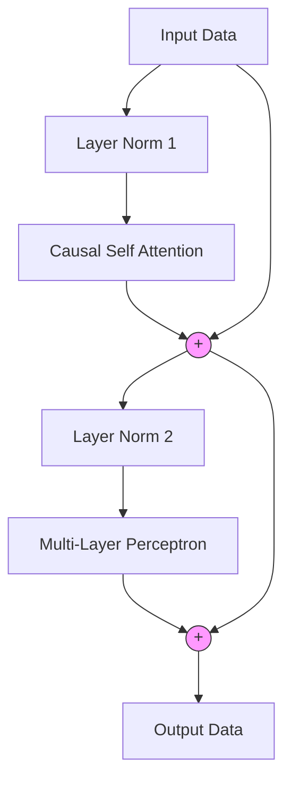
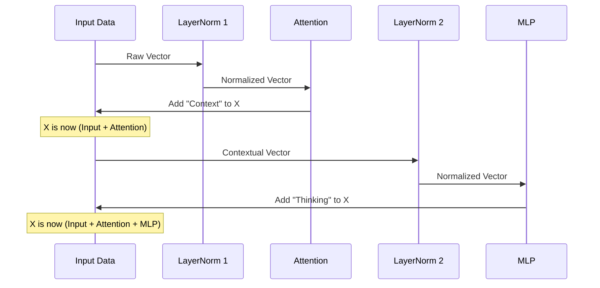

# Chapter 7: Transformer Block

In the previous chapters, we built the individual organs of our AI body. We built the **[Layer Normalization](03_layer_normalization.md)** to keep our blood pressure (math) stable, and the **[Multi-Layer Perceptron](05_multi_layer_perceptron.md)** to act as the thinking brain.

But right now, our brain cells are isolated. They can think about words individually, but they can't understand *context*.

## Motivation: The Group Project

Imagine a group of students working on a project.
*   **The MLP** is like a student working alone at their desk. They are smart, but they don't know what the others are doing.
*   **The Transformer Block** is the meeting room. It allows the students to talk to each other ("Attention") and then go back to their desks to process what they heard ("MLP").

**The Goal:** We need to combine **Communication** (Attention) and **Thinking** (MLP) into a single, repeatable unit.

---

## Concept 1: The Missing Piece (Self-Attention)

Before we build the Block, we need the "Communication" component. We call this **Causal Self-Attention**.

Think of a search engine:
1.  **Query (Q):** What are you looking for?
2.  **Key (K):** What does the result contain?
3.  **Value (V):** The actual content.

In our model, every word creates a Query ("I'm looking for adjectives!"), a Key ("I am a noun!"), and a Value ("I am the word 'Cat'").

### The Code: Causal Self-Attention
We will implement this class first so our Block can use it. It uses the `get_causal_mask` function we wrote in **[Core Utilities](02_core_utilities.md)**.

```python
import torch
import torch.nn as nn
from torch.nn import functional as F
from tinytorch import GPTConfig, get_causal_mask

class CausalSelfAttention(nn.Module):
    def __init__(self, config: GPTConfig):
        super().__init__()
        # Key, Query, Value projections combined into one matrix
        self.c_attn = nn.Linear(config.n_embd, 3 * config.n_embd)
        # Output projection
        self.c_proj = nn.Linear(config.n_embd, config.n_embd)
        
        self.n_head = config.n_head
        self.n_embd = config.n_embd
```

**Explanation:**
*   `c_attn`: We triple the size of our input because we need to generate Q, K, and V for every word.
*   `n_head`: We split our attention into multiple "heads." It's like having 12 different conversations happening at once.

### The Forward Pass (Mixing Information)

This is where the magic happens. We calculate the similarity between words and mix their information.

```python
    def forward(self, x):
        B, T, C = x.size() # Batch, Time (Sequence), Channels
        
        # 1. Calculate Query, Key, Values
        q, k, v  = self.c_attn(x).split(self.n_embd, dim=2)
        
        # 2. Reshape for Multi-Head Attention (Split channels into heads)
        k = k.view(B, T, self.n_head, C // self.n_head).transpose(1, 2)
        q = q.view(B, T, self.n_head, C // self.n_head).transpose(1, 2)
        v = v.view(B, T, self.n_head, C // self.n_head).transpose(1, 2)
```

**Explanation:**
*   We use `.view()` to reshape the data so we can treat each "Head" separately.

Now, we perform the attention calculation (The "Search"):

```python
        # 3. Calculate Attention Scores (affinities)
        att = (q @ k.transpose(-2, -1)) * (1.0 / math.sqrt(k.size(-1)))
        
        # 4. Apply the Mask (Hide the future!)
        mask = get_causal_mask(T).to(x.device)
        att = att.masked_fill(mask == 0, float('-inf'))
        
        # 5. Aggregate values
        att = F.softmax(att, dim=-1)
        y = att @ v # The weighted sum of interesting values
```

*Note: We need `import math` at the top of our file.*

Finally, we reassemble the heads:

```python
        # 6. Reassemble all heads side-by-side
        y = y.transpose(1, 2).contiguous().view(B, T, C)
        
        # 7. Final projection
        return self.c_proj(y)
```

---

## Concept 2: The Transformer Block

Now that we have **Attention** (Communication) and **MLP** (Thinking, from Chapter 5), we can build the **Block**.

### The Residual Connection (The Highway)

Deep neural networks often forget information as it passes through many layers. To solve this, we use a **Residual Connection** (or Skip Connection).

Imagine a highway.
*   **The Main Path:** Data flows straight through.
*   **The Off-Ramp:** Data goes into the Attention or MLP layer, gets processed, and merges back onto the highway.

If the layer gets confused, the model can simply ignore the off-ramp and keep the data flowing on the highway. This is mathematically represented as `x = x + layer(x)`.

### Architecture Diagram



---

## Implementing the Block

We combine everything into a single class.

### 1. Initialization

We need references to all the components we have built in previous chapters.

```python
from tinytorch import LayerNorm, MLP

class Block(nn.Module):
    def __init__(self, config: GPTConfig):
        super().__init__()
        # Communication
        self.ln1 = LayerNorm(config.n_embd, bias=config.bias)
        self.attn = CausalSelfAttention(config)
        
        # Thinking
        self.ln2 = LayerNorm(config.n_embd, bias=config.bias)
        self.mlp = MLP(config)
```

**Explanation:**
*   `ln1`: Normalizes data before Attention.
*   `attn`: The communication layer we just built.
*   `ln2`: Normalizes data before MLP.
*   `mlp`: The thinking layer from **[Multi-Layer Perceptron](05_multi_layer_perceptron.md)**.

### 2. The Forward Pass

This creates the "Highway" structure.

```python
    def forward(self, x):
        # 1. Communication Phase (with Residual skip)
        x = x + self.attn(self.ln1(x))
        
        # 2. Thinking Phase (with Residual skip)
        x = x + self.mlp(self.ln2(x))
        
        return x
```

**Why `x + ...`?**
This is the residual connection. We take the original `x` (the highway) and add the result of the layer (the off-ramp) to it.

---

## Internal Implementation: The Data Flow

Let's visualize exactly what happens to a batch of data as it flows through this block.

1.  **Input:** A batch of word vectors.
2.  **Norm 1:** The numbers are stabilized.
3.  **Attention:** Words look at each other. "River" sees "Bank" and updates its meaning.
4.  **Add:** We add this new context to the original word vectors.
5.  **Norm 2:** Stabilize again.
6.  **MLP:** The model thinks about this new context ("River bank means water!").
7.  **Add:** We add this realization to the vectors.



---

## Example Usage

Here is how we use the `Block` in our code. It looks just like any other PyTorch layer.

```python
# 1. Setup Configuration
config = GPTConfig(n_embd=768, n_head=12)

# 2. Initialize the Block
block = Block(config)

# 3. Create dummy data (Batch=1, Time=10 words, Dim=768)
input_data = torch.randn(1, 10, 768)

# 4. Process the data
output_data = block(input_data)

print(f"Input shape: {input_data.shape}")
print(f"Output shape: {output_data.shape}")
```

**What to expect:**
The shapes will remain identical (`1, 10, 768`). This is the beauty of the Transformer Block. Because the input and output shapes are the same, we can stack 12, 24, or even 100 of these blocks on top of each other to make the AI smarter!

---

## Conclusion

We have created the fundamental unit of the GPT architecture. The **Transformer Block** is a self-contained processing unit that:
1.  Allows words to communicate (Attention).
2.  Processes that information (MLP).
3.  Keeps the signal flowing smoothly (Residuals & LayerNorm).

This block is the "LEGO brick" of modern AI. But just like with our previous components, complex logic creates complex bugs. We need to verify that our Attention masks are working and that the residual connections are actually passing gradients.

In the next chapter, we will write a test suite to inspect our new engine.

Next Step: **[Transformer Block Tests](08_transformer_block_tests.md)**

---

Generated by [Code IQ](https://github.com/adityasoni99/Code-IQ)