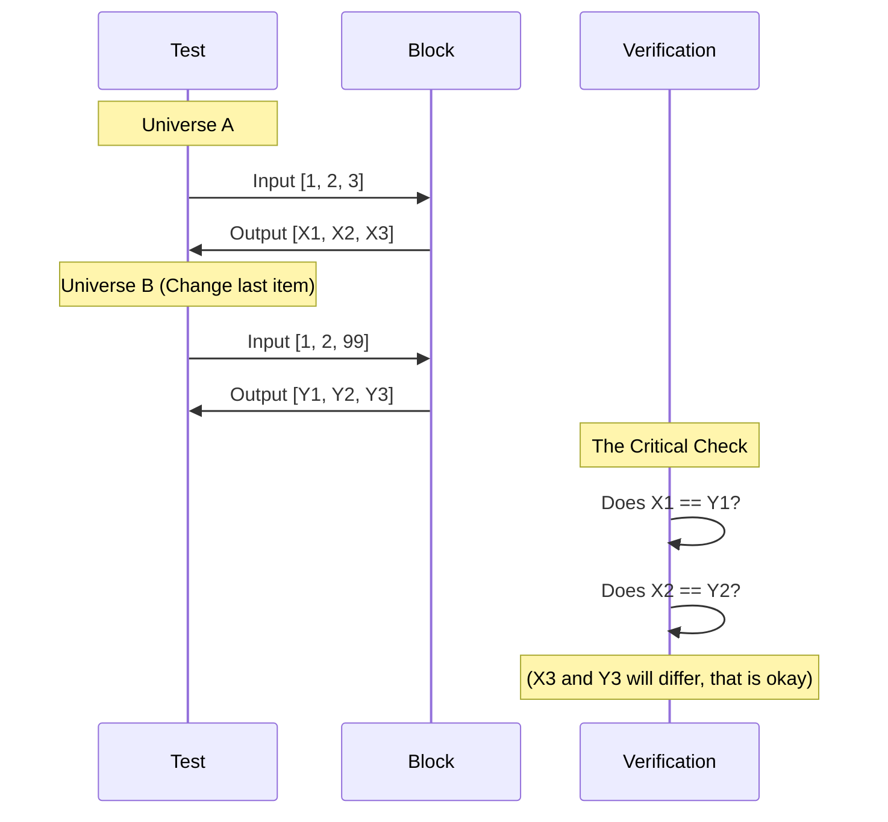

# Chapter 8: Transformer Block Tests

In the previous chapter, **[Transformer Block](07_transformer_block.md)**, we assembled the main engine of our GPT model. We combined the "Communication" layer (Attention) and the "Thinking" layer (MLP) into a single unit.

Now, we face a critical question: **Does it actually work?**

## Motivation: The Time Travel Problem

The most dangerous bug in a GPT model is **Information Leakage**.

Our model is supposed to predict the future based *only* on the past.
*   **Correct:** Read "The", predict "Apple".
*   **Cheating:** Read "The" AND peek at "Apple", then predict "Apple".

If our Causal Mask (the triangular grid of zeros we discussed in **[Core Utilities](02_core_utilities.md)**) is broken, the model will "time travel." It will see the future words during training. It will look like a genius during training (getting 100% accuracy) but will fail miserably in the real world when the future isn't available yet.

In this chapter, we will write a test to prove that our Transformer Block prevents time travel.

---

## Key Concepts

We need to verify two main properties of our Block:

### 1. Shape Preservation (The LEGO Rule)
Since we plan to stack 12 or more of these blocks on top of each other, the output of the block **must** be the exact same shape as the input. If it shrinks or expands, the next block won't fit.

### 2. Causal Integrity (The Time Travel Rule)
We need to prove that changing the **last** word in a sentence does not change the model's understanding of the **first** word.

**The Logic:**
*   If I change the ending of a movie, the beginning scenes shouldn't magically change.
*   If the beginning scenes *do* change, it means the beginning was "watching" the end. That is a bug!

---

## Test 1: The Shape Check

Let's start with the easy one. We will create a dummy block and feed it random data to ensure the plumbing is connected correctly.

```python
import torch
from tinytorch import GPTConfig, Block

def test_block_shape():
    # 1. Setup: Small config
    config = GPTConfig(n_embd=32, n_head=4)
    block = Block(config)
    
    # 2. Input: Batch=2, Time=10, Dim=32
    x = torch.randn(2, 10, 32)
    
    # 3. Output
    out = block(x)
    
    # 4. Verify
    assert out.shape == x.shape
    print("✅ Shape Test Passed")
```

**Explanation:**
*   We initialize a small block (embedding size 32).
*   We feed it a batch of data.
*   We assert that `Input Shape == Output Shape`.

---

## Test 2: The Causal Integrity Check

This is the most sophisticated test in our library. We are going to simulate two parallel universes to see if "future" events affect the "past."

### The Strategy

1.  **Universe A:** Input is `[A, B, C]`.
2.  **Universe B:** Input is `[A, B, Z]`.
3.  **The Check:** The model's output for `A` and `B` should be **identical** in both universes. The change from `C` to `Z` should not propagate backwards.

### Visualizing the Test



### Implementing the Causal Test

We must be careful here. The Transformer Block contains **Dropout** (randomness). We must turn it off using `.eval()` or our test will fail simply because of random noise.

**Step 1: Create the Data**

```python
def test_causal_masking():
    # 1. Setup and disable randomness (Dropout)
    config = GPTConfig(n_embd=32, n_head=4)
    block = Block(config)
    block.eval() # Important! Turns off dropout

    # 2. Create Universe A
    # Batch 1, Sequence Length 5, Dim 32
    x1 = torch.randn(1, 5, 32)
```

**Step 2: Create the Parallel Universe**

```python
    # 3. Create Universe B (Clone A)
    x2 = x1.clone()
    
    # 4. Alter the FUTURE (Change the last word)
    # We change index 4 (the 5th word)
    x2[0, 4, :] = torch.randn(32)
```

**Step 3: Run and Compare**

```python
    # 5. Run both through the block
    out1 = block(x1)
    out2 = block(x2)

    # 6. Compare the PAST (Index 0)
    # The output for word 0 should depend ONLY on word 0
    diff = (out1[0, 0] - out2[0, 0]).abs().max()

    # 7. Assert difference is effectively zero
    assert diff < 1e-6
    print("✅ Causal Test Passed: No Time Travel detected.")
```

**What happens if this fails?**
If `diff` is a large number (like 0.5), it means `out1[0]` looked at the last word to make its decision. Since we changed the last word in `x2`, the decision changed. This would mean our mask in **[Core Utilities](02_core_utilities.md)** is broken or not being applied in **[Transformer Block](07_transformer_block.md)**.

---

## Internal Implementation: Why does this work?

Let's look under the hood at why the math ensures causality.

When we run the `Attention` layer inside the block, we perform a matrix multiplication. Without the mask, every word multiplies with every other word.

The mask forces specific multiplications to become zero.

```mermaid
graph TD
    Future[Future Word (Z)] -->|Attempt to Connect| Past[Past Word (A)]
    Mask[Causal Mask] -- Blocks Connection --> Past
    
    subgraph "Inside Self-Attention"
    Past -- Query --> Mix((Mix))
    Future -- Key --> Mix
    Mask -.-> Mix
    end
    
    style Mask fill:#ffaaaa,stroke:#333
```

Because we set the attention score to `-infinity` (which becomes `0` after Softmax) for future words, the value `Z` is mathematically erased from the calculation of `A`.

If our test passes, it proves that:
1.  The `get_causal_mask` function creates the correct shape.
2.  The `CausalSelfAttention` applies the mask before Softmax.
3.  The `Block` connects the Attention layer correctly.

---

## Running the Full Suite

As always, we bundle these into a runnable script.

```python
if __name__ == "__main__":
    print("Testing Transformer Block...")
    
    test_block_shape()
    test_causal_masking()
    
    print("🎉 All Block tests passed! The engine is secure.")
```

## Conclusion

We have verified the integrity of our Transformer Block.
1.  **It fits:** The inputs and outputs match, allowing us to stack them.
2.  **It's honest:** It cannot see the future, ensuring valid learning.

This was the final component test. We now have verified **Utilities**, **Normalization**, **MLP**, and the **Block**.

We are now ready for the main event. We are going to stack these verified blocks together to build the full GPT architecture.

Next Step: **[GPT Architecture](09_gpt_architecture.md)**

---

Generated by [Code IQ](https://github.com/adityasoni99/Code-IQ)