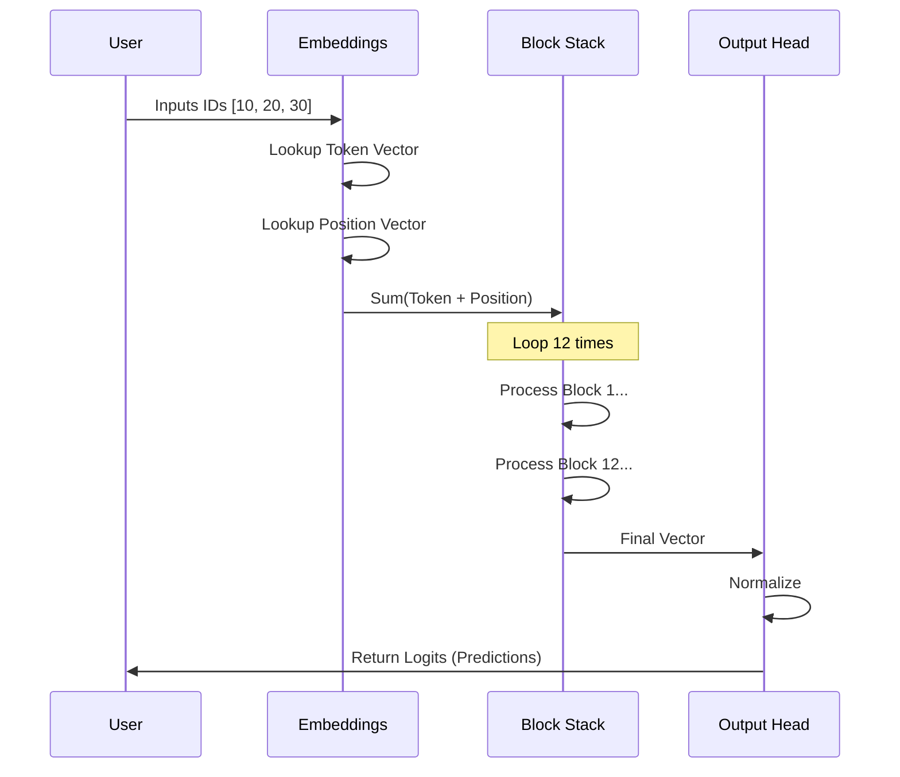

# Chapter 9: GPT Architecture

In the previous chapter, **[Transformer Block Tests](08_transformer_block_tests.md)**, we verified our "engine"—the Transformer Block. We proved that it processes information correctly and, crucially, that it doesn't "cheat" by looking into the future.

But a single engine sitting on a garage floor isn't a car. It needs a chassis, wheels, and a steering wheel.

In this chapter, we will assemble the final **GPT (Generative Pre-trained Transformer)** model. We will combine Embeddings, a stack of Transformer Blocks, and an Output Head into a single, cohesive system.

## Motivation: The Skyscraper Analogy

We have built a **Transformer Block**, which is like a single floor of an office building.
*   It has workers (MLP) and meeting rooms (Attention).
*   It processes information.

However, deep learning works best when we create **depth**. We don't just want one floor; we want a skyscraper.

**The Goal:**
1.  **Entry (Embeddings):** Convert raw token numbers (like `452`) into rich vectors.
2.  **The Tower (Stack):** Pass that vector through 12 (or more) layers of Transformer Blocks.
3.  **Exit (Head):** Convert the final vector back into a prediction for the next word.

---

## Component 1: The Entryway (Embeddings)

Computers can't understand the word "Apple." They only understand numbers. In **[Core Utilities](02_core_utilities.md)**, we decided on a `vocab_size` (e.g., 50,257 unique words).

We need two types of dictionaries (Embeddings) to start the process:

1.  **Token Embeddings (`wte`):** "What does word #452 mean?"
    *   It converts an index to a vector.
2.  **Positional Embeddings (`wpe`):** "Where is this word in the sentence?"
    *   Since the Transformer processes everything at once, it doesn't naturally know that "The" came before "Apple." We have to explicitly add this information.

---

## Component 2: The Tower (ModuleList)

This is the easiest part conceptually, but the most powerful. We simply take the **[Transformer Block](07_transformer_block.md)** we built and duplicate it `n_layer` times.

If our `config.n_layer` is 12, we create a list of 12 blocks. The output of Block 1 becomes the input of Block 2, and so on.

---

## Component 3: The Exit (The Head)

After the data travels through the skyscraper, it is a rich, complex vector. But we need a simple probability list to pick the next word.

We use:
1.  **LayerNorm:** To stabilize the final result (from **[Layer Normalization](03_layer_normalization.md)**).
2.  **Linear Layer:** To project the vector size (`n_embd`) back to the vocabulary size (`vocab_size`).

---

## Internal Implementation: The Flow

Before coding, let's visualize the journey of a single sequence of IDs (like `[10, 20, 30]`).



---

## Building the GPT Class

We will implement this in `tinytorch/model.py`. We need to import all the components we built in previous chapters.

### Step 1: Initialization

We organize our sub-layers into a dictionary called `transformer`.

```python
import torch
import torch.nn as nn
from tinytorch import GPTConfig, Block, LayerNorm

class GPT(nn.Module):
    def __init__(self, config: GPTConfig):
        super().__init__()
        self.config = config
        
        self.transformer = nn.ModuleDict(dict(
            # 1. Embeddings
            wte = nn.Embedding(config.vocab_size, config.n_embd),
            wpe = nn.Embedding(config.block_size, config.n_embd),
            
            # 2. The Stack (List of Blocks)
            h = nn.ModuleList([Block(config) for _ in range(config.n_layer)]),
            
            # 3. Final Norm
            ln_f = LayerNorm(config.n_embd, bias=config.bias),
        ))
```

**Explanation:**
*   `wte`: Word Token Embeddings.
*   `wpe`: Word Position Embeddings.
*   `h`: The "Hidden" layers. We use a list comprehension to create `config.n_layer` blocks instantly.

### Step 2: The Output Head

We add the final projection layer that translates "neural thoughts" back into "word probabilities."

```python
        # The Language Model Head
        # Projects from vector size -> vocab size
        self.lm_head = nn.Linear(config.n_embd, config.vocab_size, bias=False)
        
        # Initialize weights (we'll discuss this later)
        self.apply(self._init_weights)
```

**Note:** We connect the transformer body to this head in the `forward` pass.

---

## The Forward Pass

This is where we connect the pipes. We need to take input indices `idx`, calculate positions, and run the loop.

### Part A: Preparing the Input

The user gives us `idx` (the words). We need to figure out the `pos` (the positions).

```python
    def forward(self, idx):
        device = idx.device
        b, t = idx.size() # Batch, Time (Sequence Length)
        
        # 1. Create position indices: [0, 1, 2, ..., t-1]
        pos = torch.arange(0, t, dtype=torch.long, device=device) 
        
        # 2. Lookup embeddings
        tok_emb = self.transformer.wte(idx) # Token vectors
        pos_emb = self.transformer.wpe(pos) # Position vectors
        
        # 3. Combine them
        x = tok_emb + pos_emb
```

**Explanation:**
*   If we have 5 words, `pos` becomes `[0, 1, 2, 3, 4]`.
*   We add `tok_emb + pos_emb`. This fuses the "meaning" of the word with its "location."

### Part B: The Tower Loop

Now, we push `x` (our data) up the skyscraper, floor by floor.

```python
        # 4. Pass through the stack of blocks
        for block in self.transformer.h:
            x = block(x)
            
        # 5. Final Normalization
        x = self.transformer.ln_f(x)
```

**Explanation:**
*   This loop is the heavy lifter. If `n_layer` is 12, this loop runs 12 times.
*   By the end, `x` contains deep, contextual understanding of the sentence.

### Part C: The Prediction

Finally, we convert the vector `x` into logits (unnormalized scores).

```python
        # 6. Project to vocabulary size
        logits = self.lm_head(x)
        
        return logits
```

**What are logits?**
Logits are raw scores. If "Apple" has a score of 10.0 and "Car" has a score of -5.0, the model thinks "Apple" is much more likely to be the next word.

---

## Weight Initialization

You might have noticed `self.apply(self._init_weights)` in Step 1.
If we start with random numbers that are too large or too small, the model won't learn. We need a helper function to set safe starting values.

```python
    def _init_weights(self, module):
        if isinstance(module, nn.Linear):
            # Use Normal distribution (bell curve)
            torch.nn.init.normal_(module.weight, mean=0.0, std=0.02)
            if module.bias is not None:
                torch.nn.init.zeros_(module.bias)
        elif isinstance(module, nn.Embedding):
            torch.nn.init.normal_(module.weight, mean=0.0, std=0.02)
```

**Explanation:**
*   We set weights to small random numbers (std=0.02).
*   We set biases to zero.

---

## Putting It All Together: Example Usage

Now we can create the full model and simulate a pass!

```python
# 1. Setup the Blueprint
config = GPTConfig(vocab_size=1000, n_layer=4, n_head=4, n_embd=64)

# 2. Build the Model
model = GPT(config)

# 3. Create dummy input (Batch 1, Sequence "Hello World" -> [5, 10])
input_ids = torch.tensor([[5, 10]]) 

# 4. Run the model
logits = model(input_ids)

print(f"Input shape: {input_ids.shape}")   # [1, 2]
print(f"Output shape: {logits.shape}")     # [1, 2, 1000]
```

**Understanding the Output:**
The output shape is `[1, 2, 1000]`.
*   **1:** The batch size.
*   **2:** We made predictions for every position in the sequence.
*   **1000:** The vocabulary size. Each of these 1000 numbers is the probability score for that specific word being next.

---

## Conclusion

Congratulations! You have successfully architected a **GPT** model.

We have:
1.  **Embeddings** to handle input.
2.  **A Stack of Blocks** to handle processing.
3.  **A Head** to handle output.

We have moved from individual components to a complete system. However, just like with the individual blocks, assembling the whole system introduces new places for bugs to hide. Does the gradient flow all the way from the top to the bottom? Do the parameters initialize correctly?

In the next chapter, we will run a full system check.

Next Step: **[GPT Tests](10_gpt_tests.md)**

---

Generated by [Code IQ](https://github.com/adityasoni99/Code-IQ)